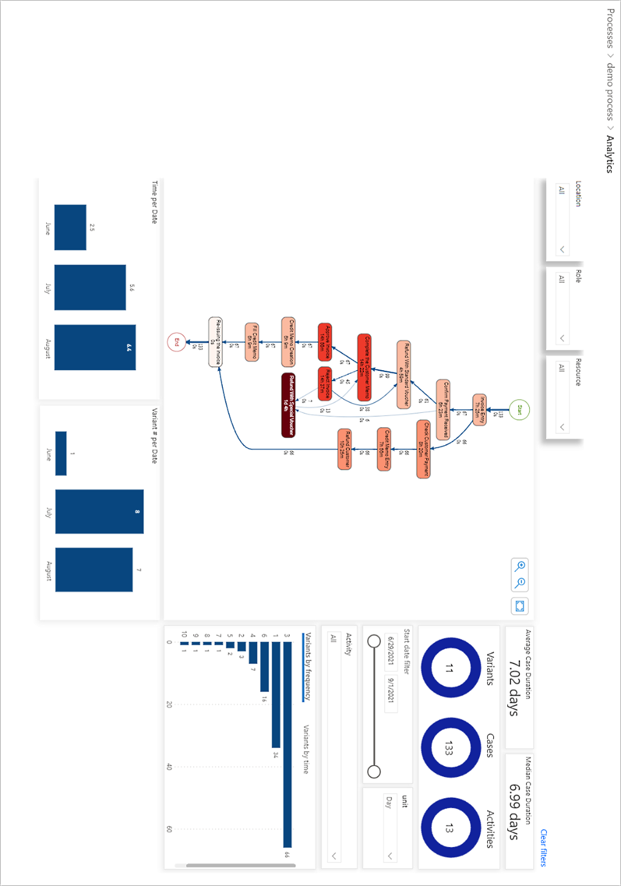

# Visualize and gain insights from processes in process advisor (preview)

[!INCLUDE[cc-beta-prerelease-disclaimer](./includes/cc-beta-prerelease-disclaimer.md)]

This topic explains metrics and visuals, and what they could tell you about your process.

> [!IMPORTANT]
> - This is a preview feature.
>
> - [!INCLUDE[cc_preview_features_definition](includes/cc-preview-features-definition.md)]

## Visualize and gain insights from processes with the process map

The process map empowers you to visualize and gain insights from processes. By looking at a graphical representation of how your business processes are performed, you can glean insights about where opportunities exist.

Activities describe tasks or actions, the sequence of which makes up a business process. Activities can be performed by humans, or in the case of automation—by machines. In the process map, different activities appear as nodes, and transitions between activities appear as edges. Each process sequence will have a start and an end.

Different activity combinations and variants are shown separately on the process map. A process variant is a unique path from the beginning to the end of the process. In other words, a process variant is a specific activity sequence, like a "trace" through the process, from start to end. Each variant differs from the others by at least one activity.

You can see additional metrics, frequency of the activities, as well as process throughput time (case duration), on the process map.

Frequency shows you the total number of workflows (also known as cases) passing through it. Case duration is the time between the very first event of the case and the last.

To drill down into the process, you have various filters available:

- **Variant selector**: Allows you to select one variant, or a set of process variants to visualize in your process map. 

- **Activity selector**: Allows you to select cases that contain the selected activity.

- **Start date filter**: Allows you to see the process visualization in a particular period.

Additionally, there are key performance indicators (KPIs) available to help you better understand your task. They are described in the following section.

## Use KPIs and visualizations for analytics

Out-of-the-box, you'll get several KPIs and visualizations to help you to understand your process.

Here's a short video on process mining analytics including custom filters: 
 
> [!VIDEO https://www.microsoft.com/en-us/videoplayer/embed/RWNQx7]

> [!div class="mx-imgBorder"]
> 

### KPIs

- **Average case duration**: Shows you the average time it takes for a process to be completed across all cases you are analyzing. It is one of the most important data points when analyzing your process. The reason is that understanding how long a process lasts, how it changes over time, and further investigating the root cause of the process duration could make a great starting point in speeding up your process.

- **Median case duration**: Median in general shows the most frequent duration for a task to complete. It's a very useful metric in cases where a small number of cases (or even a single activity) are so different than most cases that the average time for completion would look skewed towards this offending case. To prevent the user from misinterpreting the time to completing the process, this measure shows the most frequent time as opposed to a simple average.

- **Number of variants**: Shows how many different paths were taken to accomplish a process. For example, one case of a process might have 10 steps to complete a purchase order, while another only nine.

- **Number of cases**: Shows the number of cases analyzed in a particular process.

- **Number of activities**: Shows the number of steps or activities taken to complete the process.

## Visualizations

- **Variants by frequency**: Shows which variants are the most common, sorted by the most common to the least common. You could select one or multiple variants in the bar chart to analyze details of the variant(s) by filtering for them. This would update the process map, KPIs and other visualizations.

- **Variants by time**: Shows a bar chart of the longest duration variant to the shortest one. Filtering on a specific variant(s) updates the process map and KPIs so you could get insights into the behavior of the selected variant(s). To select multiple variants, press Ctrl and select the desired variants.

- **Variant number per Date**: Shows how the number of variants for a selected time frame changes and informs if the processes are getting more or less standardized. An increasing number of variants over time would suggest an increased complexity in process execution over time.

- **Time (case duration) per Date**: Shows how duration of the process changes over time.

### Filters

- **Activity filter**: Filters for all cases where the selected activity is present

- **Unit filter**: Filters for a specific unit of time to make the process easier to analyze. For example, processes that last days would be more easily analyzed by selecting Days unit. As a default, the process advisor selects what it thinks is the best unit, but you can change it to accommodate your analysis.

- **Start date filter**: Filters for the time range when recording has started and ended. For example, if your process changed over time, you want to see if there was any impact on your metrics after the process change by filtering for recordings that started after a certain time.

- **Optional Filters**: If you imported Optional Columns during your data upload process, you will have additional filters to slice and dice the data by. In the image above we have examples of optional filers for Location, Role and Resource.
 

