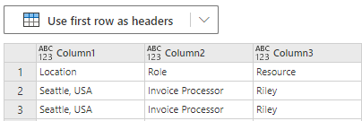
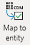

# End-to-end (E2E) walkthrough with demo data in process mining

Download the sample event log CSV file, [ProcessMiningSampleData.csv](https://go.microsoft.com/fwlink/?linkid=2174463). For task mining (user recording demo data) go here.  

## Create a process

1. Sign in to [Power Automate](https://preview.flow.microsoft.com/en-us/?processinsights-core.tabularData=true).

1. Select your environment.

1. On the left navigation panel, select **Process advisor** > **Create**.

1. Select **Create a new process**.

1. Enter a process name, and then select **Data (preview)**. <!-- Where is this? -->

1. Select **Create**. <!-- Where is this? -->

## Import data and analyze

1. On the left panel, select **Data** > **Tables**.

1. On the toolbar at top, select **Data** > **Get data** > **Blank table** on the Power Query - Choose data source screen.

    > [!div class="mx-imgBorder"]
    > 

1. Open the sample event log CSV file that you downloaded in Microsoft Windows Notepad (or any text editor).

1. Select all contents of the CSV file by pressing **Ctrl** + **A**.

1. Copy the selection by pressing **Ctrl** + **C**. 

1. Paste the selection you copied into the blank table in process advisor by pressing **Ctrl** + **V**. 

1. Select **Use first row as headers**. 

    > [!div class="mx-imgBorder"]
    > 

1. Upload your event log, select your file from the list, and choose **Select** to continue. <!-- How do you upload? No Select. -->

1. Select **Next** twice to get to the Power Query editor.

1. Validate that your fields are showing up correctly in the table view.

1. On the toolbar, select **Map to entity**. <!-- Where is this? -->

    > [!div class="mx-imgBorder"]
    > 

1. On the left side of the modal, select the **Event log** entity.

1. Map the three required columns by selecting **Auto map**.

1. Return to the Power Query editor by selecting **OK**.

1. Return to the process details page by selecting **Save**.

1. On the toolbar, select **Analyze**, and then select **Confirm** when the dialog opens.

Wait a minute or two for the analysis to complete. Once the process is analyzed, select **Analytics** to view the process map.
