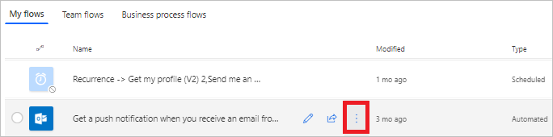
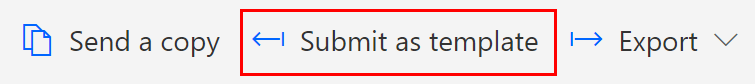
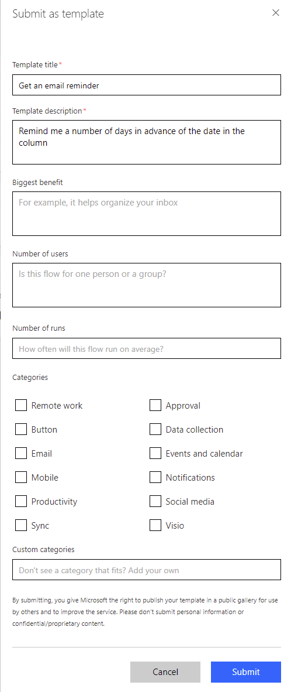

# Submit a template to the Power Automate gallery

Submit a cloud flow template to the gallery of templates for Power Automate. Templates help people not only to create flows more easily but also to imagine additional scenarios that would benefit from a cloud flow.

1. On the **My Flows** page, select the ellipsis (...) for a cloud flow.

    
1. Select **Details** in the menu that appears.
1. Select **More**, and then select **Submit as template** in the menu that appears.

    

   You can only submit flows that have run successfully at least once since the last save:

     
1. Specify a meaningful title, a clear description of the scenario that your template will help automate, the biggest benefit, the number of users, number of runs, and the categories that apply for the template.

    
1. Select **Submit**.

     The Power Automate team verifies and *possibly modifies* your template. If the team approves your template, it appears in the gallery of templates for Power Automate.

[!INCLUDE[footer-include](includes/footer-banner.md)]