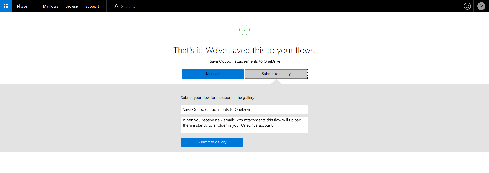
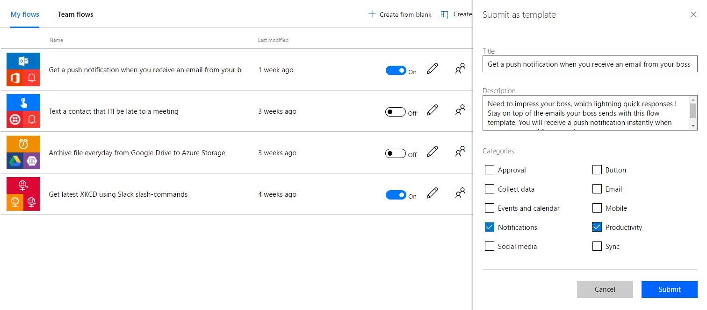

<properties
    pageTitle="Submit a flow template | Microsoft Flow"
    description="Submit a Microsoft Flow template so that others can use the flow you created."
    services=""
    suite="flow"
    documentationCenter="na"
    authors="sunaysv"
    manager="erikre"
    editor=""
    tags=""/>

<tags
   ms.service="flow"
   ms.devlang="na"
   ms.topic="article"
   ms.tgt_pltfrm="na"
   ms.workload="na"
   ms.date="04/25/2016"
   ms.author="sunayv"/>

# Submit a flow template to the Microsoft Flow gallery #

A flow template can be submitted to be showcased in the Microsoft Flow template gallery. Templates can help other users of Microsoft Flow to easily create flows and be inspired to automate scenarios showcased by templates. 

1. In order to submit a flow as a template, click on the "..." context menu and select "Submit as a template"

	

1. Next, provide a meaningful title, a clear description of the scenario your template will help automate and select the categories that apply for the template. Clicking "Submit" will send your template to Microsoft Flow for verification and approval, if your template is approved - it will show up in the Microsoft Flow gallery.

	

**Note**: Microsoft may modify your template before publishing it to the gallery.
