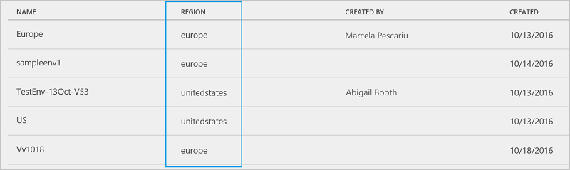

<properties
    pageTitle="Regions overview for Microsoft Flow | Microsoft Flow"
    description="Overview with question and answer about regions in Microsoft Flow"
    services=""
    suite="flow"
    documentationCenter="na"
    authors="MSFTMan"
    manager="anneta"
    editor=""
    tags=""/>

<tags
   ms.service="flow"
   ms.devlang="na"
   ms.topic="article"
   ms.tgt_pltfrm="na"
   ms.workload="na"
   ms.date="01/19/2017"
   ms.author="deonhe"/>

# Regions overview in Microsoft Flow

## Q & A

### Question: How do I find out where my data is stored?
All data is stored in the region that hosts the environment. For example, if your environment is created in the Europe region, then all your data is stored in Europe data centers. 

The Microsoft Flow Admin Center shows you the region. The Admin Center is only available to Administrators: 

1. Go to [admin.flow.microsoft.com](https://admin.flow.microsoft.com), and sign-in with your work account. 
2. In the Admin Center, all existing environments are listed on the **Environments** tab, this list shows the **Region** where your data is stored:  
    

### Question: What regions are available?
The following regions are available: 

- **United States**
- **Europe**
- **Asia**
- **Australia**
- **India**
- **Japan**

### Question: What features are specific to a given region?

Environments can be created in different regions, and are bound to that geographic location. When you create a flow in an environment, that flow is stored in data centers in that geographic location. This applies to any items you create in that environment, including common data model, flows, connections, gateways, PowerApps, and custom APIs.

For the optimal performance, if your users are in Europe, then create and use the environment in the Europe region. If your users are in the United States, then create and use the environment in the U.S. 

**Gateways**: 
- Currently not available in the **India** region.
- Currently supported in the default environment. They are not supported in custom environments.

### Question: Where exactly are the data centers located?

Microsoft does not publicly advertise all data centers, but the [Office 365 data center map](http://o365datacentermap.azurewebsites.net/) provides more information.

### Question: Is Microsoft Flow available in national clouds?

No, Microsoft Flow is not currently available in the US Gov, Germany or China regions. Availability for national clouds is planned for 2017.

### Question: What IP addresses are used in each region?

See the [limits and configuration document](limits-and-config.md) for details on the outbound IP addresses for each region.

