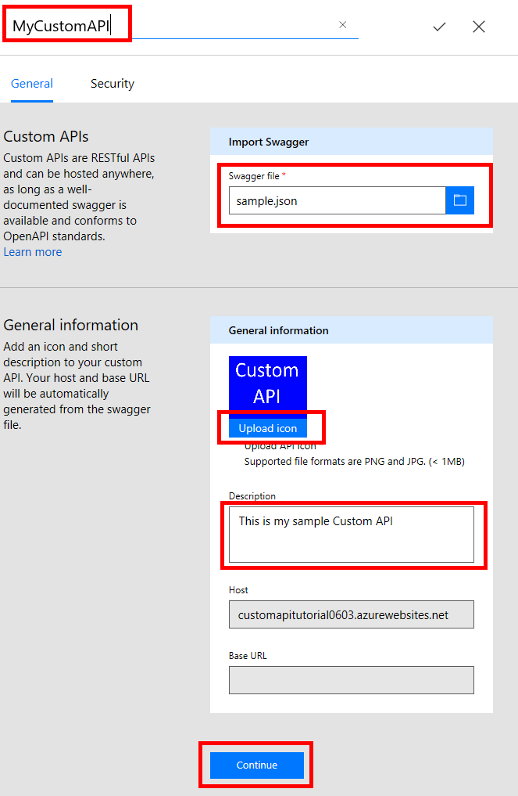
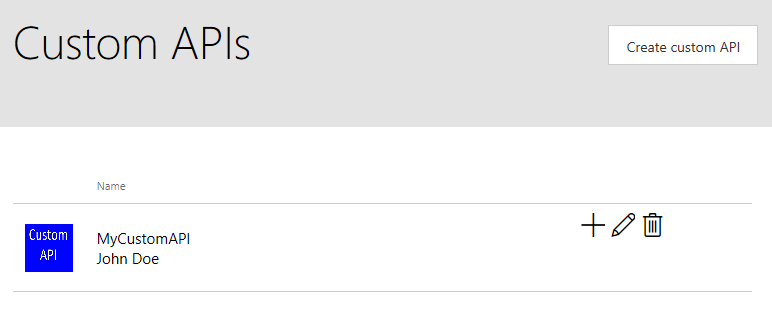

<properties
	pageTitle="Register Custom APIs in Microsoft Flow | Microsoft PowerApps"
	description="Register Custom APIs in Microsoft Flow using Swagger and OAuth."
	services=""
    suite="flow"
	documentationCenter=""
	authors="camsoper"
	manager="AFTOwen"
	editor=""/>

<tags
   ms.service="flow"
   ms.devlang="na"
   ms.topic="article"
   ms.tgt_pltfrm="na"
   ms.workload="na"
   ms.date="10/26/2016"
   ms.author="casoper"/>

# Register Custom APIs in Microsoft Flow

Microsoft Flow can leverage any RESTful APIs hosted anywhere.  This tutorial demonstrates registering and using a custom API.

## Prerequisites

- A [Microsoft Flow account](https://flow.microsoft.com).
- A Swagger file (JSON) for your custom API. If you don't have one, we'll show you several options to create the Swagger file.
- An image to use as an icon for your custom API (optional).


## Authentication

Custom APIs in Microsoft Flow can use any of several authentication mechanisms.

- Basic Authentication
- OAuth 2.0. The specific implementations below are currently supported, with more coming soon.

	- Azure Active Directory
	- Box
	- Dropbox
	- Facebook
	- Google
	- Instagram
	- OneDrive
	- SalesForce
	- Slack
	- Yammer


The [OpenAPI Specification](https://github.com/OAI/OpenAPI-Specification/blob/master/versions/2.0.md#securityDefinitionsObject) describes how to specify authentication within a Swagger.

If your API endpoint allows unauthenticated access, you should remove the ```securityDefintions``` object from the OpenAPI (Swagger) file. In the following example, remove all of the following ```securityDefintions``` object:

```
  "securityDefinitions": {
    "AAD": {
      "type": "oauth2",
      "flow": "implicit",
      "authorizationUrl": "https://login.windows.net/common/oauth2/authorize",
      "scopes": {}
    }
  },
```

### Examples
* [Azure Resource Manager](customapi-azure-resource-manager-tutorial.md) with AAD authentication.
* [Azure WebApp](customapi-web-api-tutorial.md) with AAD authentication.

## Register a custom API

### Step 1: Create a Swagger file

You can create a Swagger file from *any* API endpoint, including:

- Publicly available APIs. Some examples include [Spotify](https://developer.spotify.com/), [Uber](https://developer.uber.com/), [Slack](https://api.slack.com/), [Rackspace](http://docs.rackspace.com/), and more.
- An API that you create and deploy to any cloud hosting provider, including Amazon Web Services (AWS), Heroku, Azure Web Apps, Google Cloud, and more.  
- A custom line-of-business API deployed on your network as long as the API is exposed on the public internet.

When you create the Swagger file, a JSON file is created.  You'll need this is Step 2.

#### Getting help with Swagger files

- If you're new to Swagger, you should visit the [Getting Started pages on Swagger.io](http://swagger.io/getting-started/).

-  There's a Swagger [Hello World example](https://github.com/OAI/OpenAPI-Specification/wiki/Hello-World-Sample) on GitHub.

- To create your own API, deploy it to Azure, create a Swagger file based off this new API, and then register it in Microsoft Flow, see the [Web API tutorial](customapi-web-api-tutorial.md).

- To validate your Swagger files, use the [Swagger editor](http://editor.swagger.io/#/). You can paste your JSON data, and validation automatically occurs.

- To customize your Swagger document to work with Microsoft Flow, see [Customize your Swagger definition](customapi-how-to-swagger.md).

### Step 2: Add a connection to the custom API

Now that the Swagger file (JSON file) is generated for the custom API, add the connection to Microsoft Flow.

1. In the [Microsoft Flow web app](https://flow.microsoft.com/), click the **Settings** button at the upper right of the page (it looks like a gear).  Then click **Custom APIs**.

	  

2. Click **Create custom API**.  

	You will be prompted for the properties of your API.  

	| Property | Description |
	|----------|-------------|
	| Name | At the top of the page, click **Untitled** and give your flow a name. |
	| Swagger file | Browse to the JSON file created from Swagger. |
	| Upload API icon | Cick **Upload icon** to select an image file for the icon. Any PNG or JPG image less than 1 MB in size will work. |
	| Description | Type a description of your custom API (optional). |

	  

	Select **Continue**.

3. If the JSON file contains a ```securityDefintions``` object, you will be prompted to enter security information, such as OAuth2 or API Key values.

	>[AZURE.TIP] If the JSON file does not use the ```securityDefintions``` object, then no additional values may be needed.

	After entering security information, click the check mark (**&#x2713;**) next to the flow name at the top of the page to create the custom API.

4. Your custom API is now displayed under **Custom APIs**.

	  

5. Now that the custom API is registered, you must create a connection to the custom API so it can be used in your apps and flows.  Click the **+** to the right of the name of your custom API and then complete any necessary steps to sign in to your API's data source.  For **OAuth** authentication, that might be a sign-in screen.  For API Key authentication, you might get prompted for a key value.

### Step 3: Add the custom API to a flow

Now you're ready to use the custom API with your flow. To illustrate, we'll use a custom weather API.

#### Add the custom API to your flow

>[AZURE.NOTE] This example creates a very simple flow to show you how to add your custom API. For more information, see [Get started with flows](./get-started-logic-flow.md).

1. In [flow.microsoft.com](https://flow.microsoft.com), at the top of the page, select **My flows**, and then select **Create from blank**.

	>[AZURE.TIP] If you don't see a **My flows** link, it might be hidden under a hamburger button in the upper-left corner in mobile browsers.

2. You are presented several templates already representing some common scenarios. You can use any of these and add your custom API to it, or you can choose **Create from blank** to create a flow from scratch.  Select **Create from blank**.

	   

4. Select **Recurrence**, and set the frequency to 1 minute.

	  	

5. Select **+ New Step**, and then select **Add an action**. In the list, your custom API is listed.

	

6. Select the operation you want to call from your custom API.  For this example, the API gets the current temperature, and then sends an email using Office 365.

	

7. Name your flow, and then select the check mark (**&#x2713;**) to save your flow.

## Quota and throttling

- You can create up to five custom APIs in a Microsoft Flow account.
- For each connection created on a custom API, users can make up to 500 requests per minute.
- Keep in mind that deleting a custom API deletes all the connections created to the API.

## Next steps

[Learn about custom Swagger extensions](customapi-how-to-swagger.md).

[Use an ASP.NET Web API](customapi-web-api-tutorial.md).

[Register an Azure Resource Manager API](customapi-azure-resource-manager-tutorial.md).
