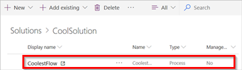
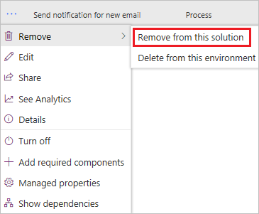
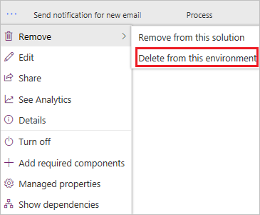

# Remove a solution-aware flow

You can either remove a cloud flow from a solution, or delete the flow from an environment entirely.

Action|Result
------|-----------
Remove from this solution|The flow is removed from the selected solution, but it remains in the environment. You can use the flow in other solutions in the environment at a later date.
Delete from this environment|The flow is deleted; it is not available in the environment.

## Remove a cloud flow from a solution

1. Sign in to Power Automate, and then select **Solutions** from the navigation bar.
1. Select the solution that contains the flow you want to remove from the solution.

   

1. Select **...** (Commands) for your flow, select **Remove**, and then select either **Remove from this solution**.

   

>[!IMPORTANT]
>When you remove a cloud flow, it gets moved to the **Default Solution**, where you can edit or delete the flow, or add it to another solution.

## Delete a cloud flow from an environment

1. Sign in to Power Automate, and then select **Solutions** from the navigation bar.
1. Select the solution that contains the flow you want to delete from the environment.

   

1. Select **...** (Commands) for your flow, select **Remove**, and then select **Delete from this environment**.

   

## Learn more

- [Create a solution](./overview-solution-flows.md)
- [Create a cloud flow in a solution](./create-flow-solution.md)
- [Export a solution](./export-flow-solution.md)
- [Import a solution](./import-flow-solution.md)
- [Edit a solution-aware flow](./edit-solution-aware-flow.md)

[!INCLUDE[footer-include](includes/footer-banner.md)]
