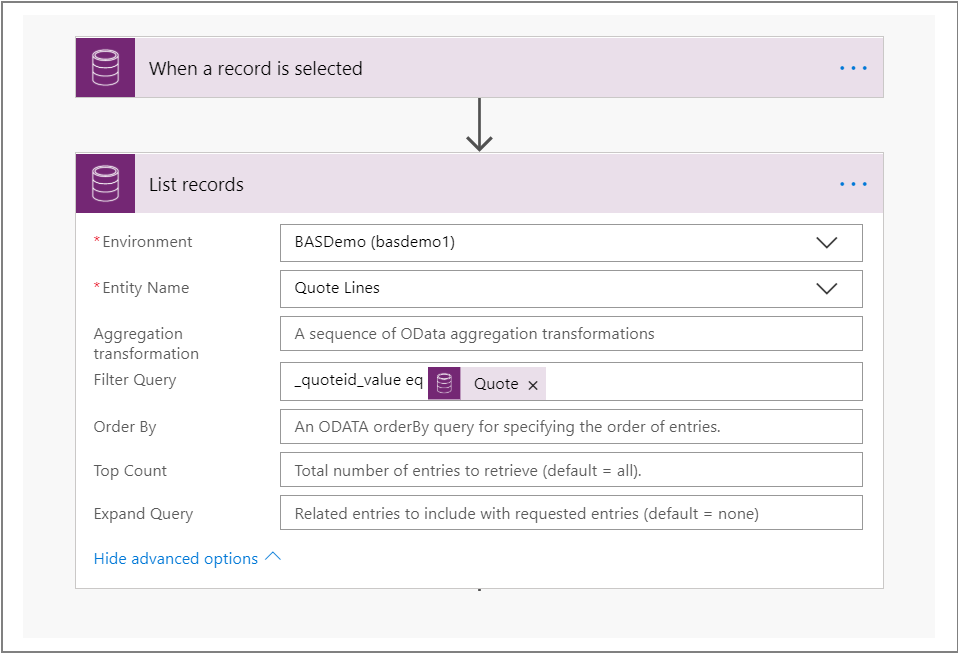
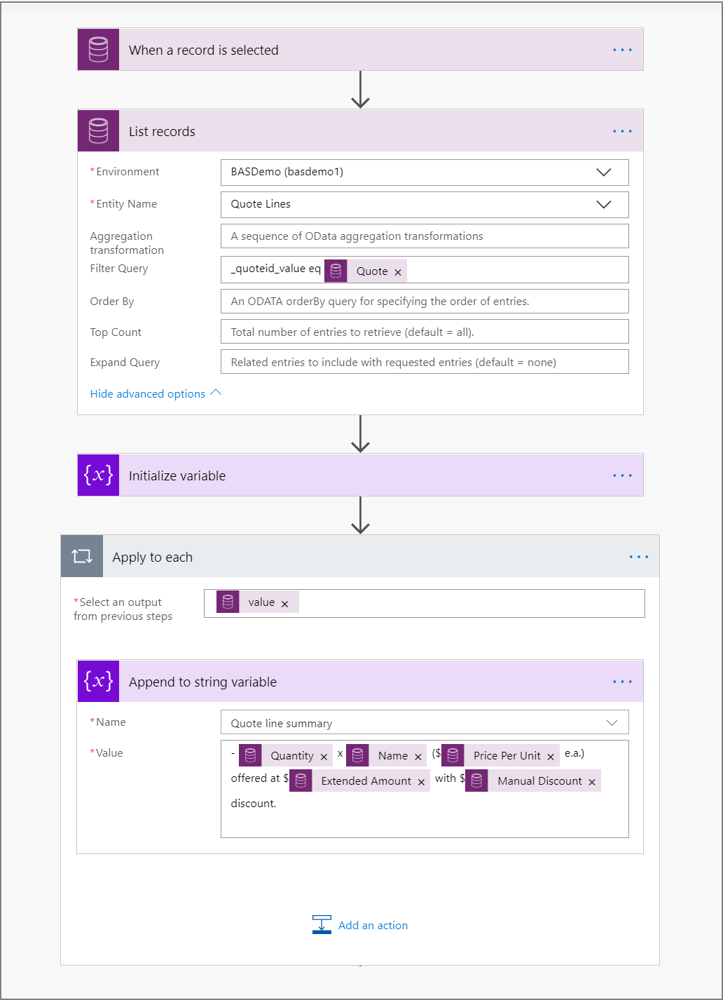
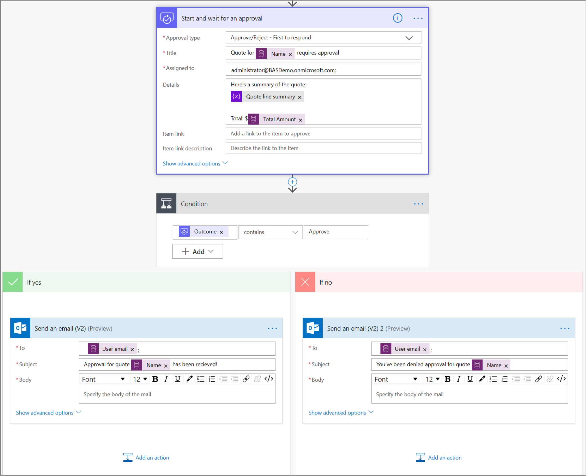
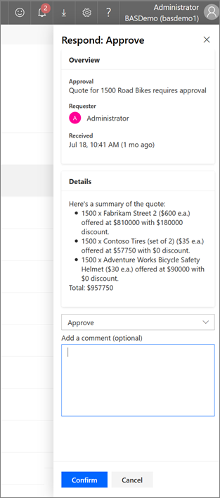

# Replace classic Common Data Service workflows with flows

This topic compares Power Automate capabilities with classic workflow.

Power Automate has significant advantages over the classic background workflow model; you should consider using Power Automate to automate your processes instead of classic workflow.

Create flows instead of classic Common Data Service workflows to build new automation processes. Additionally, you should review your existing classic background workflow processes and consider replacing them with flows.

## Feature capability comparison

This table summarizes a comparison between Power Automate and classic workflows capabilities.

*We are continuously adding new capabilities to Power Automate. We'll update information in this table as Power Automate gains capabilities; check back often! For information about upcoming flow capabilities that will help you replace classic background workflow with flow, see [What's new and planned for Power Automate](https://docs.microsoft.com/power-platform-release-plan/2020wave1/power-automate/planned-features)*

<table>
<tr>
<th colspan="2">Capability</th>
<th>Power Automate</th>
<th>Classic Workflow</th>
</tr>
<tr>
<td rowspan="5">Modeling</td>
<td>Conditional branching</td>
<td>Yes</td>
<td>
                    
   Yes
                    
                </td>
            </tr>
            <tr>
                <td>
                    
   Looping
                    
                </td>
                <td>
                    
   Yes
                    
                </td>
                <td>
                    
   No
                    
                </td>
            </tr>
            <tr>
                <td>
                    
   Wait conditions on fields
                    
                </td>
                <td>
                    
   No
                    
                </td>
                <td>
                    
   Yes
                    
                </td>
            </tr>
            <tr>
                <td>
                    
   Parallel branch
                    
                </td>
                <td>
                    
   Yes
                    
                </td>
                <td>
                    
   No
                    
                </td>
            </tr>
            <tr>
                <td>
                    
   Out-of-box connectors to external systems (trigger and
   perform actions in external services)
                    
                </td>
                <td>
                    
   Yes
                    
                </td>
                <td>
                    
   No
                    
                </td>
            </tr>
            <tr>
                <td rowspan="7">
                    
   Composition
                    
                </td>
                <td>
                    
   Dynamic content
                    
                </td>
                <td>
                    
   Yes
                    
                </td>
                <td>
                    
   Yes
                    
                </td>
            </tr>
            <tr>
                <td>
                    
   Access to pre-image of event data
                    
                </td>
                <td>
                    
   No
                    
                </td>
                <td>
                    
   Yes
                    
                </td>
            </tr>
            <tr>
                <td>
                    
   Run child workflows
                    
                </td>
                <td>
                    
   Yes
                    
                </td>
                <td>
                    
   Yes
                    
                </td>
            </tr>
            <tr>
                <td>
                    
   Run Common Data Service actions (including custom)
                    
                </td>
                <td>
                    
   Yes
                    
                </td>
                <td>
                    
   Yes
                    
                </td>
            </tr>
            <tr>
                <td>
                    
   Run custom background workflow activities
                    
                </td>
                <td>
                    
   No
                    
                </td>
                <td>
                    
   Yes
                    
                </td>
            </tr>
            <tr>
                <td>
                    
   Group steps to run in a transaction
                    
                </td>
                <td>
                    
   Yes (changesets)
                    
                </td>
                <td>
                    
   No
                    
                </td>
            </tr>
            <tr>
                <td>
                    
   Approval workflows
                    
                </td>
                <td>
                    
   Yes
                    
                </td>
                <td>
                    
   No
                    
                </td>
            </tr>
            <tr>
                <td rowspan="7">
                    
   Execution
                    
                </td>
                <td>
                    
   Trigger on field changes
                    
                </td>
                <td>
                    
   Yes
                    
                </td>
                <td>
                    
   Yes
                    
                </td>
            </tr>
            <tr>
                <td>
                    
   Trigger conditionally on field values (For example, on a
   certain date in a date field)
                    
                </td>
                <td>
                    
   No
                    
                </td>
                <td>
                    
   No
                    
                </td>
            </tr>
            <tr>
                <td>
                    
   Trigger on multiple Common Data Service entity events
                    
                </td>
                <td>
                    
   Yes
                    
                </td>
                <td>
                    
   Yes
                    
                </td>
            </tr>
            <tr>
                <td>
                    
   Run on-demand
                    
                </td>
                <td>
                    
   Yes
                    
                </td>
                <td>
                    
   Yes
                    
                </td>
            </tr>
            <tr>
                <td>
                    
   Run-as scopes
    
   (for example, organization, business unit, user)
                    
                </td>
                <td>
                    
   Yes
                    
                </td>
                <td>
                    
   Yes
                    
                </td>
            </tr>
            <tr>
                <td>
                    
   Run on a schedule
                    
                </td>
                <td>
                    
   Yes
                    
                </td>
                <td>
                    
   No
                    
                </td>
            </tr>
            <tr>
                <td>
                    
   Run synchronously (real-time)
                    
                </td>
                <td>
                    
   No
                    
                </td>
                <td>
                    
   Yes
                    
                </td>
            </tr>
            <tr>
                <td rowspan="2">
                    
   History
                    
                </td>
                <td>
                    
   Auditing
                    
                </td>
                <td>
                    
   Yes
                    
                </td>
                <td>
                    
   Yes
                    
                </td>
            </tr>
            <tr>
                <td>
                    
   Run analytics
                    
                </td>
                <td>
                    
   Yes
                    
                </td>
                <td>
                    
   No
                    
                </td>
            </tr>
            <tr>
                <td rowspan="3">
                    
   Authoring and portability
                    
                </td>
                <td>
                    
   Solution support
                    
                </td>
                <td>
                    
   Yes
                    
                </td>
                <td>
                    
   Yes
                    
                </td>
            </tr>
            <tr>
                <td>
                    
   Modern designer
                    
                </td>
                <td>
                    
   Yes
                    
                </td>
                <td>
                    
   No
                    
                </td>
            </tr>
            <tr>
<td>AI-assisted authoring</td>
<td>Yes</td>
<td>No</td>
</tr>
</table>

## Example scenario: Replace background workflow with a flow

Imagine a sales scenario where you have put together a quotation for a customer
and now need to request approval from your management team prior to sending the quotation to the customer. With
classic workflows, this wouldn’t have been easy to do and most
solutions to this require a developer to write custom background workflow activities
to retrieve quote line items.

With flows, this is easier to build as demonstrated in the walkthrough later that covers 
some of the Power Automate capabilities to support the scenario. This
includes:

- Creating a flow that runs on demand
- Getting a list of records related to a Common Data Service entity
- Looping over a list of records
- Sending approval requests

To allow the sales person to trigger the approval request on demand:

1. Sign in to [Power Automate](https://flow.microsoft.com/) and create a flow in a solution. More information: [Create a flow in a solution](create-flow-solution.md). 

1. From the list of triggers, select **Common Data Service (Current Environment) – When a record is selected** and select **Quotes** as the entity. This trigger allows a flow to be run on-demand on a record or list of records.

1. With the trigger configured, add actions to run in our flow. This will provide the approver with the summary detail they need to identify the quoted items and values. Begin by adding the **Common Data Service (Current Environment) – List records** action. Because we want to get individual items from a Quote, set the entity to **Quote lines**. To ensure we only list those quote line items that belong to the Quote for which the flow was triggered, we’ll specify an OData style filter criterion. In the **Filter Query** field, type *\_quoteid_value eq* and then select *Quote* from the list of dynamic values that appear.

    

1. As we want to summarize quote line items for the approval, add the **Initialize variable** action. Set the **Name** field to *Quote line summary* and the **Type** to String (from the dropdown), and leave the **Value** field empty.

1. Add the **Append to string variable** action and then select the *Quote line summary* variable we created earlier. In the **Value** field, select *Quantity, Name, Price per unit, Extended amount and Manual amount* from the list of dynamic values. The Power Automate designer identifies that these values are from a list of quote line items, and adds this action in an **Apply to each** loop to ensure information from each line item is added to this summary.

    

1. To request approval on the quote summary we’ve created, add the **Approval – Start and wait for an approval** action. Select an Approval type (for example, Approve/Reject – First to respond), give the Approval request a **Title** (for example, the Name of the Quote for which approval is being requested, picked from the list of dynamic values), enter the email address for the person who needs to review and approve the quote in the *Assigned to** field. In the details field, add the *Quote line summary* variable, along with any other information that might be relevant using the dynamic value picker (for example, Total Amount).

1. To determine what happens once an approval is accepted or rejected, add the **Condition** action. Select *Outcome* from the list of dynamic values from the first field in the condition, *Contains* from the dropdown in the second field, and enter *Accept* in the third field of the condition. Finally, add actions based on the outcome of the approval (For example, send a notification email).

    

We now have the approval structure created so the approver has all of the information needed to make a decision on next steps. Here's the full example 

When you run this flow against your quote, it summarizes
quote line items for that quote and sends an approval request that the approver
can respond to from Power Automate, or the actionable email they receive. An
example of the display is below:

## Recommended patterns

- **Workflows with complex else-if conditional logic**  

  Instead of using conditions, we recommend using the [switch action](https://docs.microsoft.com/azure/logic-apps/logic-apps-control-flow-switch-statement#add-switch-statement) instead.

- **Workflows that run from plug-in/code**  

  We recommend redesigning the flow to start with triggers.

  - Use Common Data Service triggers to run flows based on events in it.

  - To run flows based on events in an external service, leverage more than 260 out-of-box connectors.

  - For scenarios where a connector you need isn’t available out-of-the-box, easily create your own custom connector [learn to create custom connectors](https://docs.microsoft.com/connectors/custom-connectors/define-blank).

  - Finally, if there are scenarios where you cannot trigger your flow using Common Data Service connector, one of the out-of-box connectors, or create a custom connector, leverage the [When a HTTP request is received trigger](https://docs.microsoft.com/azure/connectors/connectors-native-reqres#use-the-http-request-trigger) to invoke the flow

- **Workflows that run recursively**  

  Use the [do-until](https://docs.microsoft.com/azure/logic-apps/logic-apps-control-flow-loops#until-loop) or [apply to each](https://docs.microsoft.com/azure/logic-apps/logic-apps-control-flow-loops#foreach-loop) loop in Flows instead

- **Workflows that need a list of records**  

  Use the **list records** action. When using this action, define the record filtering criteria using OData syntax to optimize the action by minimizing the number of records you want to retrieve.

- **Workflows that sleep to run on a schedule**  

  Use the **recurrence** trigger to run business logic at periodic intervals.

- **Workflows for which runs were managed to ensure activities were executed in a single transaction**  

  [Use the [changeset action](https://docs.microsoft.com/business-applications-release-notes/april19/microsoft-flow/automated-flows-support-change-sets-common-data-service) to ensure that all actions within it are performed as a single, atomic unit in which either all succeed, or fail as a group. If any one of the actions in a change set fails, changes made by completed operations are rolled back.

- **Monitor background workflow runs for failures**  

  In Power Automate, use the **run-after setting** on an action to configure it to run when the previous action fails. For example, send a Power Automate mobile notification when
    the **update a record** action fails, or times out.

## FAQs

- **I have a Dynamics 365 license. Can I use Power Automate?**

  Every Dynamics 365 user is entitled to use Power Automate. Review our licensing information: <https://flow.microsoft.com/pricing/>

- **How often can my flows be triggered?**

   Dynamics 365 (or Common Data Service) flows run near real-time after the trigger because they use webhooks (no polling required)

  - As with direct API access, there are throttles/limits in the system. See [Limits and configuration in Power Automate](limits-and-config.md)
  - Specifically, there is a limit of 100k actions per 5 minutes, per flow. A single loop in a flow cannot process more than 100k items at once
  - Maximum of 6GB of throughput per 5 minutes

- **How long can a single flow run?**  

  A single flow run times out after 30 days.

- **How do I move my flows between environments?**  

  Just like classic workflows, you can create flows in solutions to support the full application lifecycle for processes.

- **Are Power Automate dependencies tracked in Common Data Service?**  

  Similar to other components in a solution, all dependencies for flows in solutions are tracked in Common Data Service.

- **What about synchronous workflows?**

  We've seen feedback that synchronous workflows are a significant contributor to end user performance issues. Can your objective, or parts of the background workflow can be built using a Power Automate flow? If you can split actions out as asynchronous, the user can continue their activity while Power Automate continues to ensure completion of the action.

- **Using Power Automate, will my data stay within region (that is, the same region as my Dynamics 365 or Common Data Service environment)?**  

  Yes, Power Automate always uses the same region as Common Data Service.

- **Do I need to make proxy/firewall changes?**  

  Refer to the [IP address configuration reference](limits-and-config.md#ip-address-configuration) to determine whether you need to make any proxy/firewall changes.
