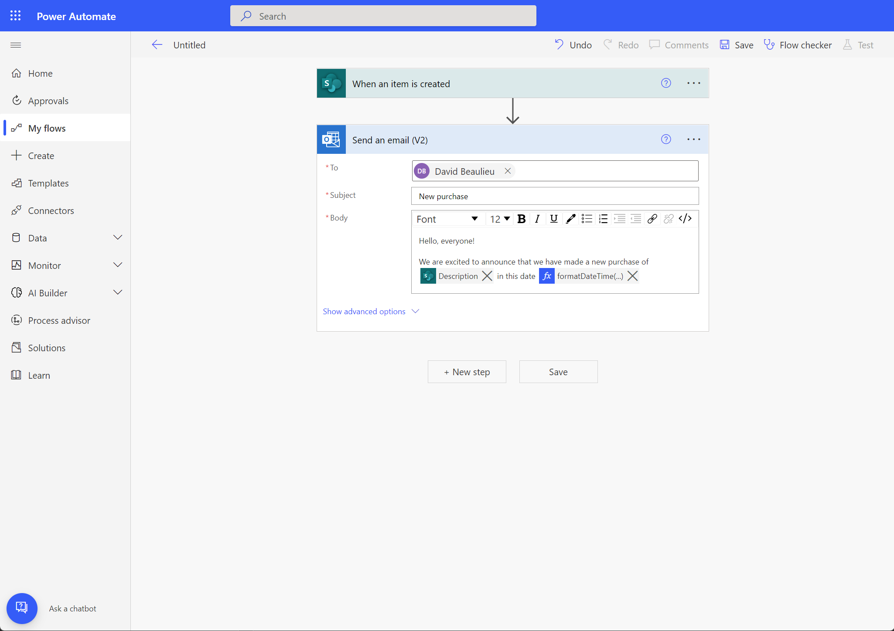

# Provide examples to format data expressions

Expressions in Power Automate are powerful ways to do operations over data. With this feature, you no longer need to learn about the different functions available and how to put them together in an expression. Now to format text, dates and numbers you can just provide examples of the desired output format to produce, and Power Automate will automatically generate the expression formula to use.

Format a text, dates, or numbers by examples
============================================

Let’s see how easy it is by looking at one example. In this sample scenario, we have a SharePoint list with products we have purchased. We want to send an email when a new product purchase is entered into the SharePoint list. By default, the date from SharePoint comes formatted like this: “2022-09-18” and we’d like that in the email message it appears as: “September 18”. Let’s see how to do it with format data by examples.

1. On the flow editor, select on which action you want to insert the formatted item. On the flyout panel that opens, select **Expression,** and then **Format data by examples**  

    

    [format-data-by-examples-step-1.png](https://microsoft.sharepoint.com/:i:/t/PARIS/EUnsMzVFjYtKoikuw31uPscBVIWpRh7JACaRJCrnws_84Q?e=gJ2tpv)
    (Alt: Screenshot showing the option to open ‘Format data by examples in the ‘Expression’ menu)  

1. A list will show all the items in your flow that can be formatted. Pick the one you want to transform.
1. Next, provide an example of how the data will come originally for the item you have selected on the previous step. Tip: You can go to the original data source or review a previous flow run to copy an example value.
1. Then provide how you’d like that example to be transformed.  

    

    [format-data-by-examples-enter-examples.png](https://microsoft.sharepoint.com/:i:/t/PARIS/ETpGBVP2HAtBvWjLng6sCkwBP63PB56pZ7u53UzvwMmAXg?e=vIApGi)
    (Alt: Screenshot showing where to enter an example value and its desired
    transformation)

1. Once you have entered an example value and desired output, select **Get expression**.
1. An expression is suggested. You can test it with another value to make sure the expression does what you’re looking for.

| Information If the suggested expression is not doing what you were expecting, you add more examples after the first example you entered to refine the expression that gets suggested. |
|---------------------------------------------------------------------------------------------------------------------------------------------------------------------------------------|

[format-data-by-examples-flow-test.png](https://microsoft.sharepoint.com/:i:/t/PARIS/EeoYXJ2ERmdBisSR0YnSIq8BkuMiLgdfrDzDTnpXKJEvyA?e=4FoTyk)
(Alt: Screenshot showing the suggested expression and how to test it)

1. If all looks good, you can select **Apply** and the expression will be added to the flow.
1. Congratulations! You’ve built an expression just by providing examples.  

    

    [format-data-by-examples-expression-in-flow.png](https://microsoft.sharepoint.com/:i:/t/PARIS/EQXwKsxhs8JDl4c4zx3qDvYBCIXj9-1ZouSiEYox7RVQ7A?e=1Qy8OE)
    (Alt: Screenshot showing the suggested expression applied to an action in the cloud flow)

Behind the tech
===============

Format data by examples is powered by [PROSE](https://www.microsoft.com/research/project/prose-framework/), a technology that enables programming by example.

Limitations 
============

- Format data by examples can format one text, number, or date at a time. More complex structures like arrays are not yet supported.
- Format data by examples is currently not available in environments based in South Africa, GCC, GCC High and DoD.

Giving us feedback
==================

If you have any feedback for this feature, e.g., the suggested expression is inaccurate or you have suggestions, ideas to share with us, you can [fill this feedback survey](https://ncv.microsoft.com/pBfc66vy6A). Thank you for taking the time to provide your comments, they help us greatly build better products.
