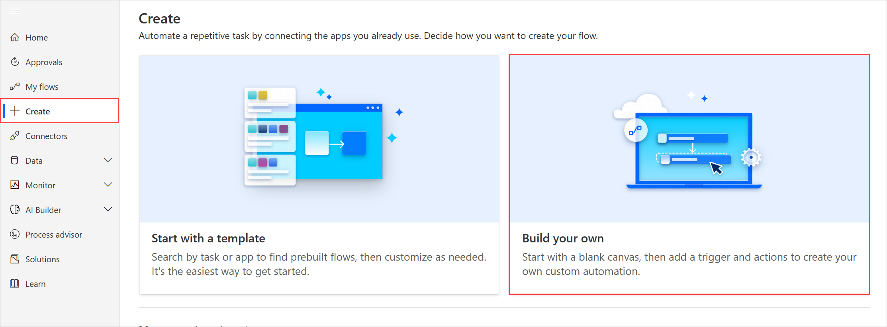
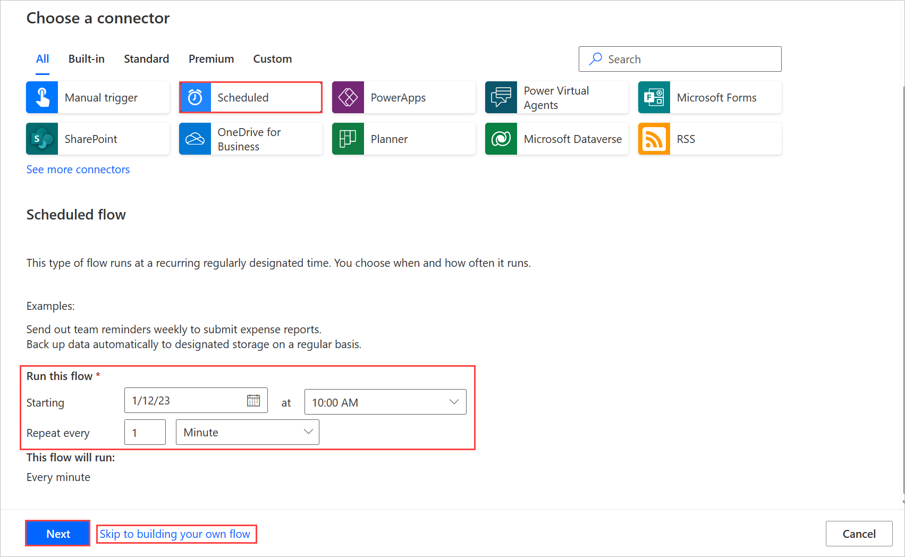
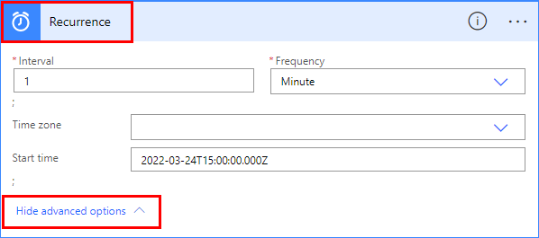
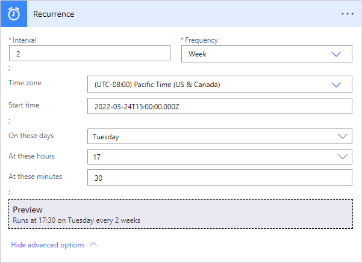

# Run flows on a schedule

Create a cloud flow that performs one or more tasks (such as sending a report in email):

* Once a day, an hour, or a minute
* On a date that you specify
* After a number of days, hours, or minutes that you specify

## Create a recurring flow

1. Sign in to [Power Automate](https://flow.microsoft.com), and then select **My flows** on the left navigation pane.
1. Select **New flow** and then **Scheduled cloud flow**.
    
1. Specify when your flow should start by editing **Starting** boxes, and specify the flow's recurrence by editing **Repeat every** boxes then select **Create**.
    

## Configure advanced options

1. Follow the steps in the previous section. and then select **Recurrence** > **Show advanced options**.

    

   > [!NOTE]
   > These options change based on the values to which **Interval** and **Frequency** are set. If your screen doesn't match the graphic below, make sure that **Interval** and **Frequency** are set to the same values that the graphic shows.
1. Select a **Time zone** to specify whether the **Start time** reflects a local time zone, Universal Coordinated Time (UTC), etc.
1. Specify a **Start time** in this format:
    YYYY-MM-DDTHH:MM:SSZ
1. If you specified **Day** under **Frequency**, specify the time of day when the flow should run.
1. If you specified **Week** under **Frequency**, specify the day or days of the week on which the flow should run and the time or times of day when the flow should run.

    For example, configure the options as shown to start a cloud flow no sooner than noon (Pacific time) on Monday, January 1, 2018, and run it every two weeks on Tuesdays at 5:30p (Pacific time).

    
1. Add the action or actions that you want the flow to take, as [Create a cloud flow from scratch](get-started-logic-flow.md) describes.

## Learn more

Learn more about the [advanced options](https://docs.microsoft.com/azure/connectors/connectors-native-recurrence) and how to configure them.
