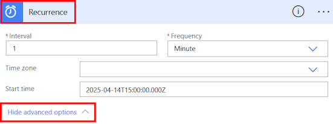

# Run flows on a schedule

Create a cloud flow that performs one or more tasks (such as sending a report in email).

- Once a day, an hour, or a minute.

- On a date that you specify.

- After a number days, hours, or minutes that you specify.

## Create a recurring flow

1. Sign in to [Power Automate](https://make.powerautomate.com).

1. Select **My flows** > **New flow** > **Scheduled cloud flow**.

1. In the fields next to **Starting**, specify the date and time when your flow should start.

1. In the fields next to **Repeat every**, specify the flow's recurrence.

1. Select **Create**.

    :::image type="content" source="media/run-scheduled-tasks/select-recurrence-aa.png" alt-text="Screenshot of the options to set up a scheduled flow.":::

Power Automate uses either the classic designer or the Edit with Copilot (preview) designer. To identify which designer you’re using, go to the **Note** section in [Understand the Edit with Copilot designer (preview)](flows-designer.md).

## Configure advanced options

# [Classic designer](#tab/classic-designer)

1. Follow the steps in the previous section.

1. Select **Recurrence** > **Show advanced options**. When you select **Show advanced options**, the dropdown name changes to **Hide advanced options**.

    >[!div class="mx-imgBorder"]
    >

    >[!NOTE]
    >These options change based on the values to which **Interval** and **Frequency** are set. If your screen doesn't match the graphic below, make sure that **Interval** and **Frequency** are set to the same values that the graphic shows.

1. In the **Time zone** field, select a time zone from the dropdown list to specify whether the **Start time** reflects a local time zone, Coordinated Universal Time (UTC), or other time zone.

1. In the **Start time** field, enter a start time in this format: YYYY-MM-DDTHH:MM:SSZ

1. If you specified **Day** under **Frequency**, select the time of day when the flow should run in the **At these hours** and **At these minutes** dropdown lists.

1. If you specified **Week** under **Frequency**, do the following. 
    - In the **On these days** and **At these hours** dropdown lists, select the day or days of the week on which the flow should run and the time or times of day when the flow should run.
    - In the **At these minutes** field, enter the minute values (from 0 to 59) separated by a comma.

    For example, configure the options as shown to start a cloud flow no sooner than 3:00 PM (Pacific time) on Thursday, March 24, 2022, and run it every two weeks on Tuesdays at 5:30 PM (Pacific time).

    >[!div class="mx-imgBorder"]
    >

   > [!NOTE]
   > If you run a flow on the month frequency, the flow runs on the same date each month.

1. Add the action or actions that you want the flow to take, as described in [Create a cloud flow from scratch](get-started-logic-flow.md).

# [Edit with Copilot (preview)](#tab/edit-with-copilot)

[!INCLUDE [cc-beta-prerelease-disclaimer](./includes/cc-beta-prerelease-disclaimer.md)]

---

### See also

[Advanced options in Azure Logic Apps](/azure/connectors/connectors-native-recurrence)

[!INCLUDE[footer-include](includes/footer-banner.md)]
