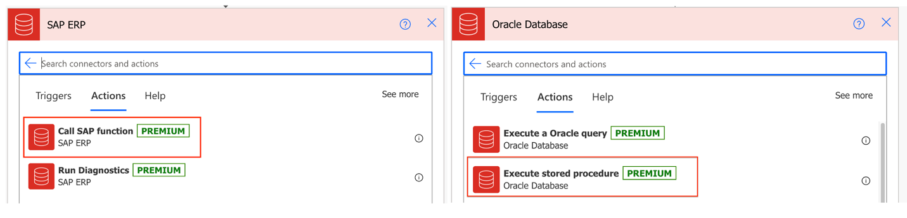
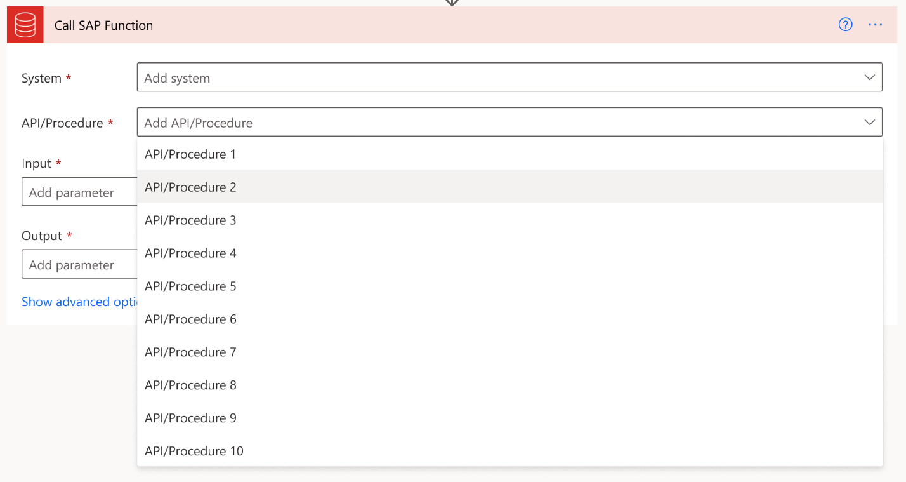
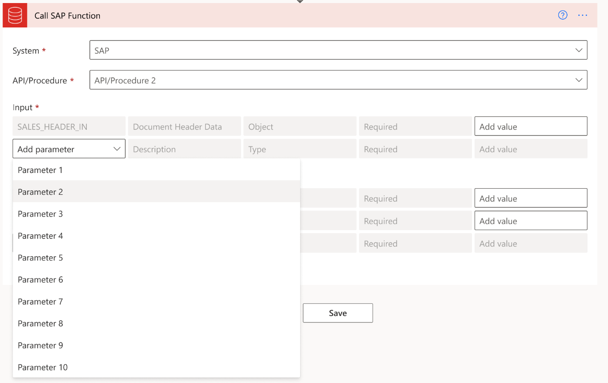
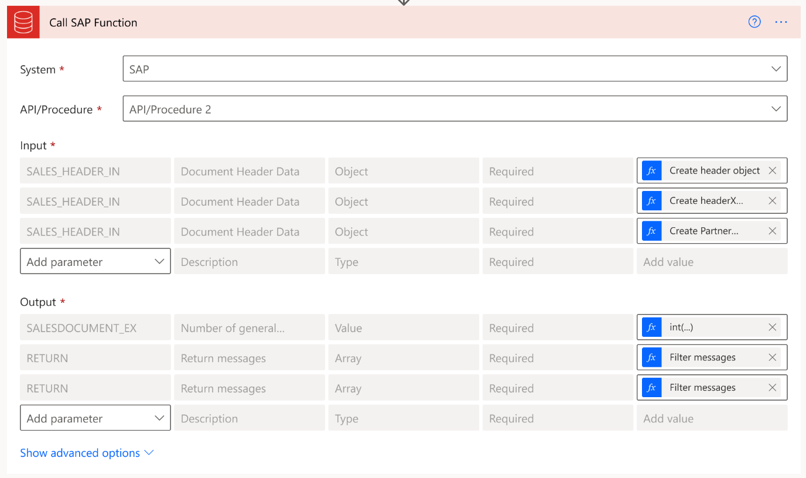

---
title: Configure complex APIs and verify the SAP integration (preview)
description: Learn about the different complex API action screens, the configuration parameters for the available action screens, and verify the SAP integration with Power Platform.
services: ''
suite: flow
documentationcenter: na
author: EllenWehrle
manager: jongilman
editor: ''
tags: ''
ms.devlang: na
ms.subservice: cloud-flow
ms.topic: article
ms.tgt_pltfrm: na
ms.workload: na
ms.date: 09/19/2022
ms.author: ellenwehrle
ms.reviewer: ellenwehrle
search.app: 
  - Flow
search.audienceType: 
  - flowmaker
  - enduser
contributors:
 - EllenWehrle
 - tapanm-msft
 - galitskyd
---

# Add connection references to flows (preview)

[This article is pre-release documentation and is subject to change.]

Once you have imported the SAP Integration solution in to Power Apps, you will need to sign in to Power Automate to add user- and system-level connection references.

The following steps will walk you through this process:

## Get started
An SAP BASIS administrator will need to complete the Call RFC function details.

1. Sign in to [Power Automate](<https://make.powerautomate.com>).
1. In the left navigation panel, select **Solutions**.
1. Select the  **SAP Integration** solution.
1. In the left navigation panel, select **Cloud flows**.
1. Select a flow.
1. Go to the command bar and click **Edit**. You will be able to see the flow.
1. Click the **New step** button.
1. The "Choose an operation" flow card will appear. Type SAP ERP into the text field to bring up the SAP ERP connector.
1. Select the **SAP ERP** connector.
1. In the "SAP system" field, add your JSON string containing system parameters.
1. In the "RFC name" field, select an RFC API that you want to modify.

### Access new screen

To access the function screen, select **Actions**:

SAP ERP > Call SAP Function
    

### Select System

Click on the **System** field to see a dropdown appear with options to select.

### Select API

Click on the **API** field to see a list of APIs that match the first three letters entered. Select the API

### Load API

Once you have selected the API, the definition of the API should be queried and the required Input and Output parameters should be loaded by default.

### Select Parameter

When you select **Add New Parameter**, a display list of valid parameters for the API filters out parameters that have already been added to the table. Use the following logic for SAP API:

- Use the SAP function RFC\_GET\_FUNCTION\_INTERFACE
- Set parameter FUNCNAME = '**&lt;API/Procedure&gt;**'. 
The valid parameters are returned in the PARAMS parameter.

    

### Enter Value

Within the Value column, the user needs to have the ability to use expressions, static values, dynamic values, and the following data operations:

- Select
- Filter
- Compose

    

### Completed State

The following example shows a state where a user has selected all the parameters needed to invoke the complex API:

### See also

- [Set up SAP integration with Power Platform (preview)](set-up-prepare.md)
- [Understand prebuilt solution available for integrating SAP with Power Platform (preview)](solutions.md)
- [Overview of SAP integration with Power Platform (preview)](overview.md)
