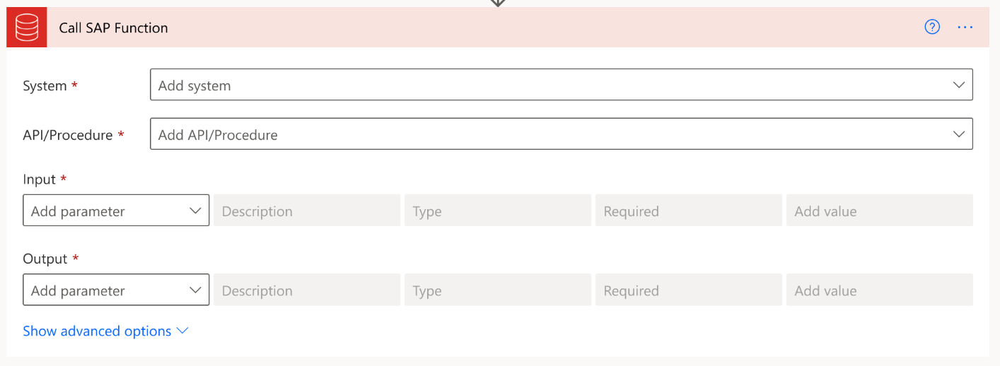
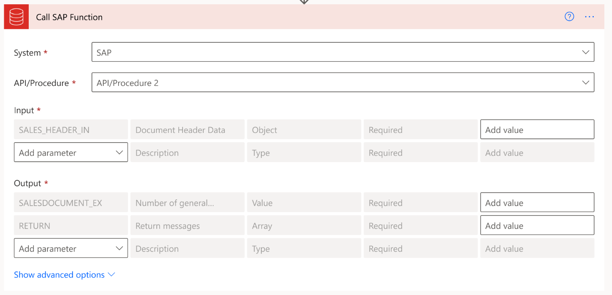

---
title: Configure action screens and verify the SAP integration (preview)
description: Learn about the different action screens, the configuration parameters for the available action screens, and verify the SAP integration with Power Platform.
services: ''
suite: flow
documentationcenter: na
author: EllenWehrle
manager: jongilman
editor: ''
tags: ''
ms.devlang: na
ms.subservice: cloud-flow
ms.topic: article
ms.tgt_pltfrm: na
ms.workload: na
ms.date: 09/19/2022
ms.author: ellenwehrle
ms.reviewer: ellenwehrle
search.app: 
  - Flow
search.audienceType: 
  - flowmaker
  - enduser
contributors:
 - EllenWehrle
 - tapanm-msft
---

# Configure action screens and verify the SAP integration (preview)

[This article is pre-release documentation and is subject to change.]

Enterprise software systems like SAP and Oracle EBS have very complex APIs, often with 30-50 arguments and several hundred fields per argument. In some cases, an API can have 2,000 – 4,000 fields in the definition. The current flow maker throws an exception for such APIs and the maker then needs to manually research and fill the arguments in raw JSON. The goal of this enhancement is to dramatically improve this user experience.

## Add Action screen

For the initial rollout of the Complex API screen, select **Add Action**:

1. SAP ERP > Call SAP Function

1. Oracle Database > Execute Stored Procedure

    

## Function Detail – Blank screen

The new function detail screen will initially be blank with 4 main areas of user input:

- System – the system to be called
- API/Procedure – the API or published stored procedure to be called
- Inputs – a tabular list of parameters to be passed to the API/Procedure
- Outputs – a tabular list of parameters to be returned the API/Procedure. The purpose here is to allow the maker to prune unnecessary data returned by the system of record.

    

## Function Detail – Select System

When selecting the System, show a drop down containing the systems that have been configured on the Systems page.


## Function Detail – Select API

Similar to the way Call SAP Function works today, display a list of APIs matching the user's text input after they have entered at least 3 characters. Depending on the system of record, use the following logic:

- If SAP, call RFC\_FUNCTION\_SEARCH with the FUNCNAME set to \***&lt;user's text input&gt;\***
- If Oracle Stored Procedure, use the following SQL: SELECT \* FROM ALL\_PROCEDURES WHERE PROCEDURE NAME LIKE '%**&lt;user's text input&gt;**%'

    

## Function Detail – Load API

Once the user has selected the API, the definition of the API should be queried and the required Input and Output parameters should be loaded by default, as shown in the screen mockup below. Depending on the system of record, use the following logic:

- If you're using SAP API, use the SAP function RFC\_GET\_FUNCTION\_INTERFACE and set parameter FUNCNAME = '**&lt;API/Procedure&gt;**'. Loop over each of the entries PARAMS parameter returned by SAP to determine the column values:

    - Parameter – set to PARAMETER
    - Description – set to PARAMTEXT
    - Type – use the following logic:

        ```
        
        Value
        
        
        Array
        
        
        Array
        
        
        Object
        
        Value
        
        
        
        
        ```

    - Required – If OPTIONAL = '' and OPTIONAL == "" and PARAMCLASS != 'X', set to Yes.

- If you're using Oracle Stored Procedure, use the following SQL: SELECT \* FROM ALL\_ARGUMENTS WHERE OBJECT\_NAME = '**&lt;API/Procedure&gt;**' AND DATA\_LEVEL = 0 ORDER BY POSITION. Loop over the results returned by Oracle to determine the column values:

    - Parameter – set to ARGUMENT\_NAME
    - Description – set to ARGUMENT\_NAME
    - Type – use the following logic:
        - If DATA\_TYPE = PL/SQL RECORD, set to Object
        - If DATA\_TYPE = PL/SQL TABLE, set to Array
        - Set to Value in all other cases
    - Required – If first 2 characters are P\_, set to Yes.

        

## Function Detail – Select Parameter

When you select **Add New Parameter**, display a list of valid parameters for the API, filtering out parameters that have already been added to the table. Depending on the system of record, use the following logic:

- If using SAP API, use the SAP function RFC\_GET\_FUNCTION\_INTERFACE and set parameter FUNCNAME = '**&lt;API/Procedure&gt;**'. The valid parameters are returned in the PARAMS parameter.

- If using Oracle Stored Procedure, use the following SQL: SELECT \* FROM ALL\_ARGUMENTS WHERE OBJECT\_NAME = '**&lt;API/Procedure&gt;**' ORDER BY POSITION.

    

## Function Detail – Enter Value

Within the Value column, the user needs to have the ability to use expressions, static values, dynamic values, and the following data operations:

- Select
- Filter
- Compose

    

## Function Detail – Completed State

The following example shows a state where a user has selected all the parameters needed to invoke the complex API:


## Verify SAP integration

The SAP integration with Power Platform enables Message Server support and allows for easier entering of parameters needed when connecting to SAP.

There is a minimum of two required fields for this action to begin:

- SAP System: This is a JSON string containing all the necessary SAP connection parameters. For a complete list of all the available properties, refer to the "SAP property guidance" table. The JSON string can be manually entered or chosen from an existing environment variable within a solution.
- RFC name: The name of the remote call function (RFC) you would like to call.

To test and verify SAP integration, use the above fields to configure the connection and validate changes from Power Platform to SAP.

### See also

- [Prepare and set up SAP integration with Power Platform (preview)](set-up-prepare.md)
- [Understand pPrebuilt solution available for integrating SAP with Power Platform (preview)](solutions.md)
- [Overview of SAP integration with Power Platform (preview)](overview.md)
