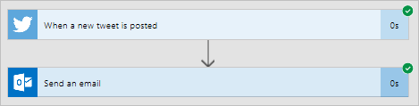
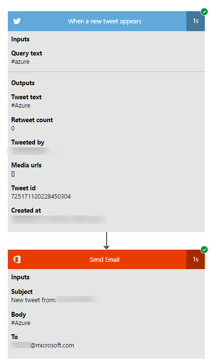

# Watch your flows in action

To ensure that your flows run as you expect, perform the trigger, and then review the inputs and outputs that each step in your flow generates.

1. Create or update a cloud flow, and then leave the designer open after you select **Create flow** or **Update flow**.

     For example, [create a cloud flow](get-started-logic-flow.md) that sends email whenever someone tweets using the **#azure** hashtag.
1. Perform the starting action for your flow.

    For example, send a tweet that contains the **#azure** hashtag.

    The starting action and each subsequent step indicates whether it succeeded and how long it took.

    
1. Select the trigger or action to see its inputs and outputs.

    
1. Select **Edit flow** to make more changes or select **Done** if the flow works as you expect.

[!INCLUDE[footer-include](includes/footer-banner.md)]
