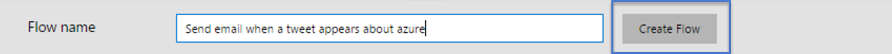
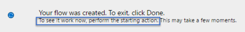
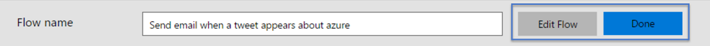

<properties
    pageTitle="See a flow run | Microsoft Flow"
    description="View the inputs and outputs for each step of a flow before you finish it to verify that it behaves as you expect."
    services=""
    suite="flow"
    documentationCenter="na"
    authors="merwanhade"
    manager="erikre"
    editor=""
    tags=""/>

<tags
   ms.service="flow"
   ms.devlang="na"
   ms.topic="article"
   ms.tgt_pltfrm="na"
   ms.workload="na"
   ms.date="04/25/2016"
   ms.author="mhade"/>

# Seeing your flows in action #
To ensure that your flows run as you expect them to, you can perform the starting action and see the inputs and outputs generated for each step in your flow. 

**Prerequisites**

- [Create a flow](get-started-logic-flow.md)

## Perform the starting action##
1. After authoring a flow, enter a flow name and select **Create flow**. If you are updating an existing flow, select **Update flow**.

 	For example, [create a flow](get-started-logic-template.md) that sends email to an address that you specify whenever anyone tweets using a particular keyword or hashtag, such as **#azure**. The email contains details about the tweet.

	  
	  
1. Your flow is created. To see the flow work now, perform the starting action. 

 	For example, send a tweet that contains the #azure hashtag.

	

	Your flow runs, and the results appear in the designer.

	

1. (optional) Select an individual trigger or action to show the inputs and outputs of the execution.

	

1. Once you've seen what the inputs and outputs of each step will be, you can either select **Edit flow** to make more changes or if you're ready to exit, select **Done**. 

	