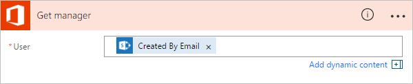

<properties
    pageTitle="Create a modern approval workflow with multiple approvers | Microsoft Flow"
    description="Create a modern approval workflow with multiple approvers "
    services=""
    suite="flow"
    documentationCenter="na"
    authors="MSFTMan"
    manager="anneta"
    editor=""
    tags=""/>

<tags
   ms.service="flow"
   ms.devlang="na"
   ms.topic="article"
   ms.tgt_pltfrm="na"
   ms.workload="na"
   ms.date="05/25/2017"
   ms.author="deonhe"/>

# Manage sequential approvals with Microsoft Flow

You can use Microsoft Flow to automate almost any workflow. Some workflows require pre-approval before the final approver is required to sign off. For example, a company may have a sequential approval policy that requires pre-approval for invoices over $1000.00 before they're approved by the Finance department.

In this walkthrough, we create a sequential approval flow that manages employee vacation requests. The flow starts after an employee creates a request for vacation in SharePoint. The flow then routes the request to someone for pre-approval. If the vacation request is pre-approved, the flow sends it to another person for final approval. If the pre-approver rejects the request, the final approver doesn't receive it. The flow also sends email to the employee whenever the status of the vacation request is changed by the pre-approver or the approver.

Note: Go to the [modern approvals walkthrough](./modern-approvals.md) if you want to create, and then test a single approver flow.

## Detailed steps in the flow

The flow:

1. Starts when an employee creates vacation request in a SharePoint Online list.

1. Adds the vacation request to the approval center, and then emails the request to the pre-approver.

1. Emails the pre-approval decision to the employee.

1. Updates the SharePoint Online list with the pre-approver's decision and comments.

   Note: If the request is pre-approved, the flow continues with these steps:

1. Sends the request to the final approver.

1. Emails the final decision to the employee.

1. Updates SharePoint list with the final decision.

This diagram summarizes the preceding steps:

   

## Prerequisites

- [Microsoft Flow](https://flow.microsoft.com).

- A SharePoint Online list.

- Office 365 Outlook and Office 365 Users account.

>[AZURE.NOTE]While we use SharePoint Online and Office 365 Outlook in this walk-through, you can use other services such as Zendesk, Salesforce, or Gmail.

Before you create the flow, create a [SharePoint Online list](https://support.office.com/article/Training-Create-and-set-up-a-list-1DDC1F5A-A908-478B-BB6D-608F34B71F94); later, we'll use this list to request approval for vacations.

The SharePoint Online list that you create must include the following columns:

   

Make note of the name and URL of the SharePoint Online list. We use these items later when you configure the **SharePoint - When a new item is created** trigger.

## Create your flow from the blank template

1. Sign into [Microsoft Flow](https://flow.microsoft.com).

     

1. Select the **My flows** tab.

     

1. Select **Create from blank**.

     

## Add a trigger

1. Enter **Sharepoint** into the search box.

     

1. Find, and then select the **SharePoint - When a new item is created** trigger.

     

1. Select the **Site Address** and the **List Name** for the SharePoint list that your flow monitors for new items.

   

## Get the manager for the person who created the vacation request

1. Select **New step**, and then select **Add an action**.

     

1. Enter **get manager** into the **Choose an action** search box.

1. Find, and then select the **Office 365 Users - Get manager** action.

     

1. Insert the **Created By Email** token into the **User** box on the **Get manager** card.

   This action gets the manger for the person who created the vacation request in SharePoint.

   

1. Provide a name for your flow, and then select **Create flow** to save the work we've done so far.

   

>[AZURE.NOTE] Select **Update flow** from the top of the screen periodically to save the changes to your flow.

   

After you save your flow, select **Edit flow** from the top of the screen, and then continue making changes.

## Add an approval action for pre-approvals

1. Select **Edit flow**.

     

1. Select **New step**, and then select **Add an action**.

     

1. Enter **approval** into the **Choose an action** search box.

     

1. Select the **Approvals - Start an approval** action.

     

1. Configure the **Start an approval** card to suit your needs.

     Note: **Title** and **Assigned To** are required.

     

This approval action sends vacation requests to the pre-approver's email address that's entered into the **Assigned To** box.

Note: Here, I've used a static email address in the **Assigned To** box. However, you may want to use the email address of the employee's manager as the pre-approver. If your organization uses Office 365, you can use the [Office 365 Users](https://flow.microsoft.com/services/shared_office365users/office-365-users/) service to dynamically get the email address for person's manager while the flow runs.

## Add a condition

1. Select **New step**, and then select **Add a condition**.

     

1. Select the **Object Name** box, and then enter **response** into the search box on the **Add dynamic content from the apps and services used in this flow** card.

1. Select the **Response** token.

     

1. Select the **Value** box, and then enter **Approve** into the box.

> [AZURE.NOTE]The valid responses to the **Approvals - Start an approval** action are "Approve" and "Reject". These responses are case-sensitive.

1. Your **Condition** card should now resemble this image:

     

>[AZURE.NOTE]This condition checks the response from the **Start an approval** action.

## Add an email action for pre-approvals

1. Select **Add an action** on the **IF YES, DO NOTHING** branch of the condition.

     

1. Enter **send email** into the search box on the **Choose an action** card.

     

1. Select the **Office 365 Outlook - Send an email** action.

     

1. Configure the email card to suit your needs.

     Note: **To**, **Subject**, and **Body** are required.

     This card is a template for the email that is sent when the status of the vacation request changes.

     Note: In the **Body** box on the **Send an email** card, use the **Comments** token from the **Approvals - Start an approval** action.

   

## Add an update action for pre-approved requests

1. Select **Add an action** from the **IF YES** branch.

1. Enter **update** into the search box on the **Choose an action** card.

     

1. Select the **SharePoint - Update item** action.

     

1. Configure the **Update item** card to suit your needs.

     Note: **Site Address**, **List Name**, **Id**, and **Title** are required.

   

## Get the pre-approver's manager

1. Use the [Get the manager for the person who created the vacation request](modern-approvals-sequential.md/#Get-the-manager-for-the-person-who-created-the-vacation-request) steps we did earlier to add, and then configure another **Office 365 Users - Get manager** action. This time we get the pre-approver's manager.

1. The **Get manager 2** card should look like this screenshot when you're finished. Be sure to use the **Email** token from the **Get manager** category on the **Add dynamic content from the apps and services used in this flow.** card.

   

## Add the final approval action

1. Use the [add an approval action for pre-approvals](modern-approvals-sequential.md/#Add-an-approval-action-for-pre-approvals) steps we did earlier to add, and then configure another **Start an approval** action. This action sends an email request for final approval.

1. When you're done, the card should resemble this image:

     

## Add the final approval condition

1. Repeat the steps from [add a condition](modern-approvals-sequential.md/#Add-a-condition) to add, and then configure a **Condition** that checks the final approver's decision.

## Send email with final approval

1. Use the steps from [Add an email action for pre-approvals](modern-approvals-sequential.md/#Add-an-email-action-for-pre-approvals) to add, and then configure an action that sends an email when vacation requests are approved.

1. When you're finished, your card should resemble this image:

   

## Update SharePoint with approval

1. Use the steps from [Add an update action for pre-approved requests](modern-approvals-sequential.md/#Add-an-update-action-for-pre-approved-requests) to add, and then configure an action that updates SharePoint when the vacation request is approved.

1. When you're finished, the card should resemble this image:

     

## Send email with pre-approval rejection

Expand the **Condition** card, and then perform the following steps:

1. Select **Add an action** on the **IF NO, DO NOTHING** branch.

1. Enter **Send email** into the search box of the **Choose an action** card.

     

1. Select the **Office 365 Outlook - Send an email** action.

     

1. Configure the email card to suit your needs.

     This card represents the template for the email that's sent when the status of vacation requests change.

   

## Update SharePoint with pre-approval rejection

1. Select **Add an action**.

     

1. Enter **update item** into the search box on the **Choose an action** card.

     

1. Select the **SharePoint - Update item** action.

     

1. Configure the card to suit your needs.

   

## Send email with final rejection

1. Use the steps from [Send email with pre-approval rejection](modern-approvals-sequential.md/#Send-email-with-pre-approval-rejection) to add, and then configure an action that sends an email when the vacation request is rejected by the final approver.

1. When you're finished, the card should resemble this image:

   

## Update SharePoint with final rejection

1. Use the steps from [Update SharePoint with pre-approval rejection](modern-approvals-sequential.md/#Update-SharePoint-with-pre-approval-rejection) to add, and then configure an action that updates SharePoint if the final approver rejects the vacation request.

1. When you're finished, the card should resemble this image:

   

1. Select **Update flow** to save the work we've done.

   

If you've followed along, your flow should resemble this screenshot:

Now that we've created the flow, let's see it in action.

## Request an approval

Create a vacation request in the SharePoint Online list you created earlier.

After you save this request, the flow triggers, and then:

1. Creates a request in the approvals center.

1. Sends an approval request email to the approvers.

Your request should resemble this image:

## View pending approval requests

View all pending approval requests by following these steps:

1. Sign into [Microsoft Flow](https://flow.microsoft.com).

     

1. Select the **Approvals** tab.

     

1. Find all pending approval requests under **Received requests**.

     

## Pre-approve a request

If you're an approver in an approval flow, you receive an email whenever someone creates a request. The approval request is also sent to the approvals center. You can then approve or reject requests from the email, the approvals center, or the Microsoft Flow app.

To approve a request:

### From email

1. Select **Approve** from the email you receive when an item is added to the SharePoint Online list.

     Note: If you're using an Android or iOS mobile phone with the Microsoft Flow app installed, the Microsoft Flow app launches, otherwise, the approvals center opens in your browser.

     

1. Enter a comment, and then select the **Confirm** button.

     

### From the approvals center

1. Sign into [Microsoft Flow](https://flow.microsoft.com).

     

1. Select the **Approvals** tab.

     

1. Select **Approve** on the request you want to approve.

     

1. Add a note, and then select the **Confirm** button.

     

### From the Microsoft Flow app

1. On your mobile phone with the Microsoft Flow app installed, select **Approve** from the request approval email.

1. Select **Confirm** in the upper right corner of the screen.

     

1. The success page shows, indicating that your approval has been recorded.

     

Note: The screens on Android and iOS may differ slightly, however, the functionality is the same on both devices.

## Approve the request

The steps to approve a request are identical to the steps to [pre-approve a request](modern-approvals-sequential.md/#Pre-approve-a-request)

Note: The final approver gets the vacation request only after the request has been pre-approved.

## Reject a request

You can reject a request via email, the approvals center, or the Microsoft Flow app. To reject a request, follow the steps above for approving a request, but, select **Reject**, instead of **Approve**.

After you confirm your decision (rejection of the request), the flow runs the following steps:

1. Sends an email to the person who requested vacation.

1. Updates the SharePoint Online list with the decision, and the comments from the approver.