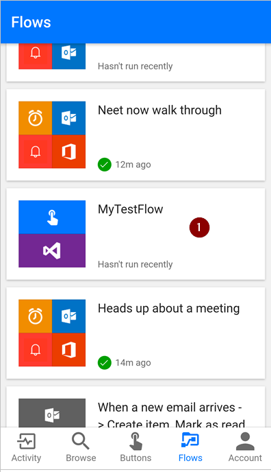
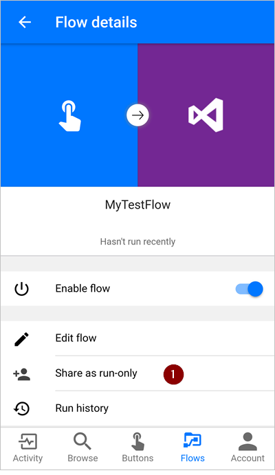
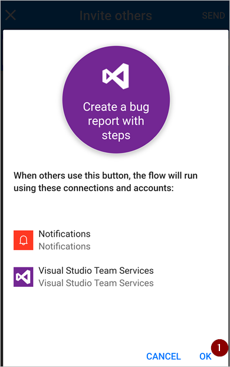
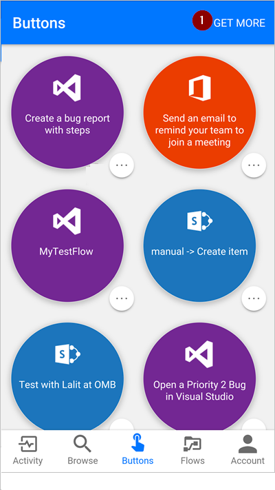

<properties
    pageTitle="Share button flows with others. | Microsoft Flow"
    description="Share button flows with others so they can save time by using your buttons."
    services=""
    suite="flow"
    documentationCenter="na"
    authors="msftman"
    manager="anneta"
    editor=""
    tags=""/>

<tags
   ms.service="flow"
   ms.devlang="na"
   ms.topic="article"
   ms.tgt_pltfrm="na"
   ms.workload="na"
   ms.date="03/15/2017"
   ms.author="deonhe"/>

# Share button flows from your mobile app

You can share [button flows](./introduction-to-button-flows.md) (buttons) with other users or groups within your organization. When you share a button flow, the person or group you share with can trigger and run your flow, the same way they run their own flows. You can stop sharing your flows at any time. You manage all button flow sharing activities from the Microsoft Flow mobile app.

>[AZURE.NOTE]All shared buttons run using the *connections* that the button creator used to design the button flow. However, persons or groups with whom a button flow has been shared can neither access the credentials used in these *connections*, nor reuse these *connections* in any other flow.

## What you need to share button flows

To share button flows, you need:

- An account with access to [Microsoft Flow](https://flow.microsoft.com).
- A flow to share.
- A mobile device with the Microsoft Flow app installed. This app is available for [iOS](https://itunes.apple.com/app/microsoft-flow/id1094928825) and [Android](https://play.google.com/store/apps/details?id=com.microsoft.flow) devices.
- A group or user within your organization with whom to share your button.

## Share a button flow

Sharing a button flow requires only a few steps from either the **Buttons** or **Flows** tab of the Microsoft Flow app.

From the **Buttons** tab:

1. Tap **...** next to the button flow you want to share.

     

1. Tap **Share as run-only**.

      

Optionally, from the **Flows** tab:

1. Tap the flow you want to share.

     

1. Tap **Share as run-only**.

      

After you've tapped **Share as run-only** from either the **Flows** or **Buttons** tab, follow these steps to share your button flow with another user or group:

1. Tap **Invite others** from the **Button users** page.

      

1. Search for, and then select the group or person with whom you'd like to share the button.

      

1. Tap **SEND** on the **Invite others** page.

      

1. Tap **OK** to acknowledge that your button flow will use the *connections* that exist in the button whenever the person or group you've shared it with runs it.

      

1. Tap **DONE** on the page that indicates the button flow sharing operation completed successfully.

      

## View the list of button users

You can view the list of groups or users with whom you have shared your buttons. You can view the list of button users from the **Buttons** or **Flows** tab.

From the **Buttons** tab:

1. Tap **...** next to the button flow you want to share.

     

1. Tap **Share as run-only**.

      

Optionally, from the **Flows** tab:

1. Tap the flow you want to share.

     

1. Tap **Share as run-only**.

      

After you've tapped **Share as run-only** from either the **Flows** or **Buttons** tab, you'll see the **Button users** page; this page shows the list of groups or users with whom the specific button is shared.

## Stop sharing a button

You can remove a user or group from the list of users if you no longer want to share a button flow with that user or group. You can remove a user or group from the **Buttons** or **Flows** tab.

From the **Buttons** tab:

1. Tap **...** next to the button flow you want to share.

     

1. Tap **Share as run-only**.

      

Optionally, from the **Flows** tab:

1. Tap the flow you want to share.

     

1. Tap **Share as run-only**.

      

After you've tapped **Share as run-only** from either the **Flows** or **Buttons** tab, you'll see the **Button users** page; this page shows the list of groups or users with whom the specific button is shared.

Use these steps from the **Button users** page to stop sharing a button flow with a user or group:

1. Tap the name of the user or group that you want to remove from the button users list.

     

1. Tap **Remove user** when the user's page is displayed.

     

1. Wait for the remove operation to complete. Notice the **Button users** list refreshes, and the user or group you removed is no longer listed.

     

## Monitor the run history of a shared button

All run history, including the runs initiated by a person with whom a button flow was shared, appear only on the **Activity** tab of the button flow creator's Microsoft Flow mobile app.

## Use buttons shared with me

You can find buttons that have been shared with you by going to the **Add buttons** list. You get to this list by tapping either the **New buttons are available** banner or **GET MORE**.

### From the New buttons are available banner

1. You will receive an alert on the **Buttons** tab whenever a new button flow is shared with you.

     

1. Select the **New buttons are available** banner, and then you will see the **Add buttons** list, which shows all button flows that have been shared with you.

     

1. Tap any button flow and it will immediately be added to the **Buttons** tab of the Microsoft Flow app. You can then use the button flow from the **Buttons** tab, just like any other button flow that's listed there.

### From **GET MORE**

1. Select **GET MORE** from the **Buttons** tab.

     

1. You will now see the **Add buttons** list, which shows all button flows that have been shared with you.

      

1. Tap any button flow and it will immediately be added to the **Buttons** tab of the Microsoft Flow app. You can then use the button flow from the **Buttons** tab, just like any other button flow that's listed there.

## Remove a shared button

If you no longer want to use a button that was shared with you, remove it from the **Buttons** tab by taking these steps from the **Buttons** tab:

1. Tap **...** next to the shared button flow you no longer want to use.

     

1. Tap **Remove** from the menu that appears.

      

That's it. The button will no longer appear on the **Buttons** tab of the Microsoft Flow app.

>[AZURE.NOTE]After you remove a shared button, if you need to, add it back into the **Buttons** tab later by selecting **GET MORE** from the **Buttons** tab.
