<properties
    pageTitle="Share your buttons with others. | Microsoft Flow"
    description="Share your buttons with others so they can use your buttons and save time."
    services=""
    suite="flow"
    documentationCenter="na"
    authors="msftman"
    manager="anneta"
    editor=""
    tags=""/>

<tags
   ms.service="flow"
   ms.devlang="na"
   ms.topic="article"
   ms.tgt_pltfrm="na"
   ms.workload="na"
   ms.date="03/22/2017"
   ms.author="deonhe"/>

# Share button flows in Microsoft Flow

In the Microsoft Flow mobile app, you can share [button flows](./introduction-to-button-flows.md) (buttons) with other users or groups within your organization. When you share a button, the person or group with whom you share can run your button, the same way they run their own buttons. You can also [share a link](share-buttons.md#re-share-a-button) to buttons that another person shared with you. You can [stop sharing](share-buttons.md#stop-sharing-a-button) your buttons at any time.

>The screenshots used in this document were taken from an Android device. If you're using an iPhone, the images may appear differently, but the functionality is the same.

Follow [these steps](share-buttons.md#use-shared-buttons) to use a button that someone shared with you.

## Prerequisites

To share buttons, you need:

- An account with access to [Microsoft Flow](https://flow.microsoft.com).
- A flow to share.
- A mobile device with the Microsoft Flow mobile app for [Android](https://aka.ms/flowmobiledocsandroid), [iOS](https://aka.ms/flowmobiledocsios), or [Windows Phone](https://aka.ms/flowmobilewindows).
- A group or user within your organization with whom to share your button.

## Share a button

You can share a button from the **Buttons** tab of the Microsoft Flow mobile app.

1. Tap **...** next to the button you want to share.

    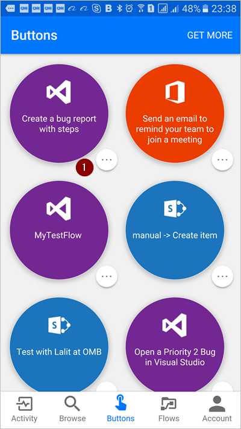

1. Tap **Share as run-only**.

    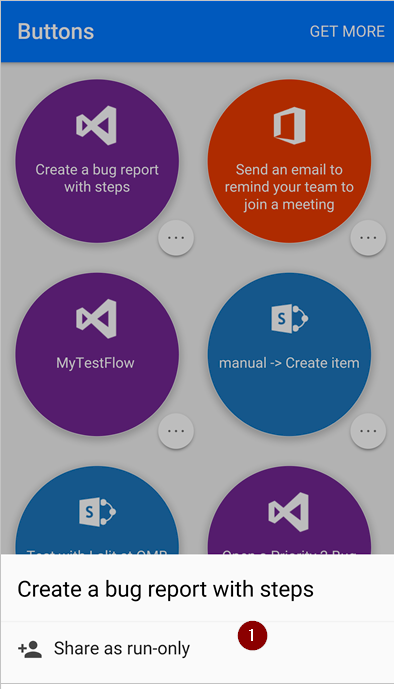

1. Tap **Invite others** from the **Button users** page.

    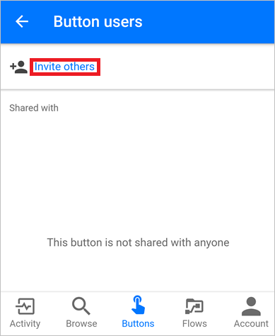

1. Search for, and then select the group or person with whom you'd like to share the button.

    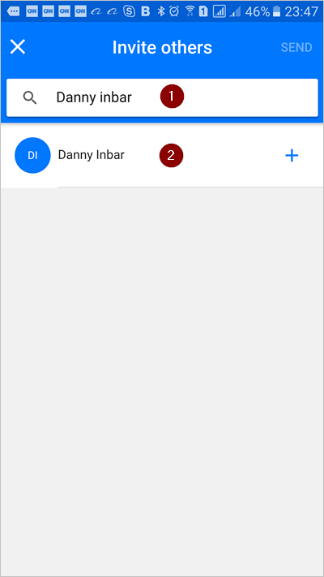

1. Tap **SEND** on the **Invite others** page.

    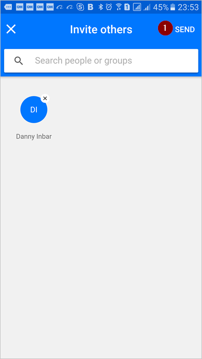

1. Tap **DONE** on the page that indicates the button sharing operation completed successfully.

    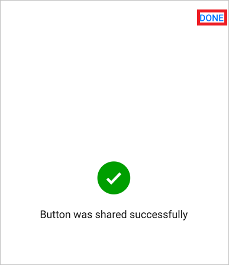

## Require users to use their own connections

>[AZURE.NOTE]When you share a button, you can allow persons with whom you've shared the button to use all connections that your button uses. You can also require them to use their own connections. If you allow others to use your connections, they can't access the credentials in your connection, or reuse them in any other flow.

Follow these steps to require persons with whom you've share your buttons to use their own connections.

1. Select **MANAGE CONNECTIONS** on the screen that's displayed immediately after you share a button.

1. Select **Provided by user**.

    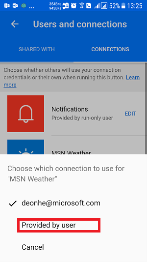

    You can view or change your selections from the **Flows** tab. To do so, select the flow you shared > **Users and connections** > **CONNECTIONS** tab > **EDIT**.

    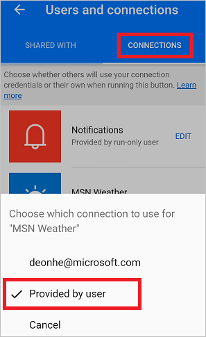

## View the list of button users

You can view all groups or users with whom a button is shared by following these steps from the **Buttons** tab:

1. Tap **...** next to the button in which you're interested, and then tap **Share as run-only**.

1. On the **Button users** page, view all groups or users with whom the button is shared.

    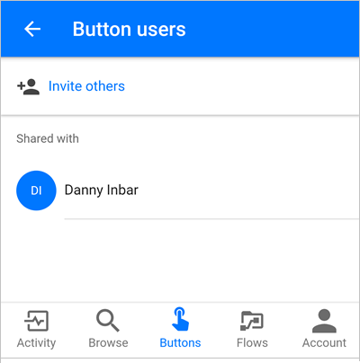

## Stop sharing a button

You can stop sharing a button by following these steps from the **Buttons** tab:

1. Tap **...** next to the button you no longer want to share, and then tap **Share as run-only**.

1. On the **Button users** page, tap the user or group with whom you want to stop sharing the button.

    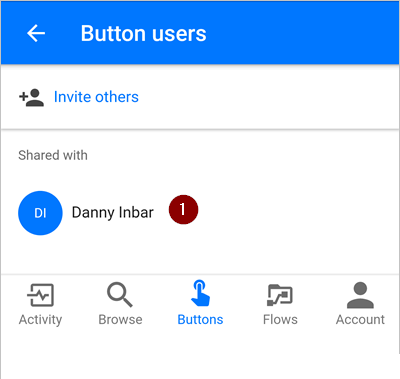

1. Tap **Remove user** when the user's page is displayed.

    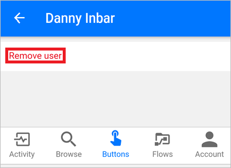

1. Wait for the remove operation to complete. Notice the **Button users** list refreshes, and the user or group you removed is no longer listed.

    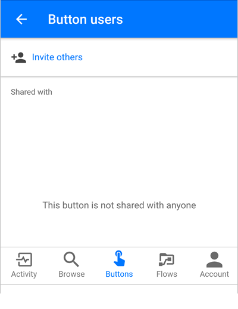

## Monitor the run history

All run history, including the runs initiated by a person with whom a button is shared, appear only on the **Activity** tab of the button creator's Microsoft Flow mobile app.

## Use shared buttons

Before you can run a button that someone has shared with you, you must add it to your **Buttons** tab from the **Add buttons** page.

1. Tap **GET MORE** (or the **New buttons are available** banner if it appears) on the **Buttons** tab.

    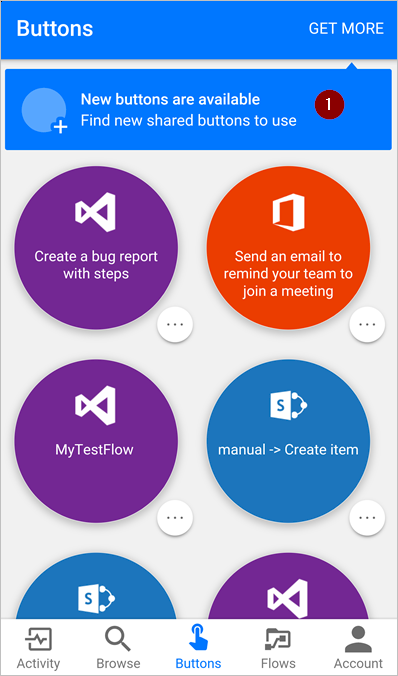

1. Tap the button you want to use.

    The tapped button will be immediately added to the **Buttons** tab of the Microsoft Flow app. You can then use the button from the **Buttons** tab, just like any other button that's listed there.

    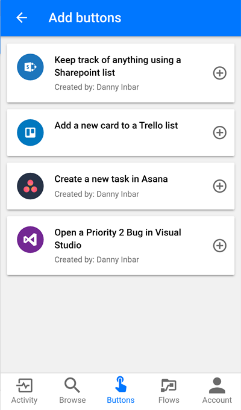

## Re-share a button

You can share a link to a button that's been shared with you.

1. Select **...** next to the button you want to share.

1. Select **Share button link**.

    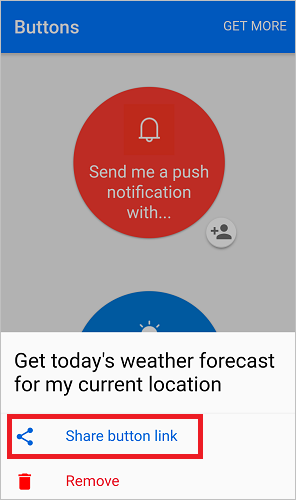

1. Select the app that you'd like to use to share the button, and then follow the steps to send the button to the person with whom you want to share.

## Stop using a shared button

If you no longer want to use a button that was shared with you, remove it from the **Buttons** tab by taking these steps:

1. On the **Buttons** tab, tap **...** next to the button you no longer want to use.

    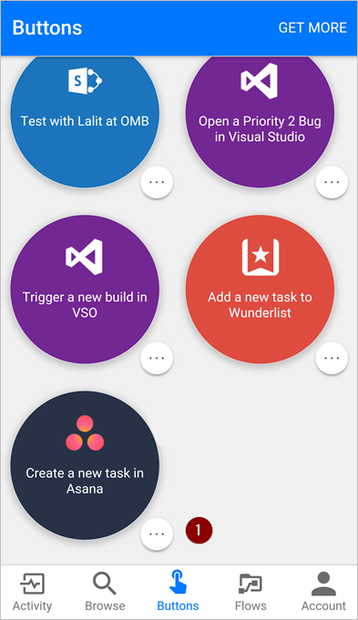

1. Tap **Remove** from the menu that appears.

    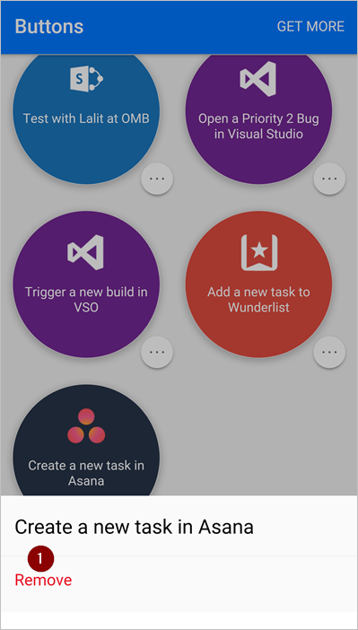

That's it. The button will no longer appear on the **Buttons** tab of the Microsoft Flow app.

>[AZURE.NOTE]After you remove a shared button, you can add it back by selecting **GET MORE** from the **Buttons** tab.

