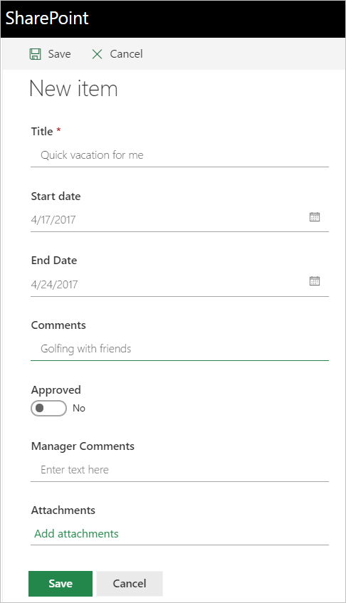
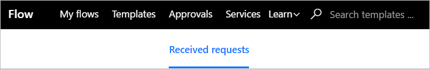
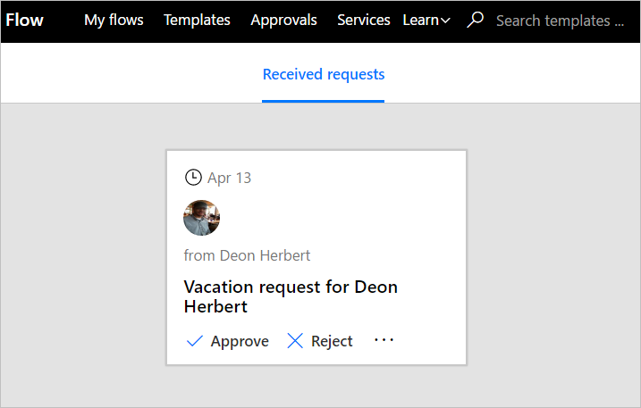
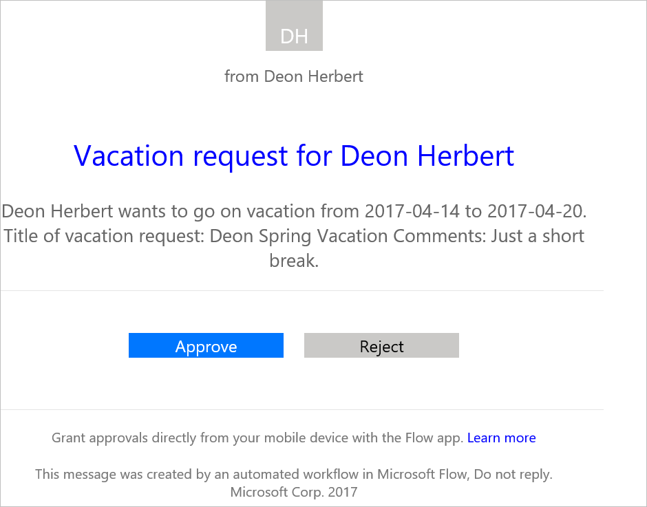
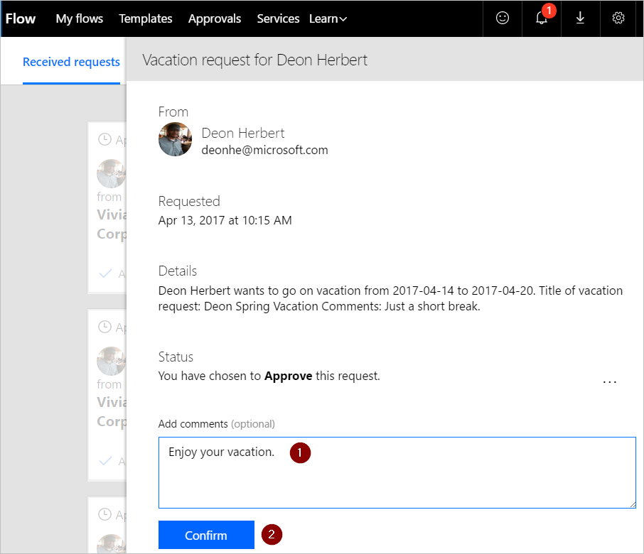
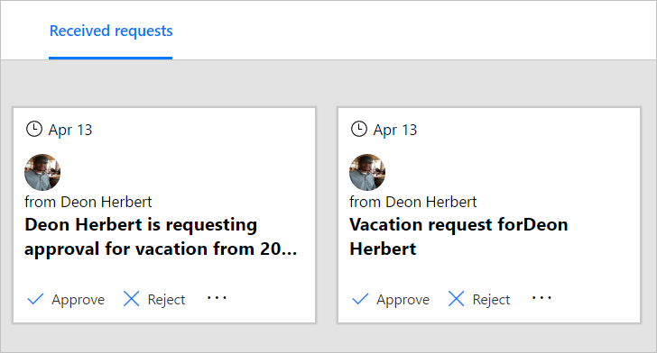
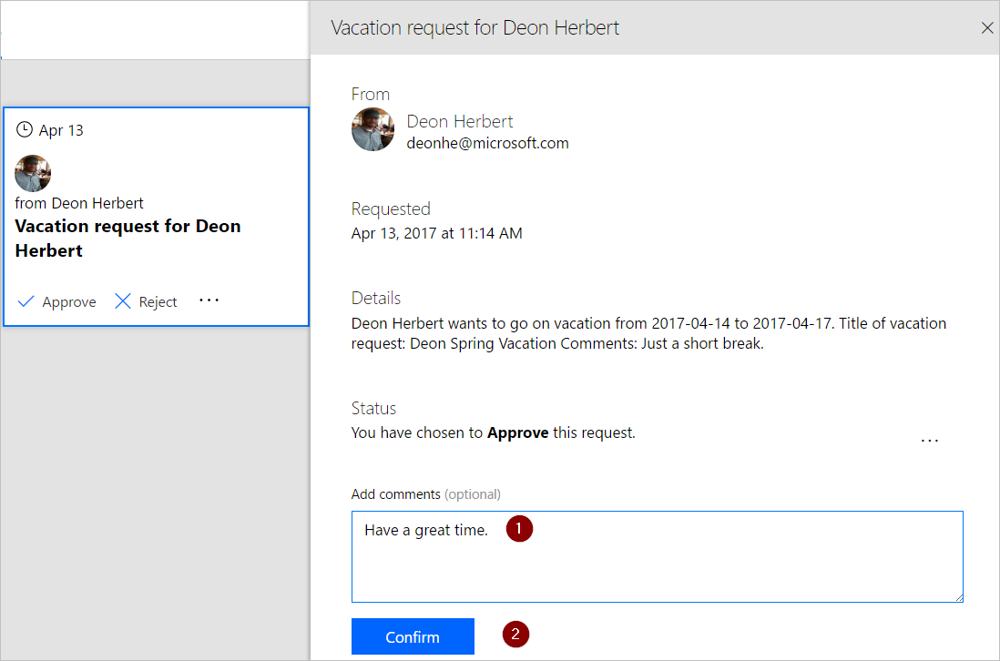
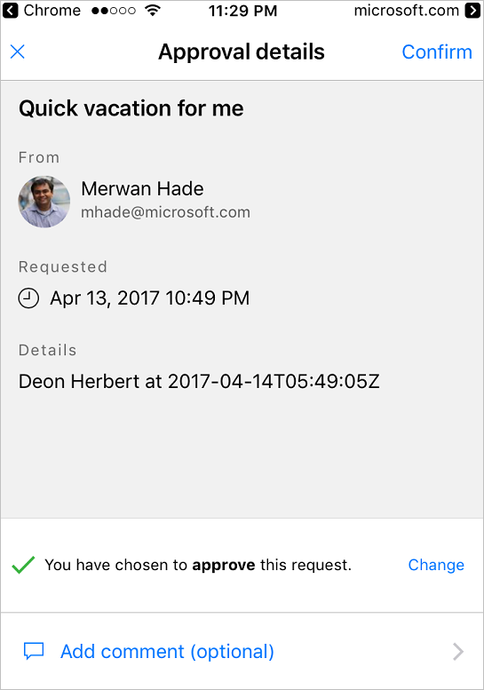

<properties
    pageTitle="Automate approval workflows. | Microsoft Flow"
    description="Automate approval workflows that integrate with SharePoint, Dynamics CRM, Salesforce, One Drive for Business, Zendesk, or WordPress."
    services=""
    suite="flow"
    documentationCenter="na"
    authors="msftman"
    manager="anneta"
    editor=""
    tags=""/>

<tags
   ms.service="flow"
   ms.devlang="na"
   ms.topic="article"
   ms.tgt_pltfrm="na"
   ms.workload="na"
   ms.date="04/20/2017"
   ms.author="deonhe"/>

# Manage approvals with Microsoft Flow

Add the Microsoft Flow **Approvals - Start an approval** action to flows to manage the approval of documents or processes. These flows can leverage several services, including SharePoint, Dynamics CRM, Salesforce, One Drive for Business, Zendesk, or WordPress.

For example, you can create a document approval flow that approves or rejects invoices, work orders, or sales quotations. You can also create a process approval flow that approves or rejects vacation requests, overtime work, or travel plans.

Approvers can manage requests from their email inbox, the approvals center on the Microsoft Flow website, or the Microsoft Flow app.

## Create an approval flow

In this walk-through, we'll create a flow that performs the following steps:

1. Starts when a vacation request is created in a SharePoint Online list.

1. Adds the vacation request to the approval center, and then emails the request to the approver.

1. Sends an email to the person who requested vacation, after the approver makes a decision.

1. Updates the SharePoint Online list with the decision, and any comments from the approver.

This diagram shows the details of the flow we'll create:

   

## Prerequisites

To complete this walk-through, you must have access to:

- [Microsoft Flow](https://flow.microsoft.com).

- A SharePoint Online list.

- Office 365 Outlook and Office 365 Users account.

>[AZURE.NOTE]While we use SharePoint Online and Office 365 Outlook in this walk-through, you can use other services such as Zendesk, Salesforce, or Gmail.

Before you create the flow, create a [SharePoint Online list](https://support.office.com/article/Training-Create-and-set-up-a-list-1DDC1F5A-A908-478B-BB6D-608F34B71F94); later, we'll use this list to request approval for vacations. The SharePoint Online list that you create must include the following columns:

   

Make note of the name and URL of the SharePoint Online list. You'll need these items later when you configure the **SharePoint - When a new item is created** trigger.

### Create your flow from the blank template

1. Sign into [Microsoft Flow](https://flow.microsoft.com).

     

1. Select the **My flows** tab.

     

1. Select **Create from blank**.

     

### Add a trigger

1. Enter **Sharepoint** into the search box.

     

1. Find, and then select the **SharePoint - When a new item is created** trigger.

     

1. Select the **Site Address** and the **List Name** for the SharePoint list that your flow monitors for new items.

     The **Site Address** and the **List Name** are the items you noted earlier in this walk-through.

     

### Add a profile action

1. Select **New step**, and then select **Add an action**.

     

1. Enter **profile** into the **Choose an action** search box.

     

1. Find, and then select the **Office 365 Users - Get my profile** action.

     

1. Provide a name for your flow, and then select **Create flow** to save the work we've done so far.

     

### Add an approval action

1. Select **Edit flow**.

     

1. Select **New step**, and then select **Add an action**.

     

1. Enter **approval** into the **Choose an action** search box.

     

1. Select the **Approvals - Start an approval** action.

     

1. Configure the **Start an approval** card to suit your needs.

     Note: **Title** and **Assigned To** are required.

     

### Add a condition

1. Select **New step**, and then select **Add a condition**.

     

1. Select the **Object Name** box, and then enter **response** into the search box on the **Add dynamic content from the apps and services used in this flow** card.

1. Select the **Response** token.

     

1. Select the **Value** box, and then enter **Approve** into the box.

> [AZURE.NOTE]The valid responses to the SharePoint Online list requests are "Approve" and "Reject". These responses are case-sensitive.

1. Your **Condition** card should now resemble this image:

     

## Add an email action for approvals

Follow these steps to send an email if the vacation request is approved:

1. Select **Add an action** on the **IF YES, DO NOTHING** branch of the condition.

     

1. Enter **send email** into the search box on the **Choose an action** card.

     

1. Select the **Office 365 Outlook - Send an email** action.

     

1. Configure the **Send an email** card to suit your needs.

     Note: **To**, **Subject**, and **Body** are required.

     This card is the email template for approved vacation requests.

     

     Note: In the **Body** box on the **Send an email** card, use the **Comments** token from the **Approvals - Start an approval** action.

### Add an update action for approved requests

1. Select **Add an action**.

     

1. Enter **update** into the search box on the **Choose an action** card.

     

1. Select the **SharePoint - Update item** action.

     

1. Configure the **Update item** card to suit your needs.

     Note: **Site Address**, **List Name**, **Id**, and **Title** are required.

     

### Add an email action for rejections

Follow these steps to configure the email template that is used if the vacation request is rejected:

1. Select **Add an action** on the **IF NO, DO NOTHING** branch of the condition.

1. Enter **Send email** into the search box of the **Choose an action** card.

     

1. Select the **Office 365 Outlook - Send an email** action.

     

1. Configure the **Send an email 2** card to suit your needs.

     Note: **To**, **Subject**, and **Body** are required.

     This card is the email template for rejected vacation requests.

     

### Add update action for rejected requests

1. Select **Add an action**.

     

1. Enter **update item** into the search box on the **Choose an action** card.

     

1. Select the **SharePoint - Update item** action.

     

1. Configure the **Update item 2** card to suit your needs.

     Note: **Site Address**, **List Name**, **Id**, and **Title** are required.

     

1. Select **Update flow** to save the work we've done.

     

If you've followed along, your flow should resemble this screenshot:

Now that we've created the flow, it's time to test it!

## Request an approval

Create a vacation request in the SharePoint Online list you created earlier.

Your request should resemble this image:

After you save this request, the flow triggers, and then:

1. Creates a request in the approvals center.

1. Sends an approval request email to the approvers.

## View pending approval requests

View all pending approval requests by following these steps:

1. Sign into [Microsoft Flow](https://flow.microsoft.com).

     

1. Select the **Approvals** tab.

     

1. View all **Received requests**.

     

## Approve a request

If you're the approver in an approval flow, you'll receive an email whenever someone creates a request. The approval request is also sent to the approvals center. You can approve or reject requests from the email, the approvals center, or the Microsoft Flow app.

To approve a request:

### From email

1. Select **Approve** from the email you receive when an item is added to the SharePoint Online list.

     Note: If you're using an Android or iOS mobile phone with the Microsoft Flow app installed, the Microsoft Flow app launches, otherwise, the approvals center opens in your browser.

     

1. Enter a comment, and then select the **Confirm** button.

     

### From the approvals center

1. Sign into [Microsoft Flow](https://flow.microsoft.com).

     

1. Select the **Approvals** tab.

     

1. Select **Approve** on the request you want to approve.

     

1. Add a note, and then select the **Confirm** button.

     

### From the Microsoft Flow app

1. On your mobile phone with the Microsoft Flow app installed, select **Approve** from the request approval email.

1. Select **Confirm** in the upper right corner of the screen.

     

1. The success page shows; this page indicates that your approval has been recorded.

     

Note: The screens on Android and iOS may differ slightly, however, the functionality is the same on both devices.

## Reject a request

You can reject a request via email, the approvals center, or the Microsoft Flow app. To reject a request, follow the steps above for approving a request, but, select **Reject**, instead of **Approve**.

After you confirm your decision (rejection of the request), the flow runs the following steps:

1. Sends an email to the person who requested vacation.

1. Updates the SharePoint Online list with the decision, and the comments from the approver.

