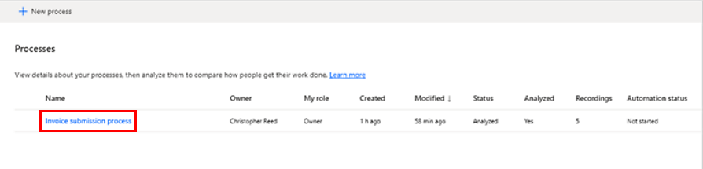
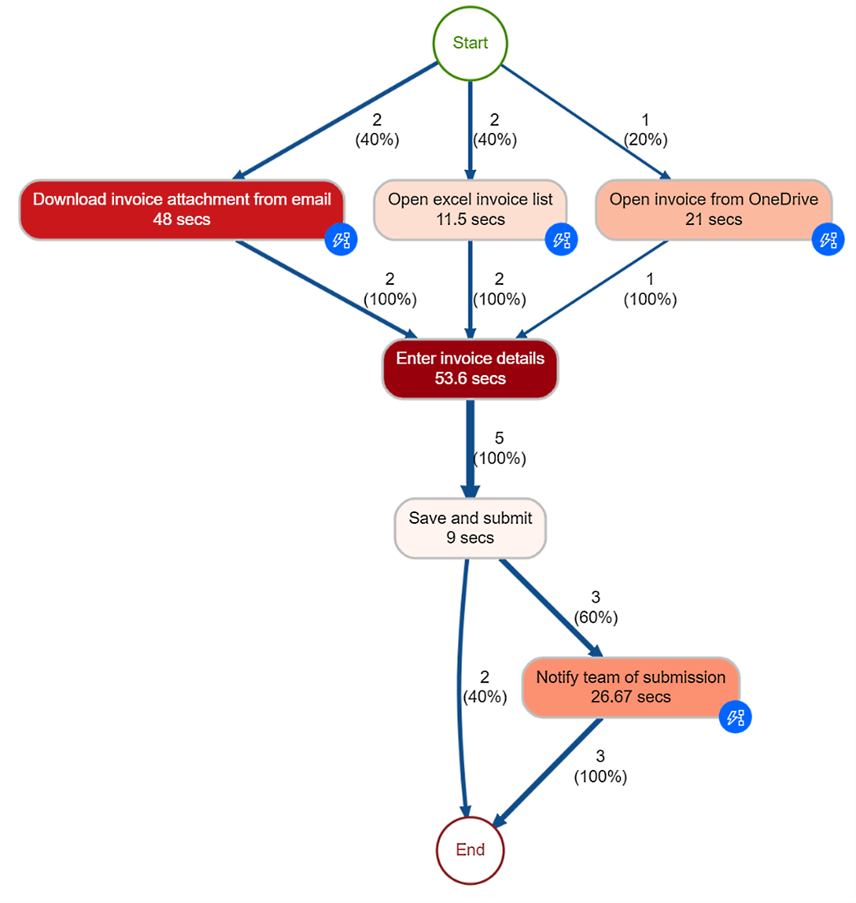
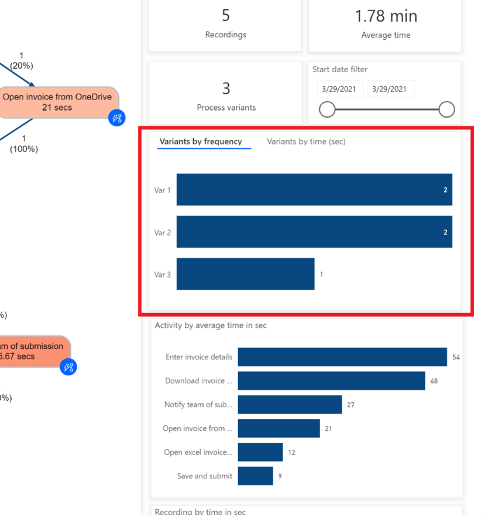
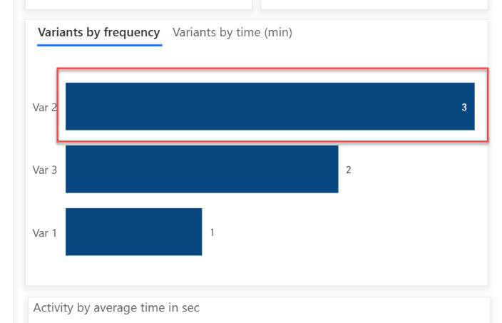
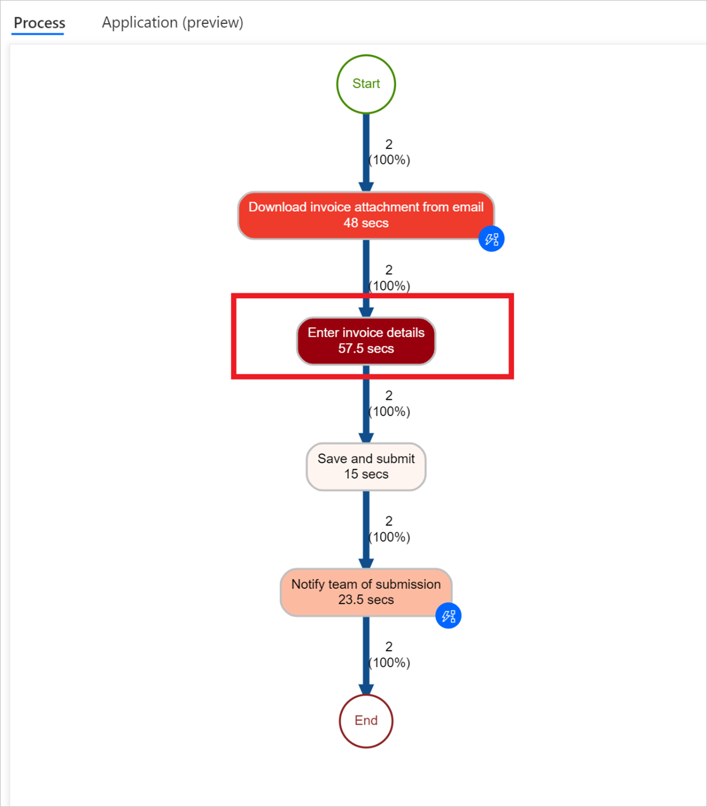
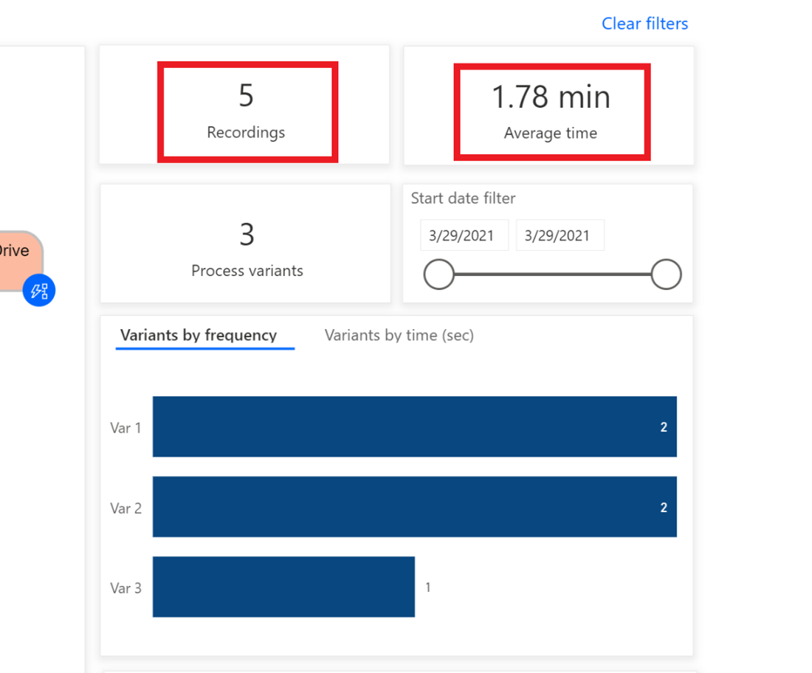

# Tutorial: Get started with task mining in process advisor

This tutorial with sample data allows you to experience task mining in the process advisor feature. In this tutorial, you will:

- [Import a solution](#import-a-solution).
- [View your recordings](#view-your-recordings).
- [Analyze your process](#analyze-your-process).
- [Gather insights with a process map](#gather-insights-with-a-process-map).
- [View metrics with activity combinations and variants](#view-metrics-with-activity-combinations-and-variants).
- [Identify automation opportunities](#identify-automation-opportunities).

For the task mining tutorial, go to [User recording demo data](https://go.microsoft.com/fwlink/?linkid=2175600). For the process mining tutorial, go to [Tutorial: Get started with process mining (preview)](process-mining-walkthrough.md).

## Get process advisor ready 

1. Sign in to [Power Automate](https://preview.flow.microsoft.com/en-us/?processinsights-core.tabularData=true).

1. Select your environment.

1. On the navigation pane to the left, select **Process advisor** > **Processes**.

    You might see a **Getting things ready** message. Allow this process to complete. It will take a few minutes.

    > [!div class="mx-imgBorder"]
    > 

    Once this process has completed, you should see the following screen:

    > [!div class="mx-imgBorder"]
    > 

## Import a solution

1. On the navigation pane to the left, select **Solutions**.

    > [!div class="mx-imgBorder"]
    > 

1. In the toolbar at the top, select **Import**.

    > [!div class="mx-imgBorder"]
    > 

1. Select **Browse**.

    > [!div class="mx-imgBorder"]
    > 

1. [Download the **RPAinaDayProcessAdvisor_1_0_0_7** solution .zip file](https://download.microsoft.com/download/9/9/5/9952b396-d9fb-4384-8d4e-5f127bf576c2/RPAinaDayProcessAdvisor_1_0_0_7.zip) and open it.

    > [!div class="mx-imgBorder"]
    > 

1. Select **Next**.

    > [!div class="mx-imgBorder"]
    > 

1. Select **Import** and wait for the solution to import.

    > [!div class="mx-imgBorder"]
    > 

## View your recordings

1. Once you've successfully imported the zip file, on the navigation pane to the left, select **Process advisor** > **Processes**.

    > [!div class="mx-imgBorder"]
    > 

11.	Select the **Invoice submission process**.

    > [!div class="mx-imgBorder"]
    > 

    > [!NOTE]
    > If this is the first time you're accessing process advisor, make sure you've selected **Processes** at least once and waited until the **Getting things ready** loading spinner disappeared before importing. If you try to import the RPAinadayProcessAdvisor_1_0_0_7.zip solution without first initializing the **Processes** section of process advisor, you'll see only a couple of recordings in the imported solution.

    You can see some of the existing recordings under **Recordings**.

1. To be sure you see the entire list of existing recordings, select **See all**.

    > [!div class="mx-imgBorder"]
    > 

1. Go back to the Invoice submission process by selecting **Invoice submission process**.

    > [!div class="mx-imgBorder"]
    > 

### Explore the features

You"ll see the following features:

> [!div class="mx-imgBorder"]
> 

- **New Recording**: Create a new recording.

- **Analytics**: See the process map and insights.

- **Share**: Share your processes with your team members.

    Process owners can pick two role options when sharing: contributor and co-owner. The contributor role would only give the user the ability to upload their own recording to the process. The co-owner role would give the user the ability to upload recordings and edit other recordings.

    > [!div class="mx-imgBorder"]
    > 

- **Analyze**: Analyze your processes.

- **Create activity names**: Create activity names for your process.
 
- **Delete process**: Delete your process.

## Analyze your process

1. Select **Analyze** to analyze your processes. When you perform this action, process advisor will analyze existing recordings to identify any bottlenecks within the business process.

    > [!div class="mx-imgBorder"]
    > 

1. Select **Confirm**.

   > [!div class="mx-imgBorder"]
   > 

1. The analysis will take a few minutes to complete. During this process, a status message displays under the **New recording** button. If you run into an error during the analysis stage, select **Analyze** to trigger this action again.

    > [!div class="mx-imgBorder"]
    > 

1. Once it's done, you'll see the **Process analysis status**  change to **Analyzed**. Select **Analytics** to see the process map and insights. This step may take a couple minutes to complete after the analysis has been performed.

    > [!div class="mx-imgBorder"]
    > 

### Analytics page layout

This section explains what you can do on the Analytics screen.

> [!div class="mx-imgBorder"]
> 

- **Automate activities (preview):** If during the recording process, a user used an application that has its Power Automate actions (for example Microsoft Outlook or Excel), then after selecting **Automate activities (preview)**, a draft Power Automate process would be opened containing the actions related to used applications that can be automated. The user would be then able to start building the final process using the proposed draft.

- **Legend:** Displays information about the report to let users better understand what they see.

- **Process:** Provides detailed information about the analyzed process. This is where users can find the process map and general information about the process (time analytics per variant, and per the recording’s author).

- **Application (preview):** Provides information about the apps used in recordings. This includes what apps were used by authors, how often were they used, and what were the transitions between them. This report explains what connectors should be used when implementing automation for the process, and where potentially to use Power Automate for desktop, as there’s no connector existing.

### Business process step relationships

In the previous example, you'll see the various steps in the business process and their related durations. These steps include:

- **Download invoice attachment from email (48 seconds)**.

- **Open Excel invoice list (11.5 seconds)**.

- **Open invoice from OneDrive (21 seconds)**.

- **Enter invoice details (53.6 seconds)**.

- **Save and submit (9 seconds)**.

- **Notify team of submission (26.67 seconds)**.

## Gather insights with a process map

The process map makes it possible to visualize and analyze processes. By looking at a graphical representation of how your business processes are performed, you can gather insights about where improvement opportunities exist.

Go to the process map by selecting **Analytics** > **Process map**.

> [!div class="mx-imgBorder"]
> 

## View metrics with activity combinations and variants

This section explains the **Variants by frequency** bars on the right.

> [!div class="mx-imgBorder"]
> 

Different activity combinations and variants are shown separately on the process map. A process variant is a unique path from the beginning to the end of the process. A process variant is a specific activity sequence, like a "trace" through the process, from start to end. Each variant differs from the others by at least one activity. You can see additional metrics, frequency of the activities, and throughput time on the process map. Frequency shows you the total number of recordings/cases passing through it. Throughput time is the time between the first event of the case and the last.
 
> [!div class="mx-imgBorder"]
> 

You can see that the invoice coming through email is the most frequent process variant.

It might take a while for you to see the changes from the chart.

> [!div class="mx-imgBorder"]
> 

## Identify automation opportunities

You can see that people spend a lot of their time entering the information in the application. This helps identify the opportunity to automate the process.

> [!div class="mx-imgBorder"]
> 

### View analytics data

1. Deselect **Var 1** by selecting any blank space within the **Variant by frequency** area.

    > [!div class="mx-imgBorder"]
    > 
  
1. Look at the top analytics data. The average this process time is 1.78 mins out of five recordings.  

    > [!div class="mx-imgBorder"]
    > 

1. Analyze other time-based metrics dashboards:

   - **Activity by average time in sec:** Notice that **Enter invoice details** and **Download invoice** are taking the most time.

        > [!div class="mx-imgBorder"]
        > 

    - **Recording by average time in min:** Notice that some people (**Preston Morales** and **Shakti Menon**) are taking more time than others.

        > [!div class="mx-imgBorder"]
        > 
 
1. Select **Application (preview)** tab where to see details on which applications were used.

    > [!div class="mx-imgBorder"]
    > ")

    It might take a while to load the reports.

    - This report is important, as it allows you to discover insights into the different applications used in a business process, the frequency with which they are accessed, and how much time is spent on the application.

    - *For example, the dashboard shows that a legacy invoicing app, outlook and Excel have significant contribution to time spent and actions by applications.*

    - Take time to get familiar with the different reports.
 
    > [!div class="mx-imgBorder"]
    >  screen")

1. Go back to the process map by selecting **Process**.

    > [!div class="mx-imgBorder"]
    > 

1. Look at the automate activities feature. From the process map, you can see that process advisor has highlighted several activities as potential candidates for automation based on applications involved inside the small blue circles.

    > [!div class="mx-imgBorder"]
    > 

1. Start creating a flow for automation by selecting **Automate activities (preview)** on the top.

    > [!div class="mx-imgBorder"]
    > ")

    A tab will open in the browser and show the flow designer. The recommended actions by process advisor that match to the activities from the process map automatically appear on the right panel. For example, several email connectors are suggested for you to for automating the **Download invoice attachment from email** activity.

    > [!div class="mx-imgBorder"]
    > 
 

