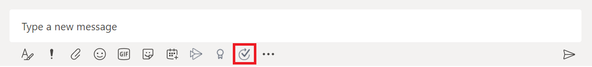
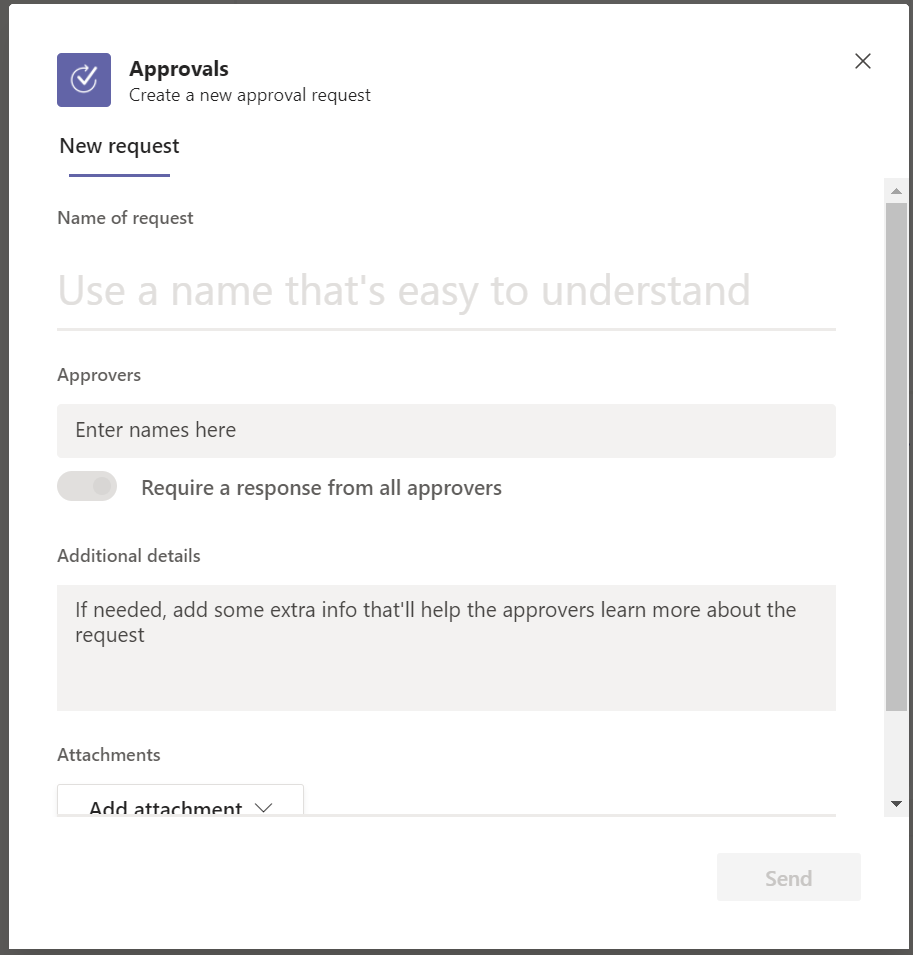
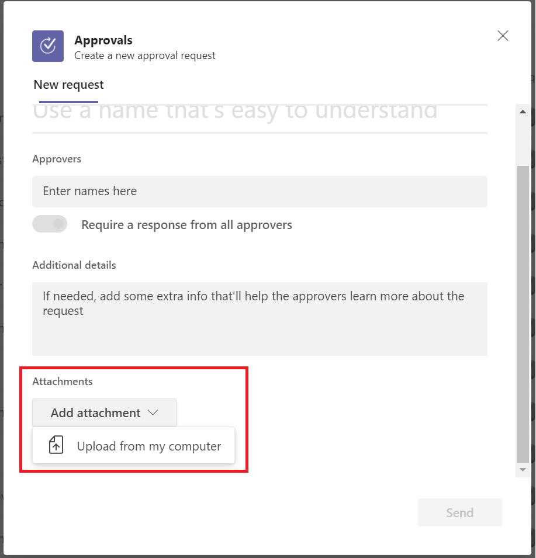
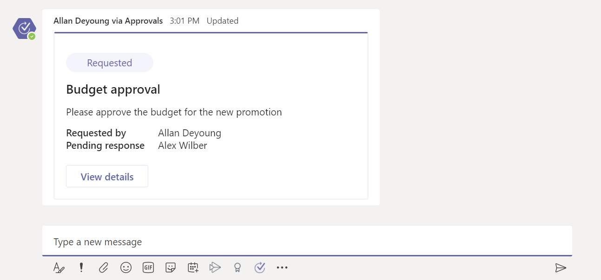
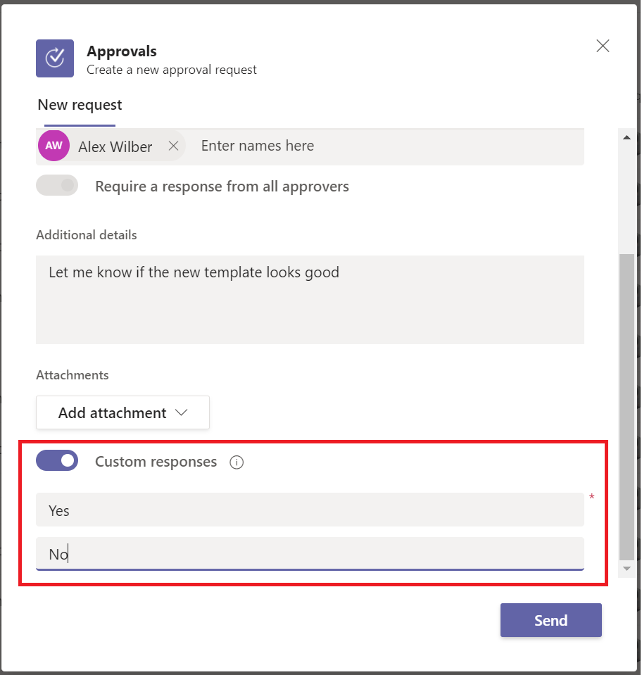

# Create an approval from a chat or channel

With the new approvals experience in Teams, you can create an approval from any chat or channel from the compose box.

## Start an approval in a chat or channel

Follow these steps to create an approval in a chat or channel in Teams.

1. Sign into [Microsoft Teams](https://teams.microsoft.com).
1. Navigate to the chat or channel in which you want to send the approval.
1. Select the approvals icon under the compose box.
   
   

1. When you select the icon, a modal dialog appears for you to enter the details of the approval.

   

1. Enter the details of the approval you want to send, along with who you need the approval from.

> [!TIP]
> By default, the approvers' input is restricted to the roster of the team or chat in which you are sending the approval.

1. **Optional**: You can also include a file with your approval. To do so, select *Add attachment* in the Approval form. Any files you upload are automatically stored in your OneDrive/SharePoint folder, just like other files shared on Teams.

   

1. Select **Send**. 

   A card is created and sent in the chat or channel.

   

## Custom responses for approvals

If you want to customize the actions for an approval, use the **Custom responses** option to change the action to anything you want. To do so, follow the same steps mentioned earlier and then toggle the custom responses option in the approvals form.

   

> [!TIP]
> If you want to add more than two custom responses, you will need to use a cloud flow to send the approval. [Learn more about custom responses in approvals](../create-approval-response-options.md).

## Known issue

Currently, all the approvals created using this native Teams experience are created in your organization's default environment.

[!INCLUDE[footer-include](../includes/footer-banner.md)]
