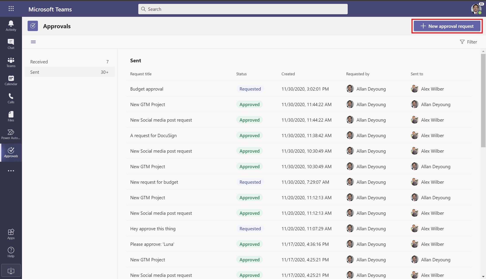
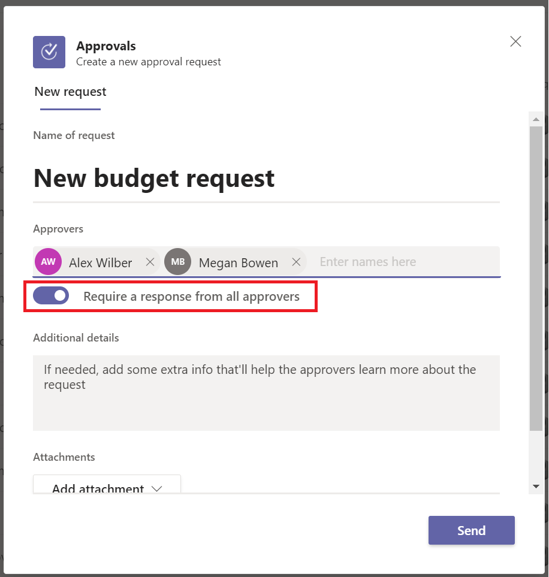

# Create an approval from the approvals app

You can trigger an approval at any time from the approvals app in Teams.

## Start an approval from the approvals app

Follow these steps to create an approval from the approvals app in Teams.

1. Sign into [Microsoft Teams](https://teams.microsoft.com).

2. Select **More added apps (...)**, search for **approvals**, and then select the **approvals** app.

   

3. Select **New Approval request** on the top right of the app.

   

4. Enter the details of the approval.

   

   >[!TIP]
   >If you are sending an approval to multiple users and you need everyone to respond, ensure that select the **Require a response from all approvers** option. If you only need one of the approvers to approve turn the option off.

   

5. Select **Send**. 

   The approval shows up in the **Sent** tab in the app.

   
   
## Known issues

Currently, all the approvals created using this native Teams experience are created in your organization's default environment.

[!INCLUDE[footer-include](../includes/footer-banner.md)]
