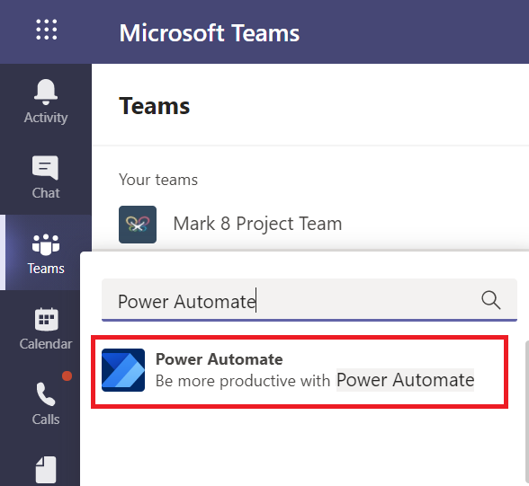
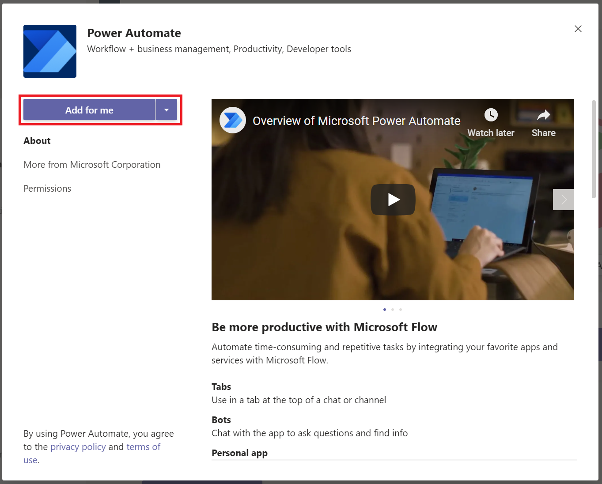
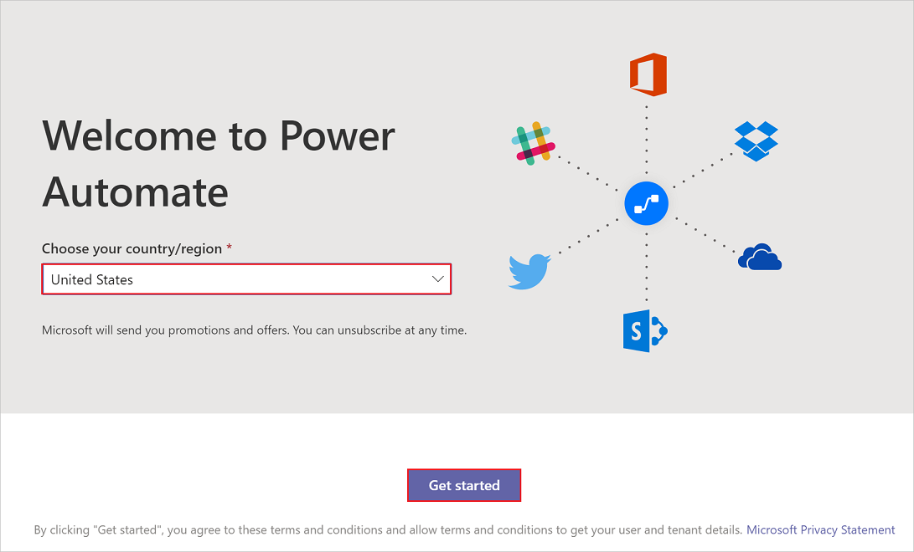
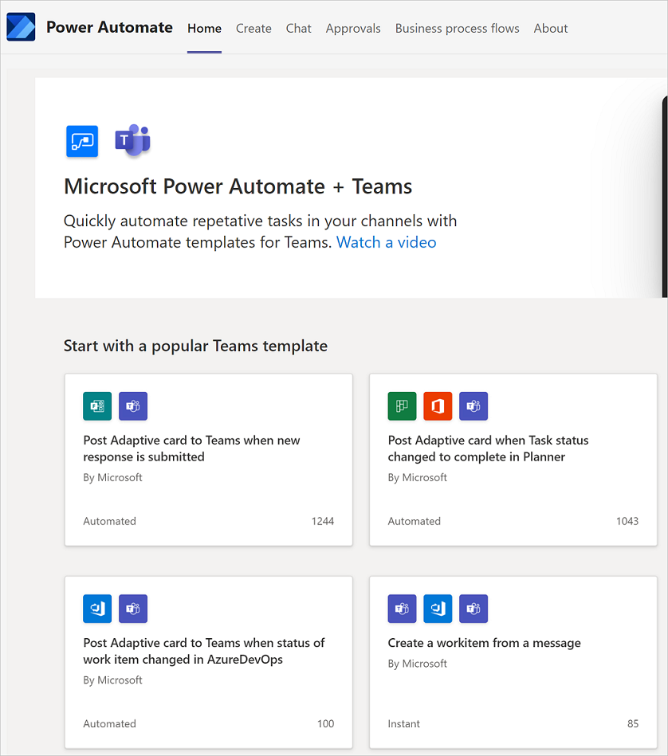

# Install the Power Automate app in Microsoft Teams

The Power Automate app lets you automate your Microsoft Teams activities or and connect Microsoft Teams to other apps and services. 

1. Sign into [Microsoft Teams](https://teams.microsoft.com).

1. Select **More added apps (...)**, search for **Power Automate**, and then select the **Power Automate** app.

   

1. Select **Add for me**.

   

1. Select your **Country/region**, and then select **Get started**.

   

   After a few moments, the Power Automate app installs. You can access the app in Microsoft Teams from the left pane.

   

>[!TIP]
>You can also install the Power Automate app from the [Microsoft Teams app store](https://teams.microsoft.com/l/app/c3a1996d-db0f-4857-a6ea-7aabf0266b00?source=store-copy-link). 

## Pin the Power Automate app

>[!TIP]
>You can pin the Power Automate app in Microsoft Teams, allowing you to access it more easily at a later time.

Follow these steps to pin the Power Automate app in Microsoft Teams:

1. Right-click on **Power Automate** in the pane on the left side.

1. Select **Pin**. 

   

## Get started with the Power Automate app

From the **Home** tab, you can [create](./teams-app-create.md) and [manage](./teams-app-home.md) your flows.

## Known issues

The Power Automate app in Microsoft Teams only shows flows from your organization's default environment. Any flow that you create from the Power Automate app is located in the default environment.

## Next Steps

- [Create flows in Microsoft Teams](./teams-app-create.md).

- [Manage your flows in Microsoft Teams](./teams-app-home.md).

[!INCLUDE[footer-include](../includes/footer-banner.md)]