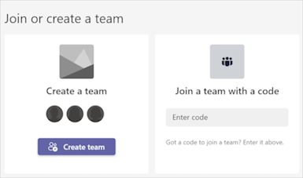

# Use flows in teams created from templates

Microsoft Teams templates are prebuilt definitions of a team's structure that are designed around a specific business need or project.

Power Automate templates and team templates are meant to address similar business scenarios. When you create a team with a Microsoft-provided team template, you get a curated selection of flow templates that are specific to your team scenario.

Here are the five team templates that support scenario-specific flow templates.

- Manage a Project
- Manage an Event
- Organize a Help Desk
- Incident Response
- Onboard Employees

For example, if you create a team from the **Manage a Project** template, the recommended flow templates on the Power Automate tab in the General channel is filtered to your Manage a Project scenario.

For example, follow these steps to use the **Manage a Project** template from within Microsoft Teams.

1. Open Microsoft Teams.
1. Select **Teams** from the top of the panel on the left.
1. Select **Join or create a team** from the bottom of the **Teams** panel on the left.
1. Select **Create team** from the **Join or create a team** screen.

   

1. Select the **Manage a Project** template.

1. On the **Manage a Project** screen, select **Next** after you review the summary and details of the template.

    :::image type="content" source="../media/teams-templates/manage-project-screen.png" alt-text="Screenshot of the 'Manage a Project' screen.":::

1. Select the **Sensitivity** and **Privacy** levels for your team.
  
1. Give your team a name, a description, and then select **Create**.

1. Wait while the team is created.

1. After you create the team, select the **Power Automate** tab in the **General** channel, and then select **Set up tab**.

1. On the **Power Automate** screen, check the **Post to the channel about this tab** checknox, and then select **Save** .

   

1. Scroll down the **Power Automate** tab to view the list of suggested Power Automate flow templates that are relevant to your team's scenario.

   

You can now select any of the flow templates listed to customize your team.

> [!TIP]
> You can use any of the five team templates listed earlier in the article to create a team that's right for your organization.

## Related information

- [Create a cloud flow from a description](../create-cloud-flow-from-description.md#use-natural-language-to-flow-in-teams)
- [Use team templates in the admin center](/MicrosoftTeams/get-started-with-teams-templates-in-the-admin-console)
- [Create a team with a Teams templates](https://support.microsoft.com/office/create-a-team-with-team-templates-702a2977-e662-4038-bef5-bdf8ee47b17b)
