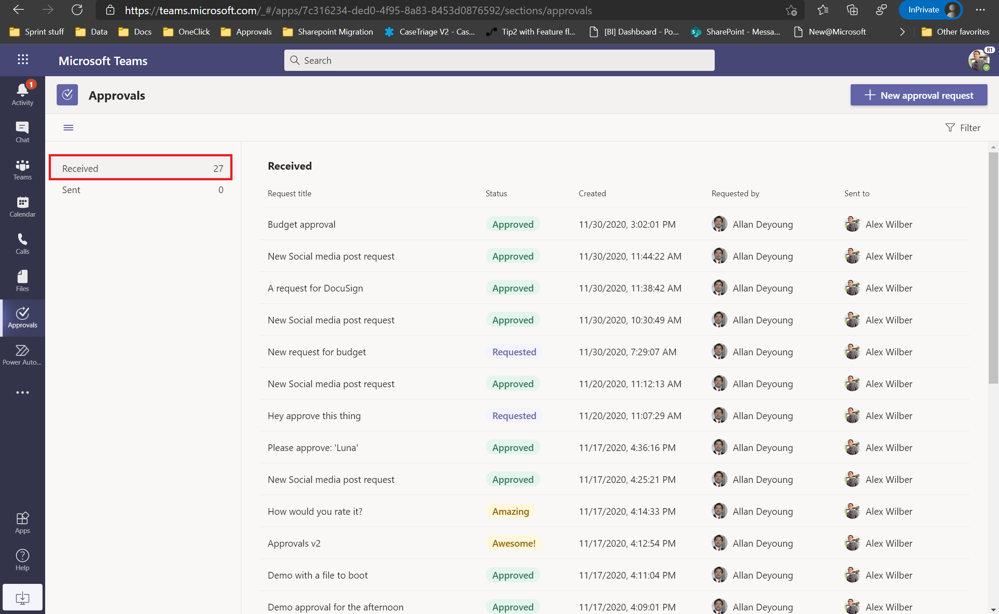
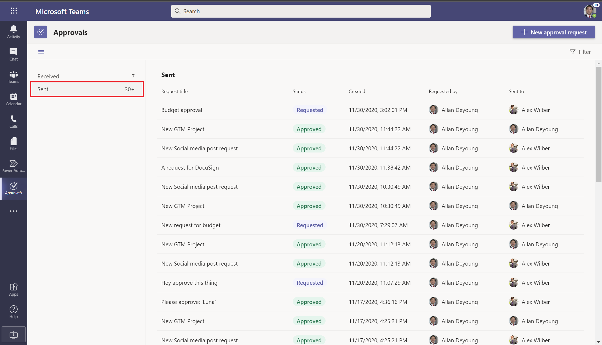
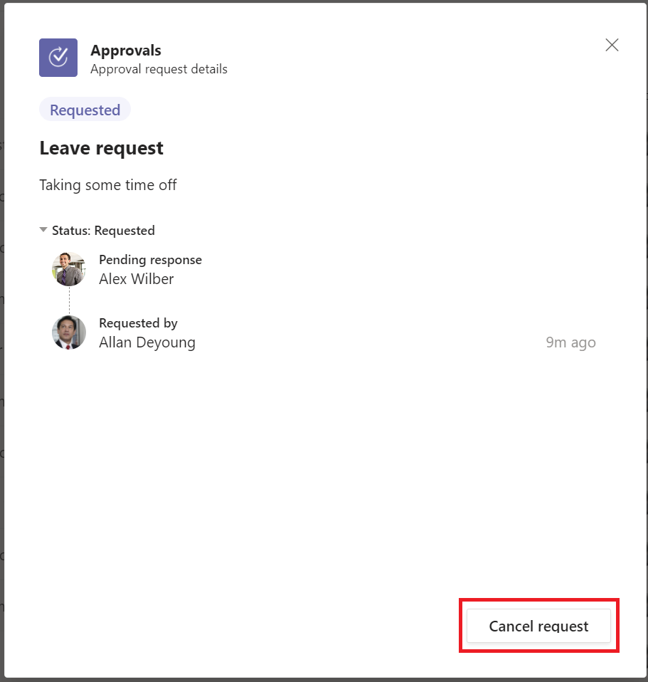

# Manage your approvals from the approvals app in Teams

The approvals app in Teams gives you an overview of all the approvals that you have sent or received in your organization's default tenant. This includes approvals you might have received through chat or channel messages, direct approvals, and even approvals that come in through a flow.

From here you can either approve or reject an approval you have received, or cancel an approval you have sent out.

## View approvals

From the main approvals app in Teams, you can get a view of all the approvals you have sent or received.

## Cancel an approval request

From the **Sent** tab, you can choose to cancel an approval that is still in progress. To do so, select the approval you want to cancel and then select the **Cancel** approval option.

>[!NOTE]
>You can only cancel approvals that are in progress.

[!INCLUDE[footer-include](../includes/footer-banner.md)]
