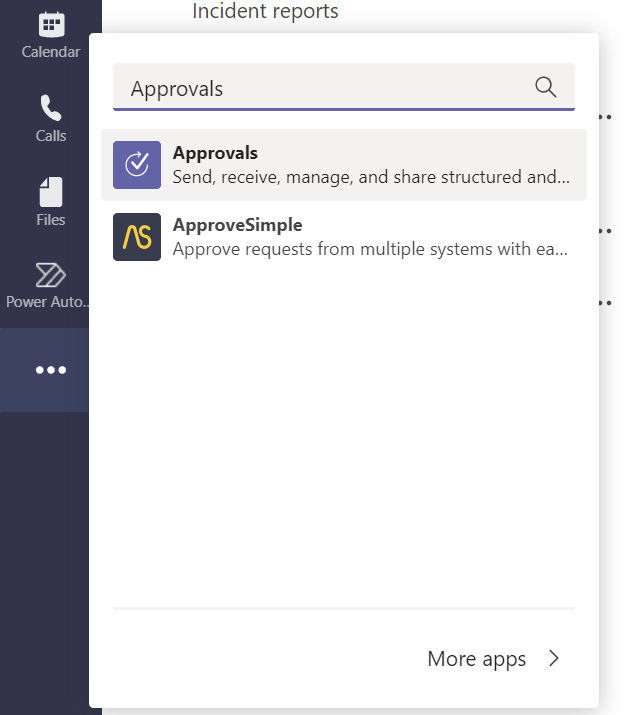

# Approvals in Microsoft Teams

Approvals in Microsoft Teams is a native Teams application that lets you easily create, manage, and share approvals from your hub for teamwork.

You can quickly start an approval flow from the same place you send a chat, a channel conversation, or from the approvals app itself. Just select an approval type, add details, attach files, and choose approvers. Once submitted, approvers are notified and can review and act on the request.

These approvals are triggered directly with the Power Automate infrastructure and don't require a flow with an approvals action. Though, if you wish to modify your approvals, by creating custom pre-approval or post-approvals actions, you can create a flow for your approval.

Learn more about how to use approvals in Teams in the following video.

> [!VIDEO https://learn-video.azurefd.net/vod/player?id=32135b16-f88d-43dc-8537-a960235611f1]

## Use the approvals app in Teams

1. Sign into [Microsoft Teams](https://teams.microsoft.com)

1. Select **More added apps (...)**, search for **Approvals**, and then select the **approvals** app

   

>[!TIP]
>If you do not see the approvals app in the more apps menu, it is likely that your Teams Administrator has disabled the app in your tenant. Contact your Teams administrator to enable the approvals app from the Teams admin center.

## Known issues

Currently, all the approvals are created in your organization's default environment.

[!INCLUDE[footer-include](../includes/footer-banner.md)]
