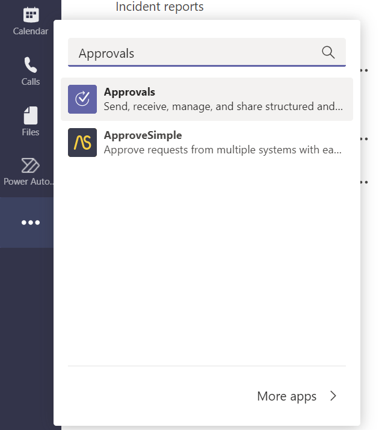

# Approvals in Microsoft Teams

Approvals in Microsoft Teams is a native Teams application that you can use to create, manage, and share approvals from your hub for teamwork.

You can quickly start an approval flow from the same place you send a chat, a channel conversation, or from the approvals app itself. Select an approval type, add details, attach files, and choose approvers. When you submit the request, approvers get a notification and can review and act on the request.

These approvals trigger directly with the Power Automate infrastructure and don't require a flow with an approvals action. If you want to modify your approvals by creating custom pre-approval or post-approval actions, you can create a flow for your approval.

Learn more about how to use approvals in Teams in the following video.

> [!VIDEO https://learn-video.azurefd.net/vod/player?id=32135b16-f88d-43dc-8537-a960235611f1]

## Use the approvals app in Teams

1. Sign in to [Microsoft Teams](https://teams.microsoft.com).

1. Select **View more apps (...)**, search for "approvals," and then select the **Approvals** app.

   

>[!TIP]
>
> If you don't see the Approvals app in the more apps menu, your Teams administrator likely disabled the app in your tenant. Contact your Teams administrator to enable the Approvals app from the Teams admin center.

## Known issues

Currently, all approvals are created in your organization's default environment.

[!INCLUDE[footer-include](../includes/footer-banner.md)]
