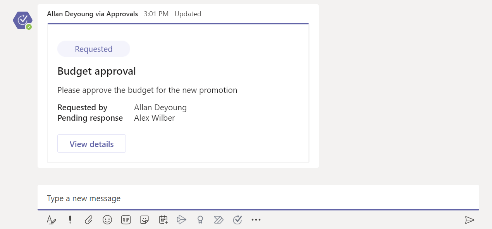
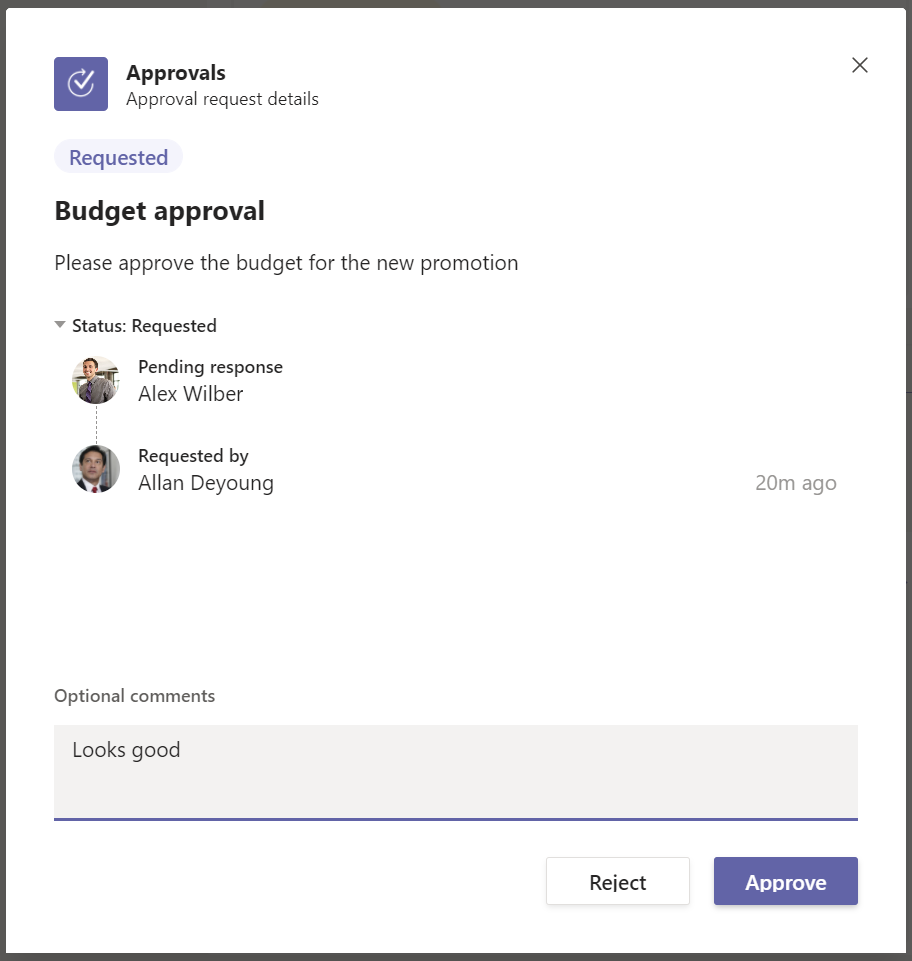
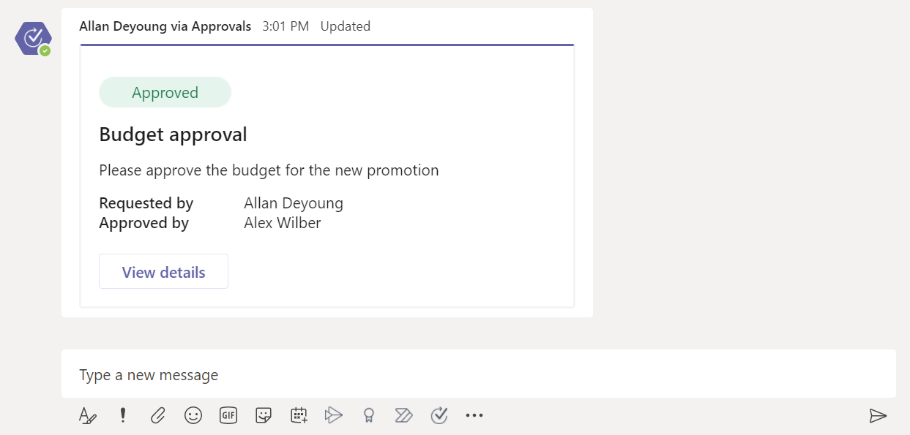
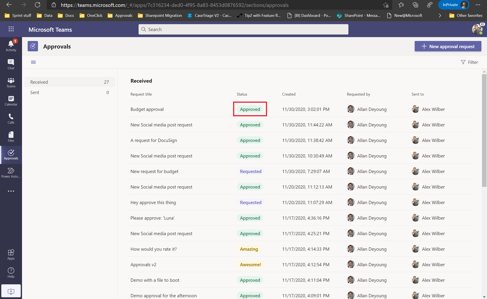
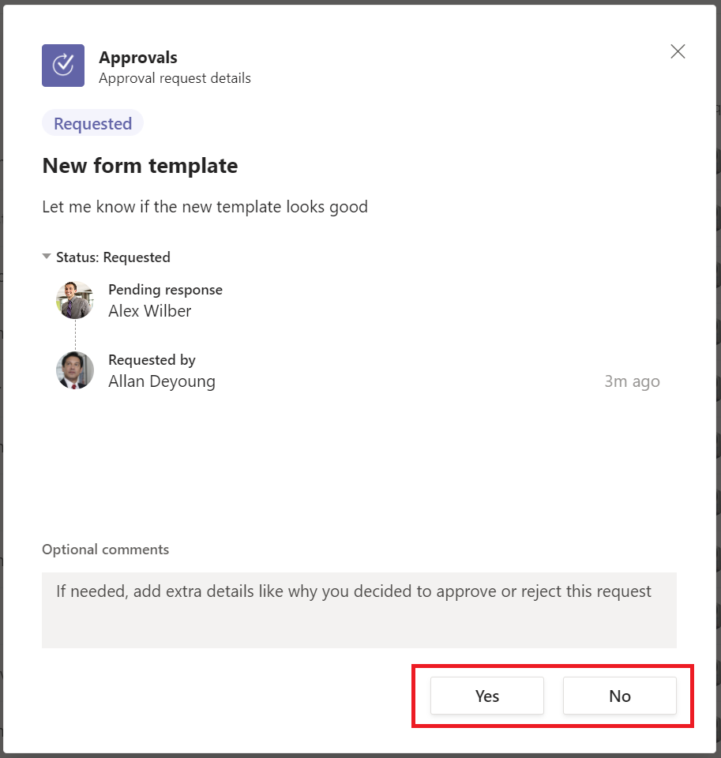

# Respond to an approval from a chat or channel

If a user sends you an approval in a chat or channel message or from the approvals app, you can respond to it directly from within the Teams chat or channel or from the approvals app.

The approvals app also shows you any approvals that were sent using a flow in the same environment. So, you can use the approvals app in Teams to manage all your approvals.

## Approve or reject a request in Teams

Follow these steps to respond to an approval in a chat or channel in Microsoft Teams.

1. Sign into [Microsoft Teams](https://teams.microsoft.com).

2. Go to the chat or channel in which you were sent the approval.

   You should see a card with the approval.

   

   Alternately, you can open the approvals app in Teams and go to the **Received** tab.

   

3. Select **View details** on the card or select the approval to open the approval form.
   
   

4. From here, you can approve or reject the approval. You can also include comments with your decision. Once approved, the state is updated in the card or the app.

   

   

>[!TIP]
>If the approver has chosen to send an approval with custom responses, the actions at the bottom can differ. For example:

[!INCLUDE[footer-include](../includes/footer-banner.md)]
