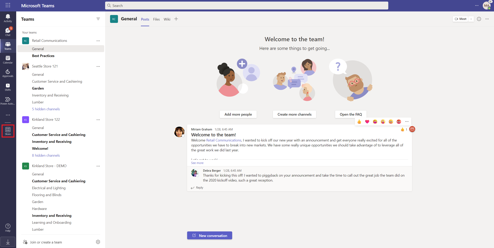
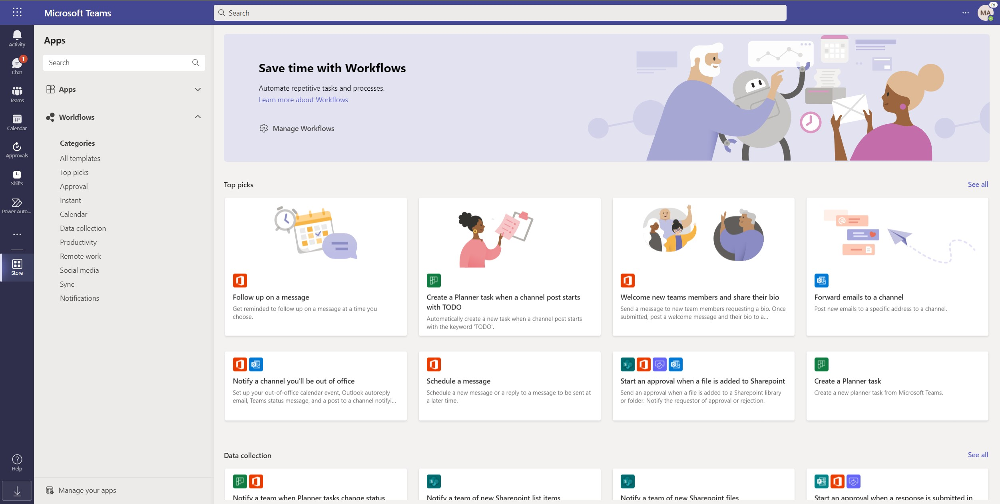
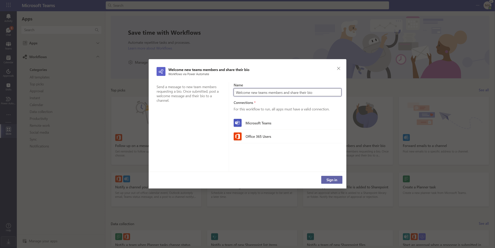
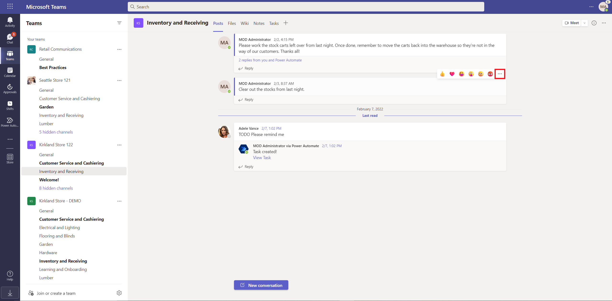
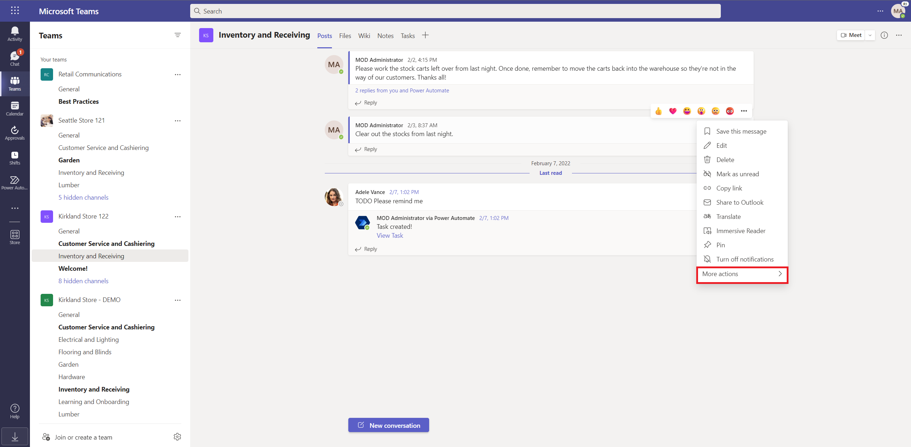
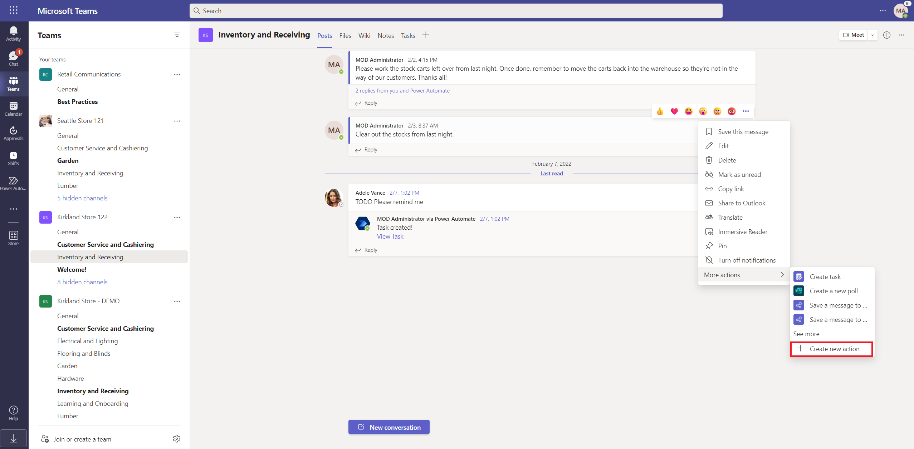
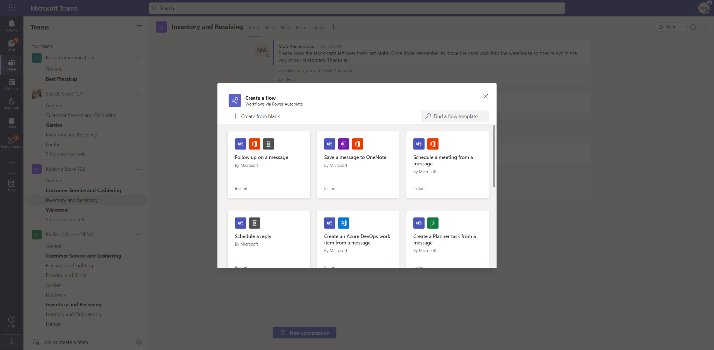
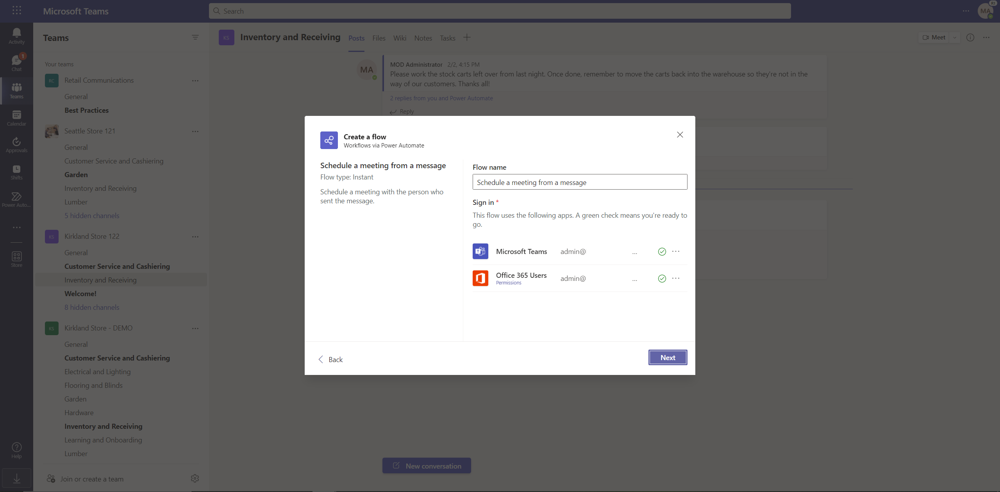
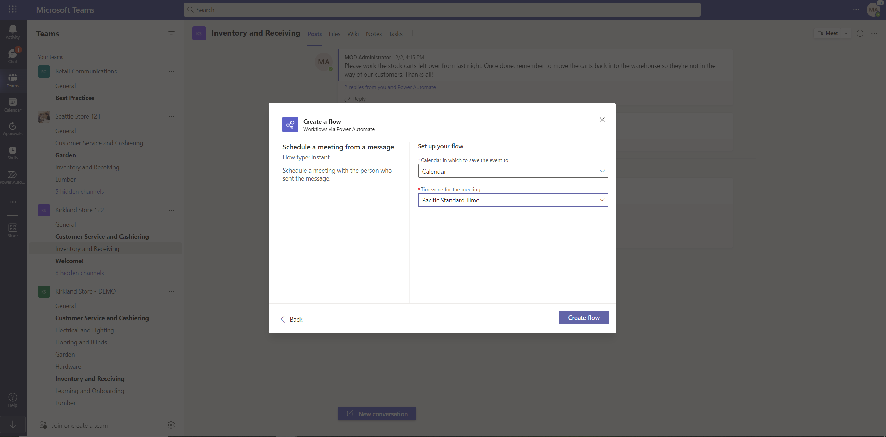
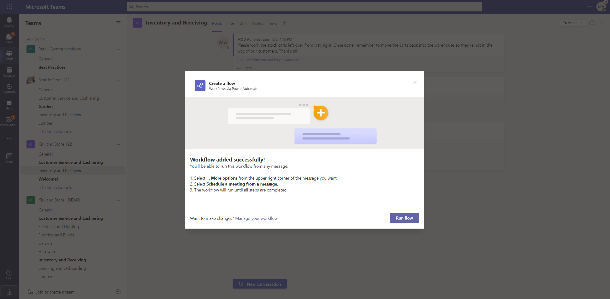

# Create flows in Microsoft Teams

There are multiple ways in which you can create flows within Microsoft Teams.

- Power automate flow templates are directly integrated into the Microsoft Teams store. Users can browse and acquire flows directly from this new entrypoint in Teams.
- You can also create flows from the overflow menu of  Teams message. 
- You can also use the [Power Automate app](./install-teams-app.md) to create from a template or from scratch

Flows created from either of these entrypoints can be managed directly within the Power Automate portal or from within the [Power Automate app](./install-teams-app.md) in Teams

## Prerequisites

To use the Power Automate app, you need an account with access to [Microsoft Teams](https://teams.microsoft.com).

## Create a cloud flow from the Microsoft Teams Store

Follow these steps to create a flow from the Microsoft Teams Store

1.	Sign in Microsoft teams

2.	Select “Store” on the left hand rail on Teams  

3.	Once within the store, you will see a new top level selection in addition to apps called “Workflows” in the bottom left hand corner of the screen

 
4.	This section if populated with templates that are relevant to Microsoft Teams that can be directly acquired from within Teams

 
5.	Clicking any template opens up a new dialog that lets you name the flow and givens you the option to sign into the apps and services used in that flow

 
6.	Click next once all the connections are setup

 
7.	Provide the parameters that are needed for that flow and select add workflow to create the flow

 
8.	You will see a confirmation page citing that your flow was created successfully!

 
9.	Flows can be managed from within the Power Automate app in Teams or using the Power Automate portal. Hit “Manage workflows” in the top header of the Workflows section to quickly take you to the Power Automate app in teams to manage flows.
 

## Create a flow from the message menu in Microsoft Teams

Microsoft Teams users can also create manually triggered flows from the overflow menu of a Microsoft teams message. 

Follow these steps to create a manually triggered flow from the Microsoft Teams Store
1.	Sign in to Microsoft Teams

2.	Hit the ellipses (…) menu of any message in Teams
 
3.	Click on More actions
 
 
4.	Click on + Create new action
 
5.	This brings up a dialog that displays templates that you can setup that use the “For a selected message” manual trigger
 
 
6.	Click on any template to set up the connections needed
 

7.	Click next to setup the parameters needed for the template

8.	You will see a confirmation page once your flow is created successfully!

## Create a cloud flow from a template in the Power Automate App

>[!NOTE]
>By default, the Power Automate app shows you templates that have been created for Microsoft Teams. You can switch filters on the top right to view all Power Automate templates, if desired.
 

Follow these steps to create a cloud flow from a Microsoft Teams template:

1. Sign into [Microsoft Teams](Https://Teams.Microsoft.com).

   >[!TIP]
   >You may also use the Microsoft Teams app.

1. Select **Apps** on the right side on the screen.
1. Search for, and then select the **Power Automate** app.

   

1. Select the **Create** tab, and then select the template on which you'd like to base your flow.

   

1. If the template that you selected is optimized for Microsoft Teams, a dialog that lets you rename the flow and authenticate with the apps necessary for the flow displays.
   

   >[!NOTE]
   >You must login to all connectors so that your flow can run successfully. A green check indicates that you've authenticated.

1. Set up the connections as needed.

1. Select **Continue** to get a list of parameters that are necessary for the flow to run successfully. Provide the parameters that are needed.
   
   

   If you wish to see the full flow, select **Edit in advanced mode**.
   
   

1. You're all set! You will get a confirmation screen showing that your flow was successfully created. After you create your flow, you can find it on the **Home** tab.

   

>[!IMPORTANT]
>When you create flows from within the Power Automate app in Microsoft Teams, they are always created in your organization's default environment. You can also access these flows from [Power Automate](https://flow.microsoft.com).

## Create a cloud flow from scratch

If you want full control over the flow that you create, select **Create from blank** from the top right side of the screen, instead of using a template.

   

This brings up the full Power Automate designer experience within Microsoft Teams where you can [create a fully customized flow](../get-started-logic-flow.md).

   

## Known issues

- Any flow that you create from within the Power Automate app is located in your organization's default environment.
- The Power Automate app and Power Automate Actions app need to be enabled in the Microsoft Teams admin center [https://admin.teams.microsoft.com/policies/manage-apps](https://admin.teams.microsoft.com/policies/manage-apps) in order for this functionality to work.

## Related articles
- [Manage your flows in Microsoft Teams](./teams-app-home.md).

- Visit the [Microsoft Teams connector documentation](/connectors/teams/).

[!INCLUDE[footer-include](../includes/footer-banner.md)]