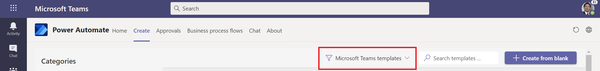
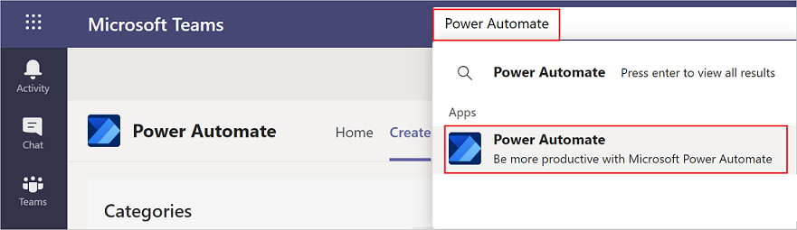
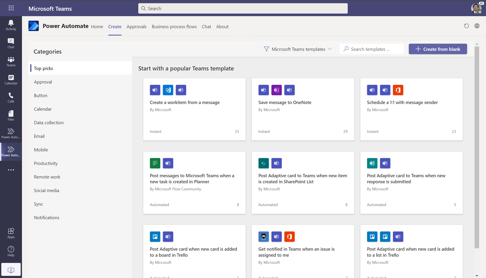
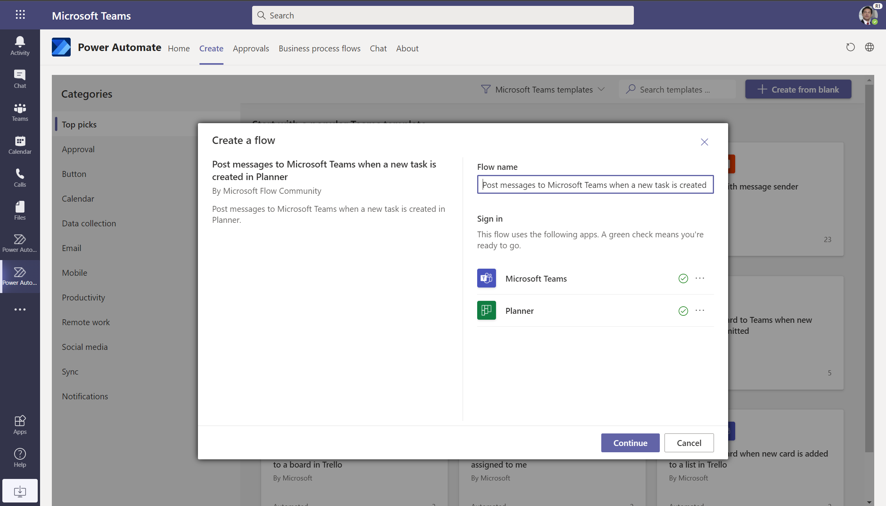
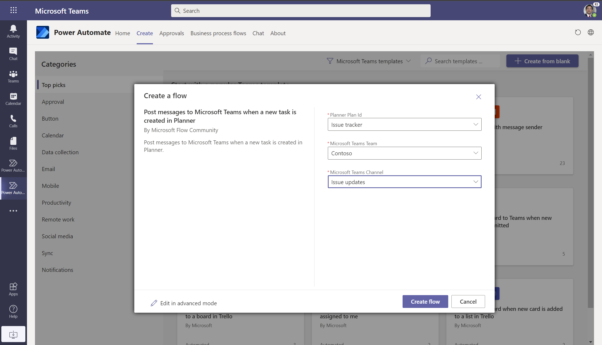
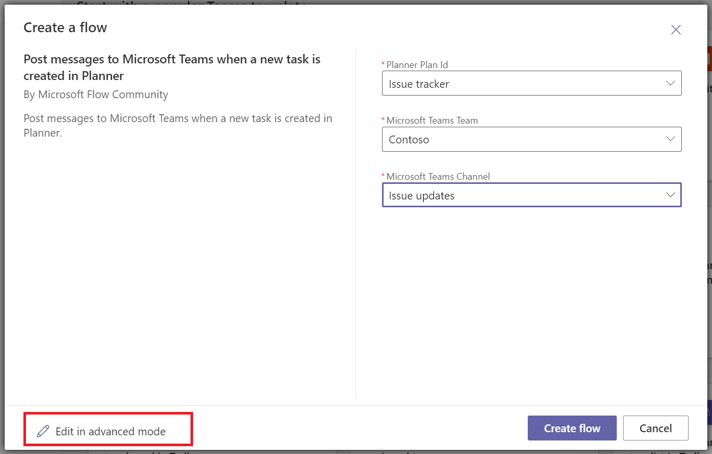
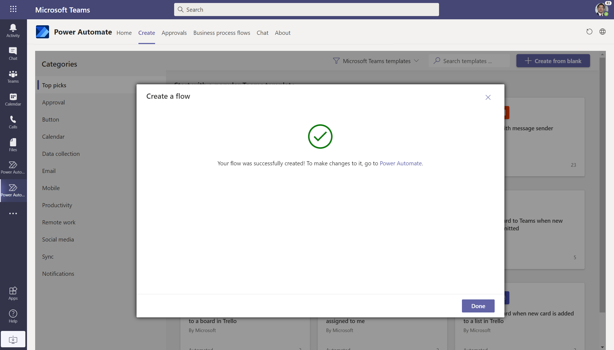
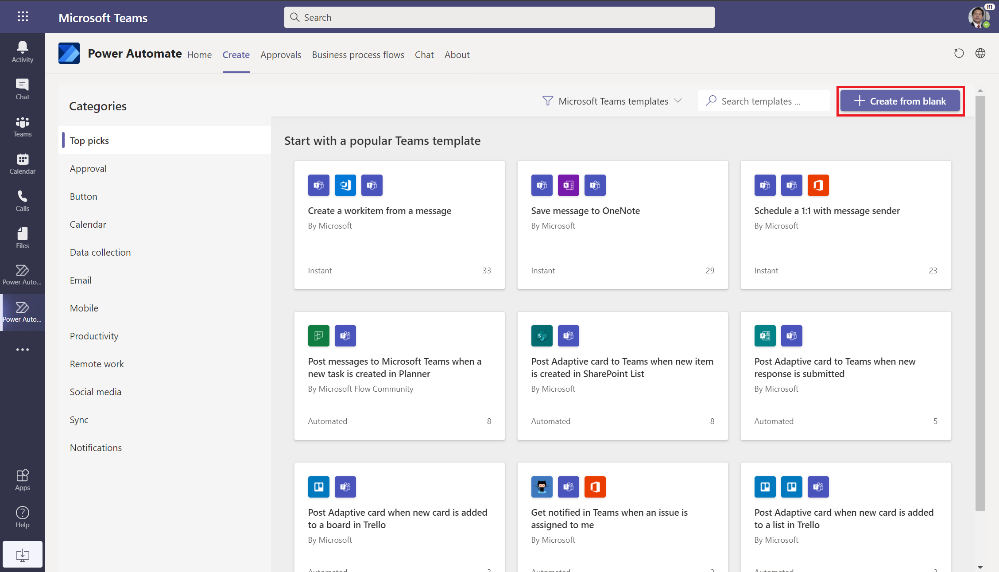
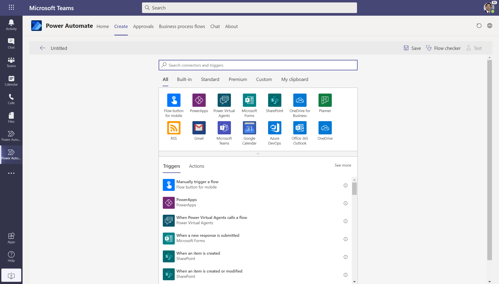

# Create flows in Microsoft Teams

You can use the [Power Automate app](./install-teams-app.md) to create and manage flows from within Microsoft Teams. To get started quickly, use one of the existing templates to create your flows, or you can create customized flows from scratch. 

## Prerequisites

To use the Power Automate app, you need an account with access to [Microsoft Teams](https://teams.microsoft.com).

## Create a cloud flow from a template

>[!NOTE]
>By default, the Power Automate app shows you templates that have been created for Microsoft Teams. You can switch filters on the top right to view all Power Automate templates, if desired.
 

Follow these steps to create a cloud flow from a Microsoft Teams template:

1. Sign into [Microsoft Teams](Https://Teams.Microsoft.com).

   >[!TIP]
   >You may also use the Microsoft Teams app.

1. Select **Apps** on the right side on the screen.
1. Search for, and then select the **Power Automate** app.

   

1. Select the **Create** tab, and then select the template on which you'd like to base your flow.

   

1. If the template that you selected is optimized for Microsoft Teams, a dialog that lets you rename the flow and authenticate with the apps necessary for the flow displays.
   

   >[!NOTE]
   >You must login to all connectors so that your flow can run successfully. A green check indicates that you've authenticated.

1. Set up the connections as needed.

1. Select **Continue** to get a list of parameters that are necessary for the flow to run successfully. Provide the parameters that are needed.
   
   

   If you wish to see the full flow, select **Edit in advanced mode**.
   
   

1. You're all set! You will get a confirmation screen showing that your flow was successfully created. After you create your flow, you can find it on the **Home** tab.

   

>[!IMPORTANT]
>When you create flows from within the Power Automate app in Microsoft Teams, they are always created in your organization's default environment. You can also access these flows from [Power Automate](https://flow.microsoft.com).

## Create a cloud flow from scratch

If you want full control over the flow that you create, select **Create from blank** from the top right side of the screen, instead of using a template.

   

This brings up the full Power Automate designer experience within Microsoft Teams where you can [create a fully customized flow](../get-started-logic-flow.md).

   

## Known issues

Any flow that you create from within the Power Automate app is located in your organization's default environment.

## Related articles
- [Manage your flows in Microsoft Teams](./teams-app-home.md).

- Visit the [Microsoft Teams connector documentation](/connectors/teams/).

[!INCLUDE[footer-include](../includes/footer-banner.md)]