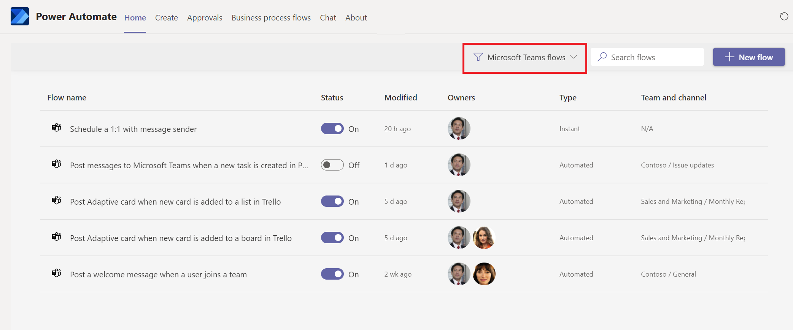
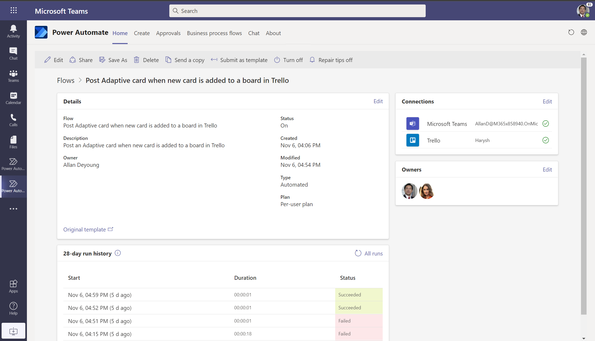

# Manage flows in Microsoft Teams

The **Home** tab provides an overview of your flows from your organization's default environment.

By default, the **Home** tab is filtered to display flows that use Microsoft Teams triggers and actions. You can select **Microsoft Teams flows** to change the filter to display all your flows.

On the **Home** tab, you can view the information that's displayed in each of the following six columns to get an overview of your flows.

Column | Description
----|----
 Flow name | Represents the name that you provided for the flow.
 Status | Displays the status of the flow. For example, is the flow enabled or disabled? You can change the status of your flows directly from this list.
 Modified | Displays the amount of time that's passed since the flow was last changed.
 Owners | Provides a list of the users who own the flow.
 Type |Shows the type of flow. Flows can be **Automated**, **Instant**, or **Scheduled**.
 Team and channel |If your flow reads from or writes to any team or channel, that information is provided here so you can get a quick glance of the teams your flow touches.
  |

>[!TIP]
>You can select any flow to view more details about it. 

## Known issues

The Power Automate app in Microsoft Teams only shows your flows that are located in your organization's default environment. 

## Related articles

[Create flows in Microsoft Teams](./teams-app-create.md).

View the [Microsoft Teams connector documentation](https://docs.microsoft.com/connectors/teams/).

[!INCLUDE[footer-include](../includes/footer-banner.md)]