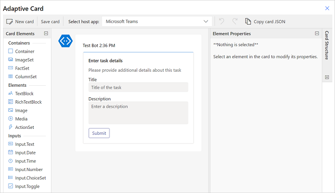
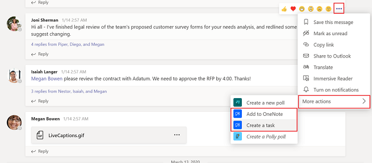
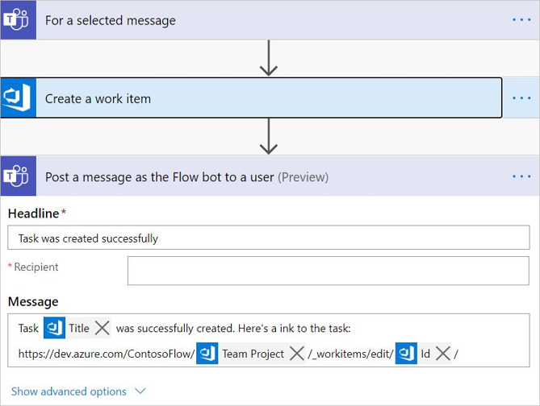

# Trigger a cloud flow from any message in Microsoft Teams

You can use messages to trigger processes in Teams. For example, you might use a Teams message as a starting point to create a work item in Azure DevOps or create a sales opportunity in Dynamics 365.

Use the **For a selected message** trigger in the Teams connector to trigger a cloud flow directly from within Teams.

## Create the flow

1. Sign in to [Power Automate](https://flow.microsoft.com).

1. Enter a name for your flow.

1. Select the **For a selected message** trigger.

1. Select **Create**. You must sign in to Teams if you aren't already signed in.

The **For a selected message** trigger has an optional input in the form of an adaptive card. Use an adaptive card to construct a form to collect information from the user who triggers the flow. For instance, if the flow creates a task, you can use an adaptive card to collect information like the title of the task and the description.

## Collect information from the user

To collect information from the user by using a form, users can select **Create Adaptive Card** in the trigger.

This displays an inline adaptive card editor, where you can drag card elements to construct your own form.

Each input within the adaptive card form has an ID. You can use the ID later in the flow through dynamic tokens to reference inputs that a user might have entered as part of running the flow.

### Use the message details within the flow

Several message elements are available as a trigger output for use within the flow. Here's an overview of some of the properties:

- **Message content**: The full HTML content of the Teams message.

- **Plain text message output**: The plain text variation of the Teams message.

- **Link to message**: A direct URL to reference the message.

- **Sender display name, Sender ID**: The details about the user who sent the message.

- **Originating user display name, originating user ID**: The details about the user who invoked the flow.

For more information, go to the [full list of trigger outputs](/connectors/teams/).

## Trigger the flow

You must create these flows within the *default* environment for them to appear in Teams.

If you don't see the flows you create with the **For selected message in Teams** trigger, ask your admin to confirm whether the Power Automate Actions app is enabled in the Teams admin center https://admin.teams.microsoft.com/policies/manage-apps. 

Any flow that uses the **For a selected message** trigger shows up as a message action in the Teams message in the **More actions** menu for the flow.<!--note from editor: I assume Joni Sherman, Isaiah Langer, and Megan Bowen are names from sample data?-->

>[!IMPORTANT]
>The name of the flow is used to reference the flow within Teams, so be sure to provide a descriptive name for it.

## Best practices

Be sure to include a form of a confirmation to the user after the flow is completed. We recommend using **Post a message as the flow bot to a user** or **Post a message as the flow bot to a channel** to notify the user in Teams when a triggered flow has been completed.

Here's an example of a cloud flow that creates a work item in Azure DevOps and then posts a confirmation to the originating user.

## Known issues and limitations

- You must create these flows within the default environment to ensure they get listed in Teams.

- Only the flow author can trigger the flow. The flow will only be available to other members of the channel/chat if the author explicitly shares it with them.

[!INCLUDE[footer-include](includes/footer-banner.md)]
