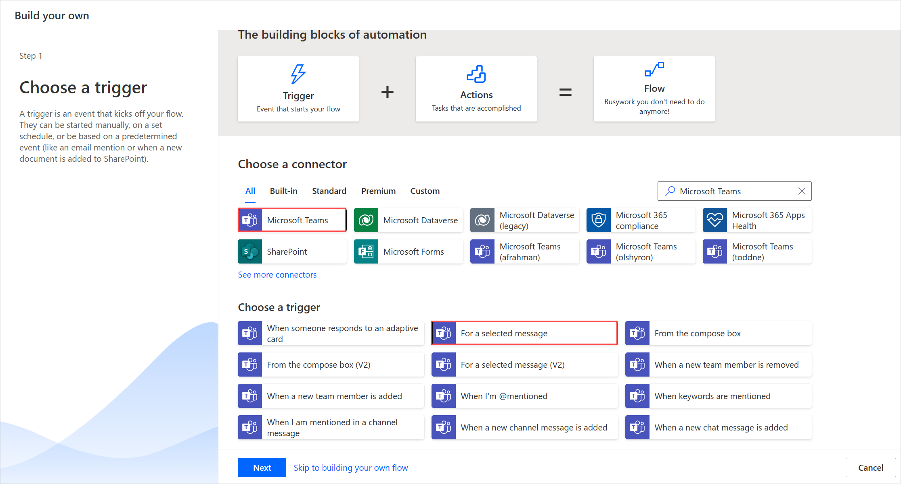
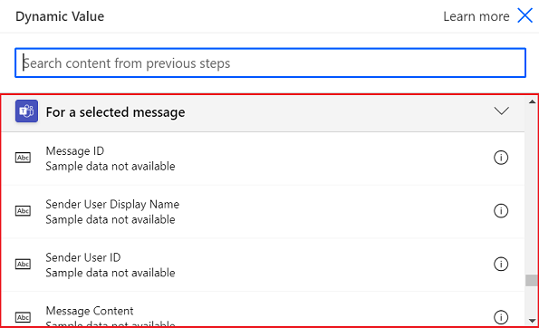

# Trigger a flow from any message in Microsoft Teams

Messages are the core interactions mechnism within Microsoft Teams. With Microsoft Teams become the hub for the work in your organization, using messages as a starting point to trigger a process which consists of repetitive task becomes more and more critical. For example, you might use a Teams message as a starting point to create a workitem in Azure DevOps, or create a sales opportunite in dynamics. 

The 'For a selected message' trigger in the Teams connector allows you to do just that by enabling you to trigger a flow directly from within the Teams client.

## Creating the flow

In order to create a custom Teams message flow, choose the "For a selected message" trigger from the Teams connector. The trigger has an optional input in the form of an adaptive card which can be used to construct a form to collect information from the user who triggers the flow. For instance, if the flow is creating a task, you can use the adaptive card to collect information like the title of the task and the description.

## Collecting information from the user
In order to collect information from the user using a form, users can simply click the Create adaptive card button within the trigger.

This brings up an inline adaptive card editor which lets you drag and drop card elements to construct your own form.

Any input within the adaptive card form has an id associated with it, which can be used later in the flow through dynamic tokens to reference inputs that a user might have entered as part of running the flow.

### Using message details within the flow
There are a number of message elements that are available as a trigger output for use within the flow. Some of the more useful properties include:
* Message content - The full HTML content of the Teams message
* Plain text message output - Plain text variation of the Teams message
* Link to message - A direct url to reference the message
* Sender display name, Sender id - Details of the user who sent the message
* Originating user display name, Originating user id - Details of the user who invoked the flow

For a full list of trigger outputs please do have a look at our (connector documentation)[https://docs.microsoft.com/en-us/connectors/teams/]

## Triggering the flow
Any flow that uses the "For a selected message" trigger shows up as a message action in the Teams message over flow "More actions" menu. 

>[!IMPORTANT]
    >The name of the flow is what is used to reference the flow within Teams so be sure to provide a descriptive name for the Flow

>[!IMPORTANT]
    >Note currently only flows within the default environment are listed within the Teams client.

## Best practices
Ideally as a best practice be sure to include some form of a confirmation back to the user once the flow is completed. We recomment using the "Post a message as the flow bot to a user" or the "Post a message as the flow bot to a channel" to notify the user in Teams when a triggered flow has completed.

For example here is a sample flow that Creates a workitem in Azure Devops and posts a confirmation back to the originating user.

## Known issues and limitations
Currently only flows within the default enviroment are listed within the Teams more actions menu.