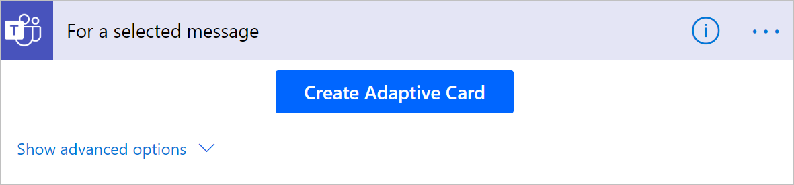

# Trigger a flow from any message in Microsoft Teams

You can use messages to trigger processes in Microsoft Teams. For example, you might use a Microsoft Teams message as a starting point to create a work item in Azure DevOps or create a sales opportunity in Dynamics. 

Use the **For a selected message** trigger in the Microsoft Teams connector to trigger a flow directly from within Microsoft Teams.

## Create the flow

1. Sign into **Power Automate**, and then select > **My flows** > **New** > **Instant-from blank**.
1. Give your flow a name.
1. Select the **For a selected message** trigger.

   

1. Select **Create**.

>[!NOTE]
>You must sign into Microsoft Teams if you are not already signed in.

The **For a selected message** trigger has an optional input in the form of an adaptive card. Use an adaptive card to construct a form to collect information from the user who triggers the flow. For instance, if the flow creates a task, you can use an adaptive card to collect information, like the title of the task and the description.

## Collect information from the user

To collect information from the user using a form, users can select the **Create Adaptive Card** button within the trigger.

This displays an inline adaptive card editor which lets you drag and drop card elements to construct your own form.

Each input within the adaptive card form has an Id. You can use the Id later in the flow through dynamic tokens to reference inputs that a user might have entered as part of running the flow.

### Use the message details within the flow

There several message elements available as a trigger output for use within the flow. Here's an overview of some of properties:

* Message content - The full HTML content of the Microsoft Teams message.
* Plain text message output - The plain text variation of the Microsoft Teams message.
* Link to message - A direct url to reference the message.
* Sender display name, Sender id - The details of the user who sent the message.
* Originating user display name, originating user id - The details of the user who invoked the flow.

   

Here's the [full list of trigger outputs](https://docs.microsoft.com/connectors/teams/).

## Trigger the flow

>[!IMPORTANT]
>You must create these flows within the *default* environment for them to appear in Microsoft Teams.

>[!IMPORTANT]
>If you don't see the flows your create with the **For selected message in Teams** trigger, ask your admin to confirm if the **Power Automate Actions** app is enabled in the Microsoft Teams admin center https://admin.teams.microsoft.com/policies/manage-apps. 

Any flow that uses the **For a selected message** trigger shows up as a message action in the Microsoft Teams message in the **More actions** menu for the flow. 

>[!IMPORTANT]
>The name of the flow is used to reference the flow within Microsoft Teams so be sure to provide a descriptive name for the flow.

## Best practices

Be sure to include a form of a confirmation to the user once the flow is completed. We recommend using the **Post a message as the flow bot to a user** or the **Post a message as the flow bot to a channel** to notify the user in Microsoft Teams when a triggered flow completes.

Here's an example of a flow that creates a work item in Azure Devops and then posts a confirmation to the originating user.

## Known issues and limitations

You must create these flows within the default environment to ensure they get listed in Microsoft Teams.