# Trigger approvals from a SharePoint document library

This article shows you how to create an approval flow for new documents (invoces) when they are added to a SharePoint document library and how to attach the document to the approval request.  
  
We want to setup an approval process so that every time a new invoice is added to that library, somebody reviews its contents and if approved, the invoice files are moved to a folder.

To follow this tutorial, create two folders, for example: **Incoming Invoices** and **Reviewed Invoices**.

   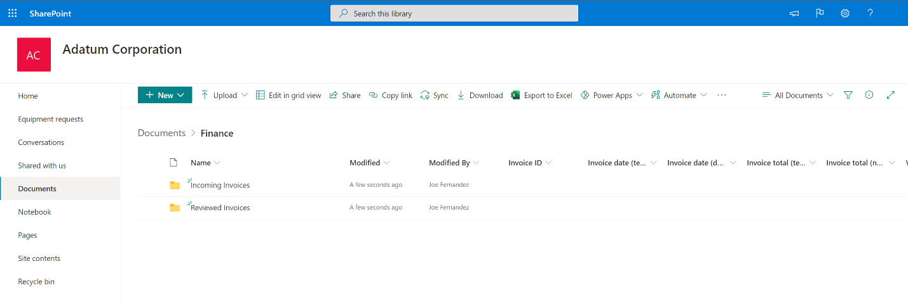

1. Go to the [Start an approval for new file to move it to a different folder](https://us.flow.microsoft.com/galleries/public/templates/d0ffe4d14c9c418e8f8ad49c3a6afcf6/start-an-approval-for-new-file-to-move-it-to-a-different-folder/) template. This template provides us a flow that's configured to setup an approval process for a SharePoint document library. Confirm that all the connections listed have a green check, and then select continue.  
  
   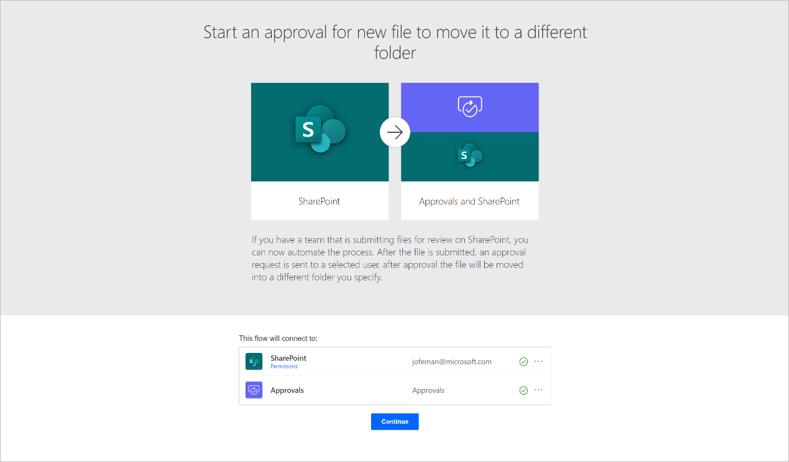

1. Once the flow is created, configure these three items.

   - **Site address** - On the trigger card, select the SharePoint site that contains your list from the list. If the SharePoint site doesn’t appear on the list, just write your SharePoint site URL. 
   
   - **Folder id:** - Select the folder where you will put the incoming files to be reviewed with an approval.

   - On the **Create file** card enter the same **Site address** as before, and then select the folder where you would like the files to be moved once they have been approved.

   - On the **Delete file** card, enter the same **Site address** as before. This action will delete the file from the first folder once it has been approved and copied to the new folder.

     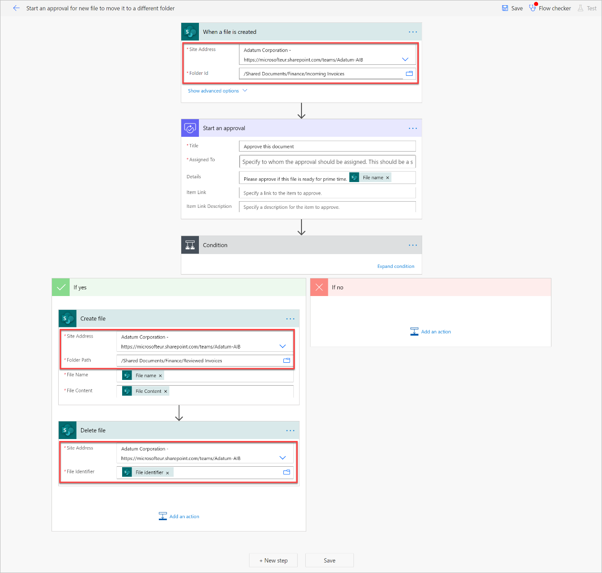

1. Replace the **Start an approval** action with another approval action that will let us attach files to it.

   - Delete the **Start an approval** action from the flow. 

        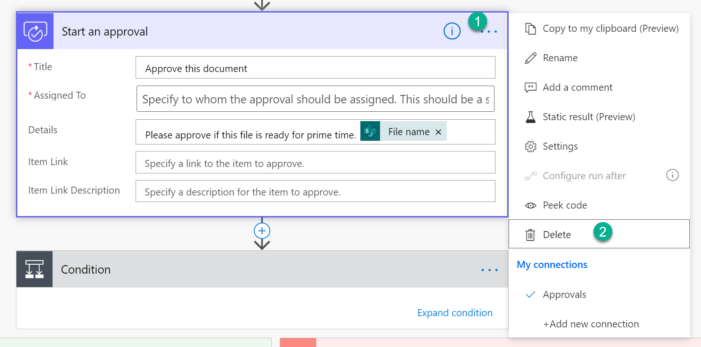

   - Where the approval action used to be, add a new action by searching for **Start and wait for an approval**.

       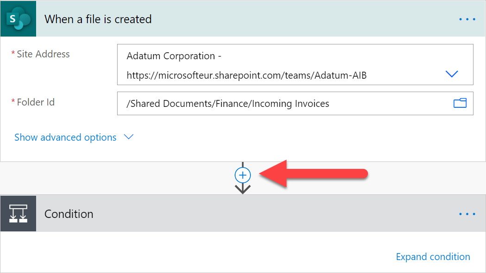

       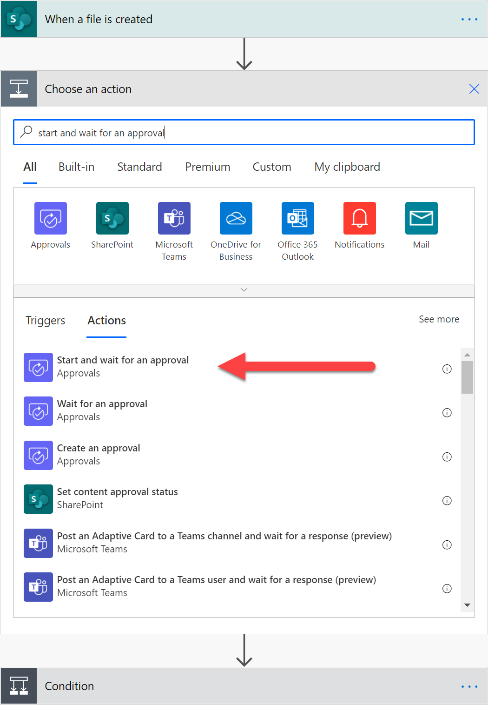

   - Select **Approve/Reject – First to respond** as the approval type. 
      
       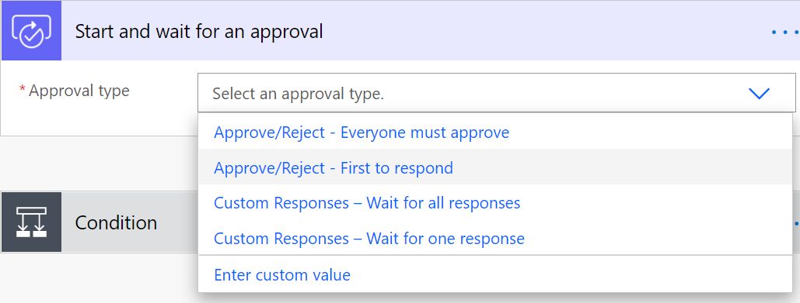

   - Give the approval request a title, and then assign it to the approver. The approver can even be you!

       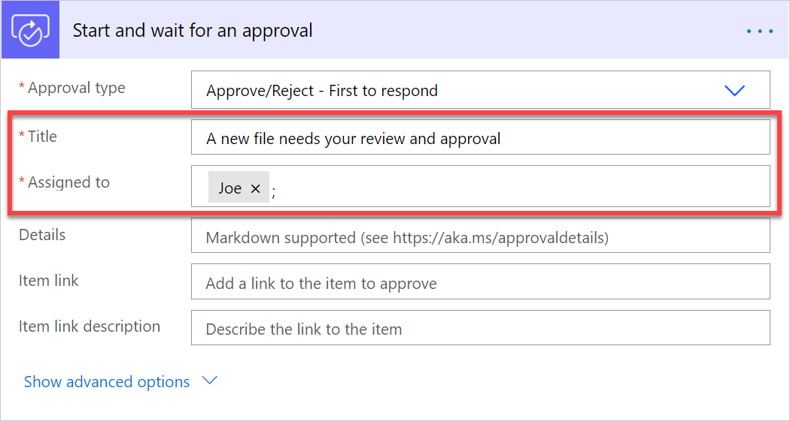

   - Select **Show advanced options**, and then select **Attachment Name – 1**. 
   
      A floating panel opens on the right where you will see all the data you can get from the SharePoint trigger. 
   
   - Select **File name**. Do the same for **Attachments Content – 1**, and then select **File Content**.  
       
       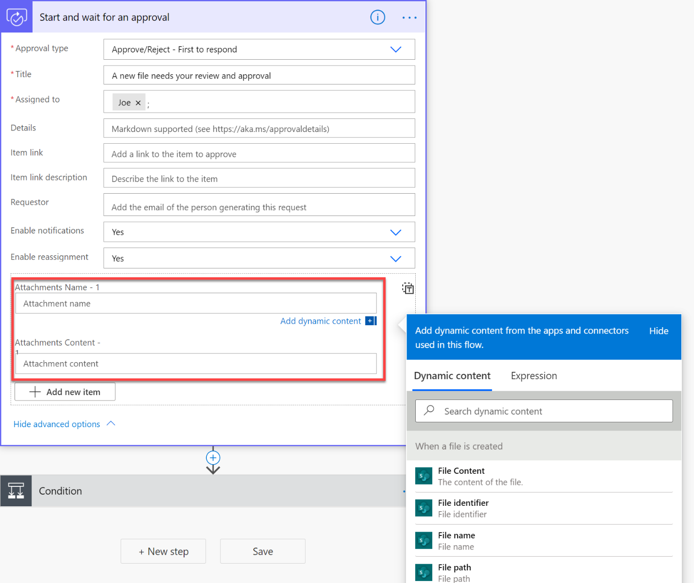
      
       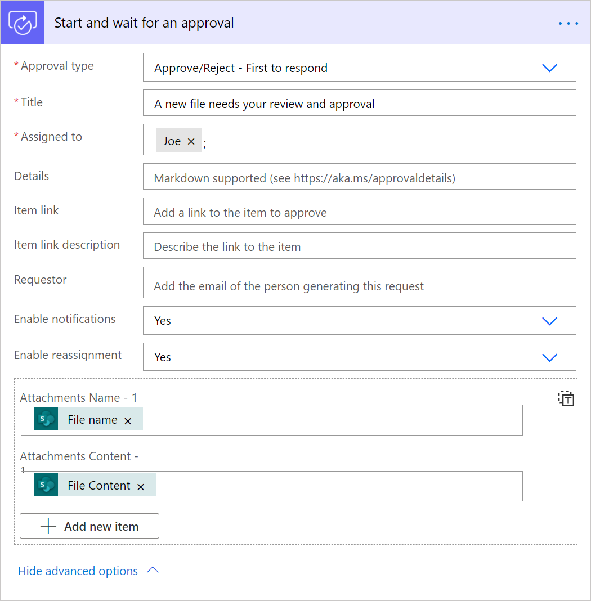

1. Expand the **Condition** card, and on the left text box, select **Outcome**. 

   This way if the approver approves the request, the action to copy the file to the second folder runs.  
  
   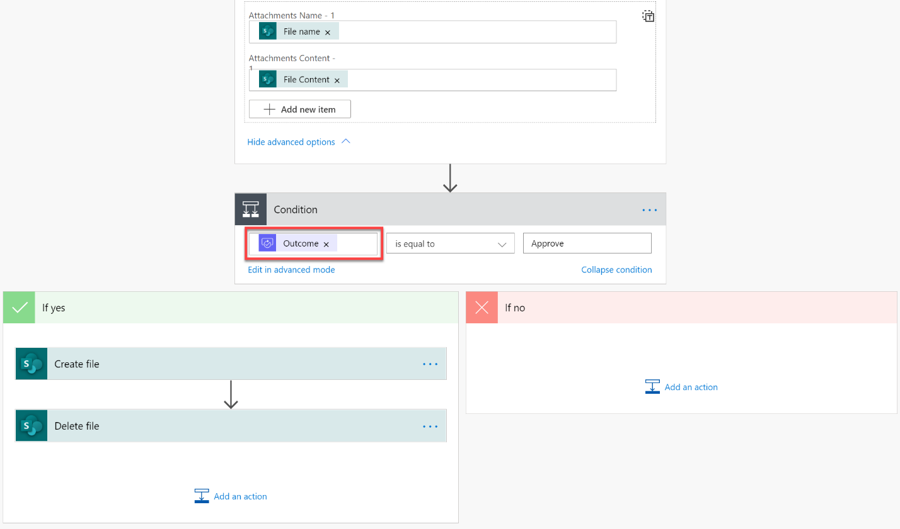

We’re done configuring the flow. Now let’s test this flow. To do it, first click on the **Save** button on the top right. You might get a warning message from Flow checker. It is safe to dismiss it.  
  
   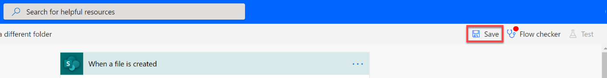

1. Once the flow has been successfully saved, click on the **Test** button. And then select, **I’ll select the trigger action** and lastly **Save and test**.  
  
   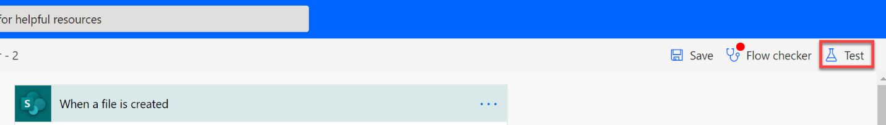

  
   

1. Power Automate will tell you once the flow is in test mode. When it is, add a new file to the incoming files folder in SharePoint and come back to your flow to see it running:  
  
   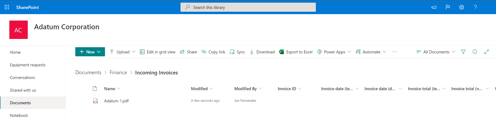

  
   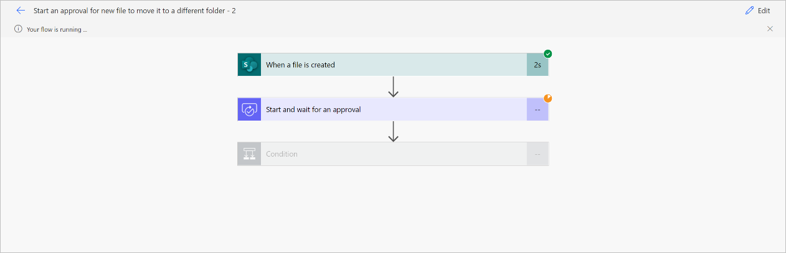

The person you have assigned the approval to, will now receive the approval request in various places where they can approve it or reject it. The file to review is attached to the approval.

**By email**  
  
   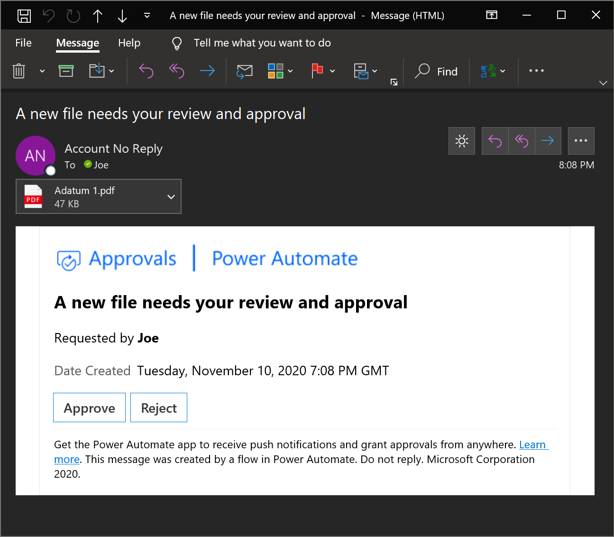

If you are not seeing the email displayed correctly, make sure you have the latest updates in your Outlook app or use the web version of Outlook.

**On the Power Automate portal, on the Action items à Approvals section**  
  
   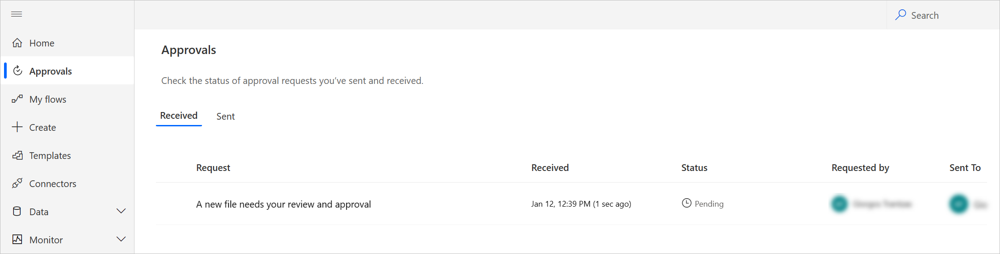

Once the approver approves or rejects the request, the flow execution will continue. If the request was approved, the file you put on the incoming folder will be moved to the other folder.

   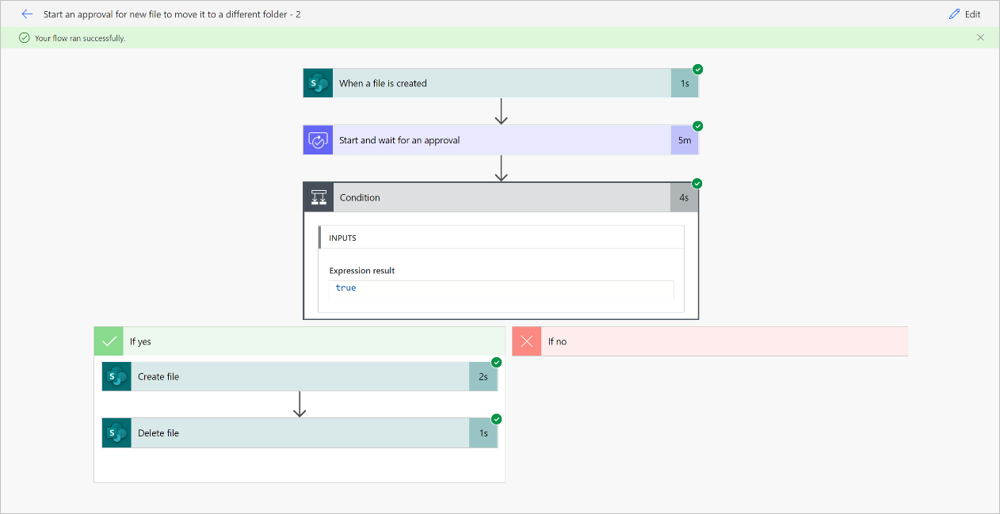

Congratulations! You have successfully run your flow with approval capabilities. Now that you know the basics, you can build on top of this flow to tailor it to your specific business needs.

## Next steps

- Create [approval flows](modern-approvals.md)

 

[!INCLUDE[footer-include](includes/footer-banner.md)]