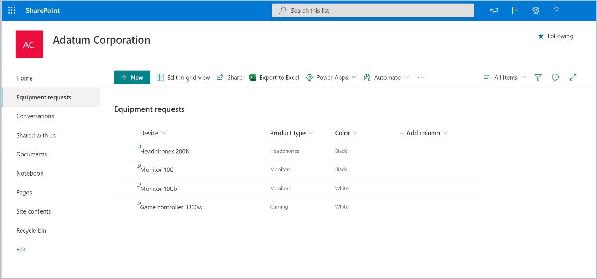

# Create an approval for new items added to a SharePoint list

Imagine that you have a SharePoint list in which employees store requests for devices like monitors or headsets. You want to create an approval process so that everytime an employee adds a request to a SharePoint list, somebody receives a request to approve it.

To follow this guided walkthrough, create a list in a SharePoint site to which you have access. You can use the following example of a list:  
  
   

Once you have a SharePoint list for which you want to create an approval process:  
  
1. Go to the [Start approval when a new item is added](https://us.flow.microsoft.com/galleries/public/templates/d62b2527bb5343d689d5107b0922e57b/start-approval-when-a-new-item-is-added/) template, which provides a flow that's configured to create an approval process on a SharePoint list. Make sure all connections listed have a green check, and then continue.  
  
   

1. Once the flow is created, configure these three items:

   -  **Site address**: Select the SharePoint site where you have your list from the dropdown list. If the SharePoint site doesn’t appear on the dropdown list, just write your SharePoint site URL.  
      
       

   - **List name**: once you have defined the Site Address, select the list you want every new item added to trigger an approval  
      
       

   - **Assigned to**: the person in your company who should receive the approval request. You can start by putting yourself as the approver!  
      
       

   That’s it! The approval flow is now all configured. If you look at the whole flow the steps are:

   - The flow is triggered every time a new item is added to the SharePoint list you have defined on the first step.

   - An approval request is sent to the person you've chosen.

   - If the approval is answered as **Approve**, the person that created the item on the SharePoint list gets an email with the approval confirmation. If the request was answered as **Reject**, that person gets an email saying that the request was rejected.

        

   - If for some reason the approval fails, you as the maker of this flow will get an email informing you that the approval failed. In this case, you will need to look at the run history of the flow to see why the approval failed.

1. Now let’s test this flow. first, select **Save** on the top right.  

   

1. Once the flow has been successfully saved, select **Test**.

   

1. Select, **I’ll select the trigger action**.

1. Select **Save and test**.  
  
   

1. Power Automate alerts you once the flow is in test mode. When it is, create a new item on your SharePoint list and then look at your flow to see it.  

   You will see that once your flow starts, it runs to the approval action where it shows an orange circle on the top right of the approval action step. This means that the assigned approvers need to respond to the approval request for the flow to continue.

   

## Next steps

- Create [approval flows](modern-approvals.md)

 

[!INCLUDE[footer-include](includes/footer-banner.md)]