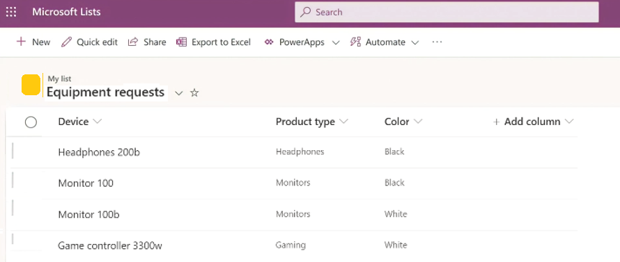
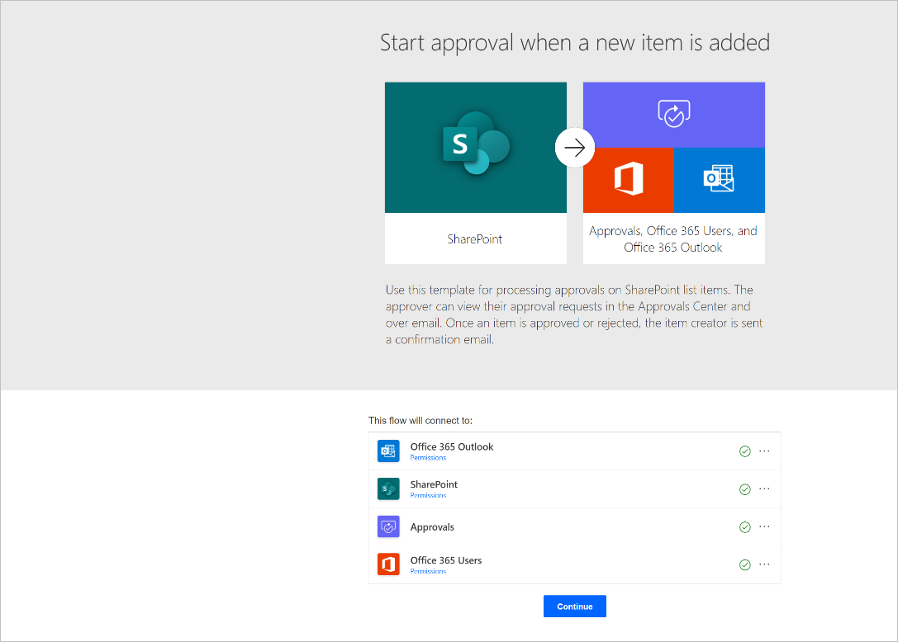
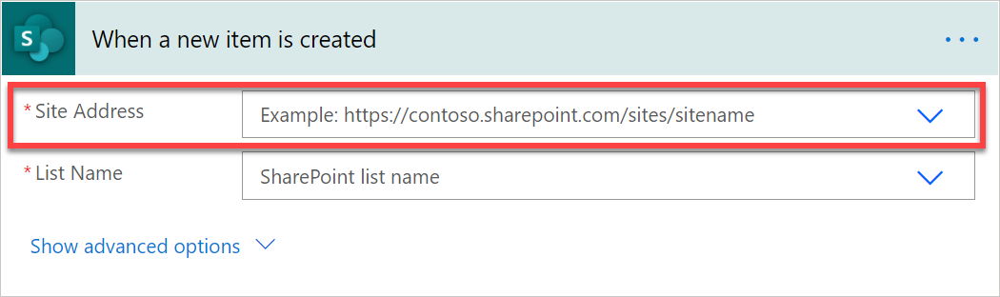
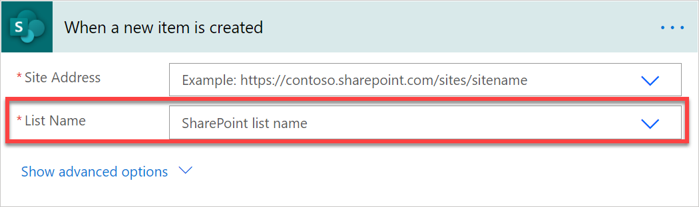
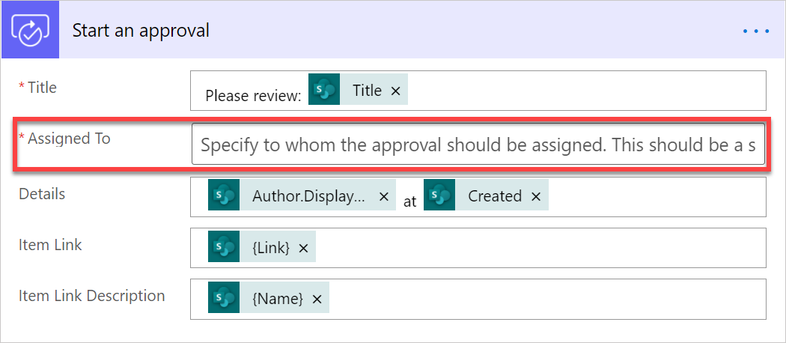
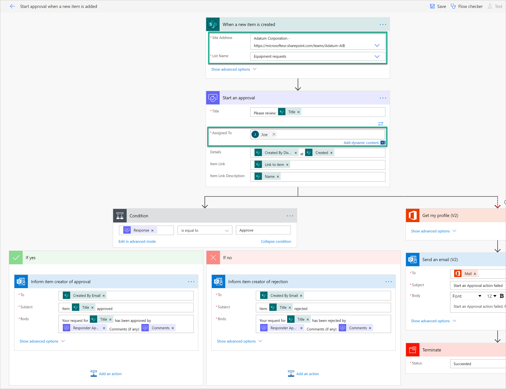
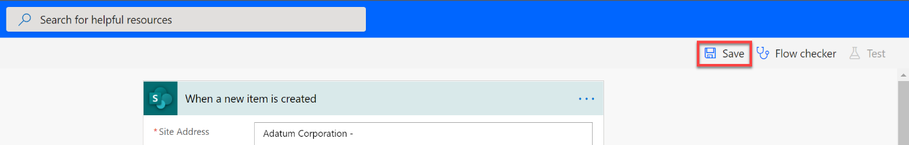
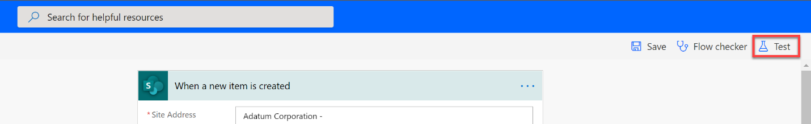
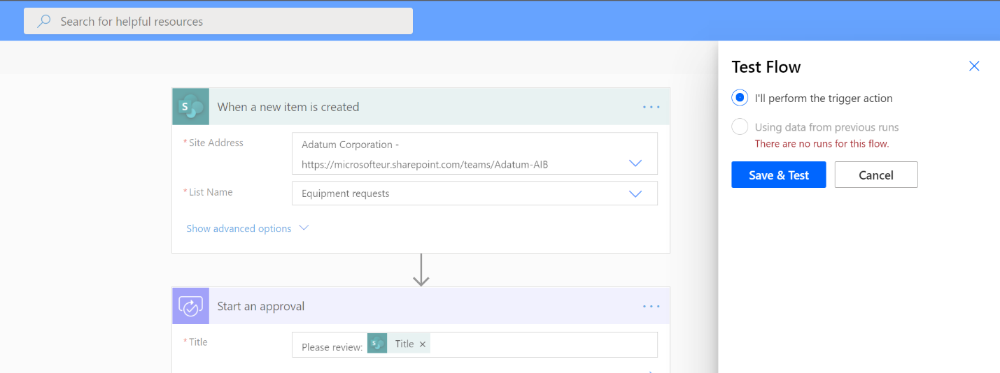
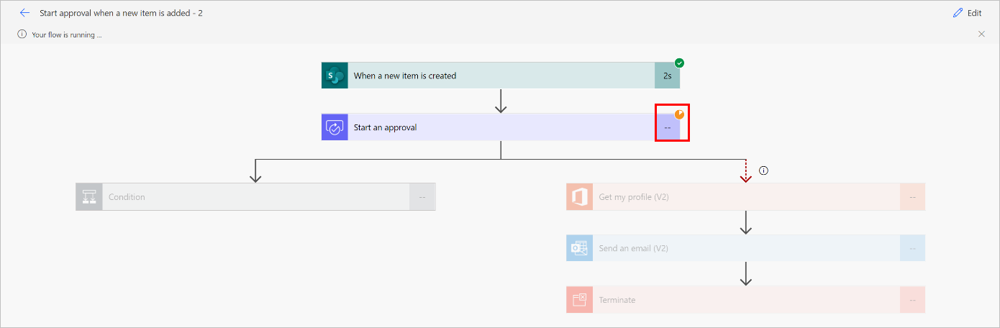

# Trigger approvals from lists created with Microsoft Lists

Imagine that you have a list created with Microsoft Lists in which employees store requests for devices like monitors or headsets. You want to create an approval process so that every time an employee adds a request to a list, somebody receives a request to approve it.

To follow this guided tutorial, create a list with Micrsoft Lists. You can use the following example of a list.  

>[!div class="mx-imgBorder"]
>

Once you have a list for which you want to create an approval process:  
  
1. Go to the [Start approval when a new item is added](https://make.powerautomate.com/galleries/public/templates/d62b2527bb5343d689d5107b0922e57b/start-approval-when-a-new-item-is-added/) template, which provides a flow that's configured to create an approval process on a list.

1. Make sure all connections listed have a green check, and then select **Continue**.  
 
    >[!div class="mx-imgBorder"]
    >

1. Once the flow is created, configure these three items:

   - **Site address**: Select the site where you have your list from the dropdown list.

     If the site doesn’t appear on the dropdown list, just enter your site URL.  

    >[!div class="mx-imgBorder"]
    >

   - **List name**: Once you have defined the **Site Address**, select the list you want every new item added to trigger an approval.  

    >[!div class="mx-imgBorder"]
    >

   - **Assigned to**: This is the person in your company who should receive the approval request. You can start by assigning yourself as the approver.  

    >[!div class="mx-imgBorder"]
    >

   That’s it! The approval flow is now configured. If you look at the entire flow, the steps are:

   - The flow is triggered every time a new item is added to the list you have defined in step 3.

   - An approval request is sent to the person you've chosen.

   - If the approval is answered as **Approve**, the person who created the item on the list gets an email with the approval confirmation. If the request was answered as **Reject**, that person gets an email saying that the request was rejected.

    >[!div class="mx-imgBorder"]
    >

   - If for some reason the approval fails, you as the maker of this flow will get an email informing you that the approval failed. In this case, you will need to look at the run history of the flow to see why the approval failed.

1. Now let’s test this flow. first, select **Save** on the top right.  

    >[!div class="mx-imgBorder"]
    >

1. Once the flow has been successfully saved, select **Test**.

    >[!div class="mx-imgBorder"]
    >

1. Select **I’ll perform the trigger action**.

1. Select **Save and test**.  

    >[!div class="mx-imgBorder"]  
    >

1. Power Automate alerts you after the flow enters test mode. When it is in test mode, create a new item on your list and then look at your flow to see it.  

   You'll see that once your flow starts, it runs to the approval action where it shows an orange circle on the top right of the approval action step. This means that the assigned approvers need to respond to the approval request for the flow to continue.

    >[!div class="mx-imgBorder"] 
    >

## Next step

- Create [approval flows](modern-approvals.md)

[!INCLUDE[footer-include](includes/footer-banner.md)]
