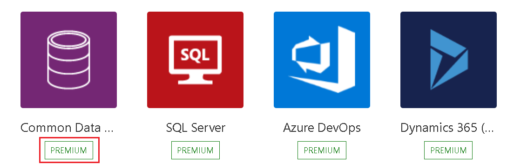

# Get started with triggers

## What is a trigger?

A **trigger** is the event that starts a flow. For example, if you want to get notification in Microsoft Teams when someone sends you an email, in this case you receiving an email is the **trigger** that starts this flow.

Power Automate offers connectors (apps/services like SharePoint, Outlook, etc.) and most connectors
offer prebuilt triggers that you can use to start your flows. Here's a partial look at the triggers that Office 365 Outlook connector provides by default.

   

## Choose the right trigger

### Triggers for instant/manual flows

If you'd like to run a flow with a tap of a button on your mobile device, to remind your team to join the daily team meeting, create an instant flow (button flow). You can trigger these flows manually from any device. 

[Learn more about instant flows](https://docs.microsoft.com/power-automate/introduction-to-button-flows#trigger-an-instant-flow).

### Triggers for scheduled flows

If you'd like to run a flow on a schedule, for example, to send a weekly project report, create a [scheduled flow](). In scheduled flows, you can choose when (date and time) and frequency (monthly/daily/hourly, etc). 

Learn more about [scheduled flows](https://docs.microsoft.com/power-automate/run-scheduled-tasks).

### Triggers for automated flows

If you'd like to create a flow that performs tasks automatically after an event, for example, create a flow that notifies you by email when someone tweets keyword you specify, create an automated flow. 

Learn more about [automated flows](https://docs.microsoft.com/power-automate/get-started-logic-flow)

## Create a flow

Here are three ways in that you can create a flow.

1. Find, and then select the [Power Automate connector](https://preview.flow.microsoft.com/connectors/) you would like to use.

   When you select a connector, you'll see the triggers available for that connector. You can start a new flow from here by selecting any of the triggers for the selected connector.
    
1. Start from the **My flows** page in Power Automate:

    1. In [Power Automate](https://flow.microsoft.com/), select **My
        flows** from the navigation bar on the left.

    1. Select **New**, and then select **Automated-from blank**.

    1. Give your flow a name in the **Add a name or we'll generate one** field

1. Most likely, there's already a [template]https://preview.flow.microsoft.com/templates/) that automates your scenario. To use a template, search for, and then select a template that covers your scenario. Then, follow the steps shown to customize the template. For detailed steps, peruse [create a flow from a template](https://docs.microsoft.com/power-automate/get-started-logic-template).

## Add a trigger to an existing flow 

1. Add a new step

1. Search for the connector and select the app icon.

   

1. Once selected, the corresponding triggers and actions will be shown. Choose
    the trigger that best suits your need.

   

>[!IMPORTANT]
>The trigger must be the first step of the flow.

## Known issues and advanced functionality

### My connector trigger is marked as a Premium connector

A standalone Power Apps or Power Automate license is required to access all premium, on-premises, and custom connectors. Microsoft 365 plan licensees can use standard connectors but cannot use premium connectors.

### How to find my license?

To find your license:

1. Go to [flow.microsoft.com](https://preview.flow.microsoft.com/)

1. Select **My flows**.

1. Select a flow.

1. Go to the **Details** section, and then select **Plan**.  

   Your current license plan is displayed.

### Customize a trigger by adding conditions

You found a trigger but want to customize further so the trigger only works when
a condition is met. For example, you are using SharePoint’s ‘When an item is
created or modified’ trigger in Power Automate. The flow triggers for every
change to the item but you might want the flow to only trigger when an item is
created or status is marked as Approved. While you can filter other events by
adding conditions in the flow, it will still run the flow and the calls are
counted in your api request causing you to reach your API request limits faster.
To avoid it, you can write expressions in trigger conditions to stop the flow
from running if the condition in trigger is not met.

A great community article of how to use trigger conditions [here](https://www.timlinenterprises.com/microsoft-power-automate-flow-trigger-conditions/)

Secure trigger inputs/outputs in run history flow, you can turn on secure input
and/or secure output setting in the trigger. A great community article of how to
do it [here](https://d365demystified.com/2019/12/19/secure-input-output-in-power-automate-run-history/)

# Troubleshoot common issues with triggers

### My trigger is deprecated

### Trigger firing for old triggers

I turned off my flow and turned it back on. Depending upon your trigger type,
either your old triggers are processed or not. Triggers can be Polling triggers
or webhook triggers.

A polling trigger is basically an event that periodically makes a call to your
service to look for new data. Polling triggers differ from webhooks in that a
polling trigger initiates an event to determine if new data is available,
whereas webhooks respond to a push of new data from the service. 

See the following table to understand how your flow responds when it's turned
back on.

| CAN FLOWS BE TURNED OFF OR DISABLED?    |                                                                                                                                              |
|-----------------------------------------|----------------------------------------------------------------------------------------------------------------------------------------------|
| Trigger type                            | Description                                                                                                                                  |
| Polling, such as the Recurrence trigger | When the flow is turned on again, all unprocessed/pending events are processed. Delete your flow if you don't want to process pending items. |
| Webhook                                 | When the flow is turned on again, it only processes new events that are generated after the flow is turned on.                               |

To know if your trigger is polling or webhook,

Go to your flow trigger, click on the …(ellipses) to select Peek code

Find the recurrence section with interval frequency. If this section is
available, it is a polling trigger.

### Recurrence trigger runs ahead of schedule

>   Make sure to set the start time to make sure it runs only at that time.

>   <https://powerusers.microsoft.com/t5/Using-Flows/Recurrence-set-for-10-but-ran-at-9-22/m-p/241400> 

### My trigger fires after a delay

If the trigger is a polling trigger (How to know if my trigger is webhook or
polling trigger) it wakes up

periodically to check if any new events have occurred.  The wake-up time depends
on the license plan the flow is running on. For example, your flows may run
every 15 minutes if you’re on the free plan. If a flow is triggered less than 15
minutes after its last run, it’s queued until 15 minutes have elapsed. And if it
is Flow for Office 365 *(Plan from your Enterprise license E3, E5 etc)* and Flow
for Dynamics 365 it will be 5 minutes. As a result, it may take a few minutes
between the time the triggering event occurs and the flow run begins. 

To check the trigger wake up frequency, go to your flow trigger, click on the
…(ellipses) to select Peek code

Find the interval frequency

If it is taking much longer than expected, the two likeliest reasons would be:

1. There have been too many calls being made to the connector or Flow causing it
to be throttled. To verify if it is throttling, manually test the flow to see if
it triggers right away or not. If it triggers right away, it is not throttling.
Further you can check Flow action analytics. Check out this
[blog](https://flow.microsoft.com/blog/introduction-action-usage-analytics-in-power-automate/)
to know more about action analytics.

If your flow is frequently throttled, redesign your flow to use fewer actions.
Learn more about plan limits and tips to optimize flow to use fewer actions
here. link 
 <https://support.microsoft.com/help/4531688/troubleshooting-slow-running-flows>.

Additional tips:

1- Acquire a Per User or Per Flow license. After this is acquired, open and
resave the flow, in order to refresh the entitlement associated with it, and to
change the throttling Mode.

2. Split the flow in several instances. If the flow processes data, you can
divide this data in subsets (per country, per business area, etc),

3.  After this, you can Save As on the flow and create several instances that
will process each one their own data. As the quota is per flow, this can be used
as a workaround.

2. There was a communication issue preventing flow from reacting to trigger
events. Potentially because of a service outage, policy change, password expiry
etc that caused the delay previously. Go to
<https://admin.powerplatform.microsoft.com/support> to know if there are any
active outages going on. Try clearing the cache of the browser and retry.

### Dynamics connector trigger issues 

Delayed trigger – Dynamics triggers can take up to 2 hours - [Dynamics
365](https://docs.microsoft.com/connectors/dynamicscrmonline/) connector
is deprecated and our recommendation is to migrate your flow to use
[CDS](https://docs.microsoft.com/connectors/commondataservice/)

My flow is not listed - The Power Automate menu only lists flows that begin with
the ‘When a record is selected Common Data Service’ trigger and contain at least
one trigger or action that references that entity. Flows that contain other
types of trigger (automatic, scheduled, etc.) will not be listed in Dynamics
365.

You must access them at <https://flow.microsoft.com> (selecting the production
environment) or at the admin center
<https://admin.powerplatform.microsoft.com/environments> (Environments\> open
environment\> Resources\> Flows) .

See this doc for more details:

<https://docs.microsoft.com/power-platform/admin/enable-embedded-flow-in-your-organization#enable-or-disable-power-automate-in-your-organization>

### Power Apps trigger issues

Unable to rename actions in flow – This is a known issue for flows that are
involved with PowerApps trigger. As a work around, to rename actions, remove the
trigger. Rename the actions and add your Power Apps trigger and configure
variables wherever needed.

Once a Power App is published it is always recommended to make copies of Flows
used by the PowerApps to make any updates.  Any update to a Flow referenced by a
live Power App has the potential to break existing users.  Do not delete or turn
off the existing Flows until all users have been upgraded to the new published
version of the Power App.

### SharePoint trigger issues

SharePoint triggers like when a file is created or modified will not fire if a
file is added/updated in a subfolder. If it is required to trigger on
subfolders, multiple triggers should be created.

### My flow triggers multiple times

Verify you don’t have copies of the flow active in different environments
triggering based on same condition. Use trigger conditions to customize trigger
to reduce the number of times it triggers.

### Unable to run the flow: 

### The flow is shared to a user. While the owner can run the flow, the user can’t. 

#### Fix connection error.

If your flow is using a Manual trigger, it needs the connection of the user who
is triggering the flow(secondary user who just got access to the flow). If it
uses the Recurrence trigger it can run on the flow author’s connection.

#### Error - User does not have a service plan adequate for the non-Standard connection

Power Automate license is required for the current user to perform any actions
like save, turn off etc. A Power Apps, Dynamics 365 or Office 365 license is not
sufficient. Users who are shared a flow with premium connectors (not belonging
to a "Per Flow" plan) will each need a "Per User" plan to edit or manually
trigger the flow. If saving/modifying the flow was possible for the same user
previously, it is possible that their license has expired.

RESOLUTION: Purchase a "Per User" plan or "Per Flow" plan for Power Automate·
Alternatively, you can start a trial for the "Per User" plan lasting 90 days
after which you will require a paid plan to run/edit flows using premium
connectors. All these options (with additional information) are available
here: [flow.microsoft.com/pricing](../flow.microsoft.com/pricing). More can be
found
in: <https://support.microsoft.com/help/4552636/error-user-does-not-have-a-service-plan-adequate-for-the-non-standard>

### My trigger doesn’t fire

#### DLP error

Admins can create data loss prevention (DLP) policies that can act as guardrails
to help prevent users from unintentionally exposing organizational data. DLP
policies enforce rules for which connectors can be used together by classifying
connectors as either **Business** or **Non-Business**. If you put a connector in
the **Business** group, it can only be used with other connectors from that
group in any given app or flow. Learn more about DLP policies here:

https://docs.microsoft.com/power-platform/admin/wp-data-loss-prevention

If your flow violates a DLP policy, it will be suspended causing the trigger to
not fire. To know if your flow is suspended, try editing the flow and save. Flow
checker will catch it if it is violating a DLP policy. Please reach out to your
admin to change the connector classification.

#### Verify if trigger is failing

Go to My flows from navigation tab, click on your flow. In the details, do you
see the following error?

It means, the flow tried to establish connection and register the trigger with
the app and failed. Flow retried and failed and is no longer trying unless the
problem is fixed. Your flow wont trigger until this problem is resolved.

You can refer to this document
<https://support.microsoft.com/help/4540228/there-is-a-problem-with-the-flow-s-trigger>
to know more about Fix trigger error.

One of the common reasons for the failure is the flow service end points are not
part of the allow list.

To fix it, please make sure IT department has whitelisted flow service
endpoints.

IP addresses:
[https://docs.microsoft.com/powerapps/maker/canvas-apps/limits-and-config\#ip-addresses](https://docs.microsoft.com/powerapps/maker/canvas-apps/limits-and-config%23ip-addresses)

Domains: <https://support.microsoft.com/help/4557620/client-request-aborted-or-failed-to-fetch-error-in-power-automate>

Make sure access to OData is enabled.

Once the problem is resolved, change something on the flow save and then change
it back and save again. This helps the flow to know something changed and tries
to register trigger.

#### Verify Connections 

With default setting, users only need to login to a connection once and use it
until revoked by admin. A possible scenario is that the password expired or
there might be a policy in your organization which set the connector’s login
token expiration after a specific amount of time. Token lifetime policies have
been configured on Azure Active Directory. For more information, please check
<https://docs.microsoft.com/azure/active-directory/develop/active-directory-configurable-token-lifetimes>
and
<https://support.microsoft.com/help/4467879/conditional-access-and-multi-factor-authentication-in-flow)Account>

To verify if your connections are working, in the navigation tab, go to Data -\>
Connections and find the app used in your flow. If there is a Fix connection
message next to the Status as shown in below pic, connections used in your flow
are broken and need to be fixed. Click on Fix connection and follow the steps to
choose a valid connection.

You can refer to this document
<https://support.microsoft.com/help/4540228/there-is-a-problem-with-the-flow-s-trigger>
to know more about Fix trigger error.

#### Verify if the flow is using a premium connector trigger

Edit your flow to find the connector name of the trigger. Go to
<https://preview.flow.microsoft.com/connectors/> and search for that
connector. If the connector is premium, it will show right below the name of the
connector.

A standalone Power Apps or Power Automate plan license is required to access all
Premium, on-premises and custom connectors. Check your license(link) and
purchase new licenses here: <https://flow.microsoft.com/pricing/>

#### Check license – 

To know your license

-   Go to My flows in navigation tab

-   Click on a flow

-   In the Details section, find Plan. Your current license plan (eg Per- user
    plan) will be listed below.

#### Verify if trigger check is skipped 

You just completed an event(for example added a new list item/set email etc)
that should have triggered the flow but the flow didn’t run.

Go to My flows in the navigation pane and select the flow. In the 28-day run
history, select All runs

Select Checks (no new data). If you are expecting the flow to run but it didn’t
run, see if it shows the trigger check is skipped at that time. If the trigger
check is skipped, the trigger condition wasn’t met for the flow to trigger.
Verify the inputs and trigger conditions of the flow to see you are using the
latest configuration to trigger the flow.

#### [./media/image12.png](./media/image12.png)

#### Verify inputs and trigger conditions

#### Edit the flow, expand the first card to see what folders, sites or mailboxes are used in the trigger. To check if the flow has any additional customizations on the trigger, verify if the flow is using any trigger conditions by selecting the ellipses (…) on the card and go to settings and find trigger conditions. If the field is empty, there are no additional customizations and the title of the card (in this case, when an item is created or modified) is when the trigger will fire. If there are additional customizations in trigger conditions (in below example, flow triggers when an item is created or modified in SharePoint but doesn’t process any items where Example column is missing data). Check you are using the latest inputs to trigger the flow.

#### Check permissions

Verify you have access to folders, sites or mailboxes used in the trigger. For
example, to be able to send email from a shared inbox via flow, you need
permissions to be able to send an email via the shared inbox. Test sending an
email from that shared mailbox in outlook.

#### Verify if admin mode is turned on 

If an environment’s admin mode is turned on, all background processes including
flows will be turned off causing the flow to not trigger

Please follow these steps to disable the admin mode.

1.        Go to the Power Platform admin center and sign in using Environment
Admin or System Administrator role credentials.

2.        From the left-side menu, select Environments, and then click on a
sandbox or production environment.

3.        On the Details page, select Edit.

4.        Under Administration mode, toggle Disabled to Enabled.

5.        Optionally, you can set Background operations and Custom message, and
then select Save.

Everything looks good but your flow is still not triggering, Verify if your flow
triggers after every step.

#### Try these steps:

1.  Test the flow manually.

2.  Remove and re-add the trigger.

3.  Switch connection.

4.  Turn off and turn on the flow.

5.  Export and import the flow – use
    <https://flow.microsoft.com/blog/import-export-bap-packages/>

6.  Create a copy of the flow.

7.  If trigger uses special conditions like when an email arrives in specific
    folder, remove the folder add again.
