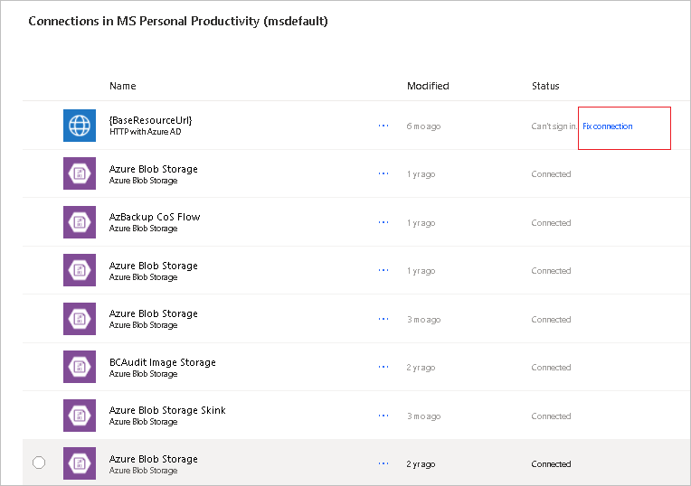

# Troubleshoot common issues with triggers

Here are some tips and tricks for troubleshooting issues with triggers.

## Identify specific flow run

Sometimes, you might need to [Identify specific flow runs](./fix-flow-failures.md#identify-specific-flow-runs) to troubleshoot your flows.

## My trigger doesn’t fire

1. A data loss prevention policy could be to blame.

   Admins can create [data loss prevention (DLP)](/power-platform/admin/wp-data-loss-prevention) policies that can act as guardrails to help prevent users from unintentionally exposing organizational data. DLP policies enforce rules for which connectors can be used together by classifying connectors as either **Business** or **Non-Business**. If you put a connector in the **Business** group, it can only be used with other connectors from that group in any given app or flow.

   If your flow violates a DLP policy, it is suspended, causing the trigger to not fire. To know if your flow is suspended, try to edit the flow and save it. The flow checker reports it if the flow violates a DLP policy. Your admin can change the DLP policy.

1. The trigger might be failing. 
   Follow these steps to confirm:

   1. Sign in to [Power Automate](https://make.powerautomate.com).
   1. Go to **My flows**, and then select your flow.
   1. Do you see the following error in the **Details**?

       :::image type="content" source="./media/triggers-introduction/fix-trigger.png" alt-text="Screenshot of an error message about the flow's trigger.":::

   This error means that Power Automate tried multiple times to establish a connection to register the trigger and failed. Your flow won't trigger until this problem is resolved.

   One of the common reasons for this failure is that the Power Automate service endpoints aren't part of the allow list. To fix it, confirm that your IT department added these endpoints to the allow list.

   Here's the list of [IP addresses](/power-apps/limits-and-config#ip-addresses) and [domains](https://support.microsoft.com/help/4557620/client-request-aborted-or-failed-to-fetch-error-in-power-automate) that need to be added to your allow list.

   Refer to this [support article](https://support.microsoft.com/help/4540228/there-is-a-problem-with-the-flow-s-trigger) to learn more about how to fix issues with triggers.

After the problem is resolved, modify the flow and then save it. You can then change it back to its original state, and then save it again. The flow becomes aware that its configuration changed, and it tries to register its trigger again.

### Verify connections

With the default settings, users only need to sign in to a connection once. They can then use that connection until an admin revokes it. A possible scenario is that the password for the connection can expire or there might be a policy in your organization which sets the connector’s authentication token to expire after a specific amount of time. Token lifetime policies are configured on Microsoft Entra ID. For more information, review this [Azure article](/azure/active-directory/develop/active-directory-configurable-token-lifetimes).

Follow these steps to verify if your connections are broken:

1. Sign in to [Power Automate](https://make.powerautomate.com).
1. Go to **Data** > **Connections**.
1. Find the connection that your flow uses.
1. Select **Fix connections**, and then update the credentials for your connection if there's a **Fix connection** message next to the **Status** column.

   

### Verify if the flow uses a premium connector trigger

1. Edit your flow to find the connector name for the trigger.
1. Go to the [list of connectors](https://make.powerautomate.com/connectors) and then search for that connector. If the connector is a premium connector, **PREMIUM** displays below the name of the connector.

    :::image type="content" source="./media/triggers-introduction/premium-connector.png" alt-text="Screenshot of a premium connector.":::

A standalone Power Apps or Power Automate license is required to access all premium, on-premises, and custom connectors. You can [purchase licenses](https://make.powerautomate.com/pricing) at any time.

### Check your license type

Follow these steps to view the type of license that you have:

1. Sign in to [Power Automate](https://make.powerautomate.com).
1. Go to **My flows** in the left pane.
1. Select any flow.
1. In the **Details** section, find **Plan**. Your current license plan is listed.

### Verify if trigger check is skipped

You just completed an event. For example, you added a new list item or sent an email that should have triggered the flow, but the flow didn’t run.

Go to **My flows** in the left pane, and then select the flow. In the **28-day run history**, select **All runs**.

:::image type="content" source="./media/triggers-introduction/all-runs.png" alt-text="Screenshot showing all runs.":::

If you expect the flow to run but it didn’t run, see if it shows the trigger check was skipped at that time. If the trigger check was skipped, it means that the trigger condition wasn’t met for the flow to trigger. Verify the flow the inputs and trigger conditions to confirm if you're using the latest configuration to trigger the flow.

### Verify inputs and trigger conditions

Sometimes, the inputs and trigger conditions might cause failures. Follow these steps to verify your inputs and conditions.

[!INCLUDE[copilot-designer-note](./includes/copilot-designer-note.md)]

# [New designer](#tab/new-designer)

1. Sign in to [Power Automate](https://make.powerautomate.com).
1. Edit the flow.
1. Expand the first card to see what folders, sites, mailboxes, and others are used in the trigger.

    :::image type="content" source="./media/triggers-introduction/copilot-triggers.png" alt-text="Screenshot that shows trigger site in Copilot.":::

1. Select **Settings**.
1. Find **Trigger conditions**.

   If the field is empty, it means that there are no other customizations and that the title of the card (in this case, **When an item is created or modified**) indicates when the trigger fires.

   If there are other customizations in **Trigger Conditions**, confirm that you're using the expected or correct inputs to trigger the flow.

    :::image type="content" source="./media/triggers-introduction/copilot-trigger-conditions.png" alt-text="Screenshot that shows trigger conditions in Copilot.":::

# [Classic designer](#tab/classic-designer)

1. Sign in to [Power Automate](https://make.powerautomate.com).
1. Edit the flow.
1. Expand the first card to see what folders, sites, mailboxes, etc. are used in the trigger.
1. On the card, select the ellipses (**…**) > **Settings**.
1. Find **Trigger conditions**.

   If the field is empty, it means that there are no other customizations and that the title of the card (in this case, **When an item is created or modified**) indicates when the trigger fires.

   If there are other customizations in **Trigger Conditions**, confirm that you're using the expected or correct inputs to trigger the flow.

    :::image type="content" source="./media/triggers-introduction/trigger-conditions.png" alt-text="Screenshot that shows trigger conditions.":::

---

### Check permissions

Verify that you have access to the folders, sites, or mailboxes that are used in the trigger. For example, to be able to send email from a shared inbox via Power Automate, you need permissions to send an email via the shared inbox. Send a test email from that shared mailbox in Outlook.

### Verify if admin mode is turned on

If an environment’s admin mode is turned on, all background processes, including flows are turned off, causing the flow to not trigger.

Follow these steps to disable the admin mode.

1. Go to the [Power Platform admin center](https://admin.powerplatform.com) and sign in with Environment Admin or System Administrator role credentials.
1. From the left-side menu, select **Environments**, and then select a sandbox or production environment.
1. On the **Details** page, select **Edit**.
1. Under **Administration mode**, set the slider to **Disabled**.

If everything looks good but your flow is still not triggering, verify if your flow triggers after every step.

### Try these steps

1. Test the flow manually.
1. Remove, and then re-add the trigger.
1. Switch the connection.
1. Turn off, and then turn on the flow.
1. [Export](./export-flow-solution.md), and then [import](./import-flow-solution.md) the flow.
1. Create a copy of the flow.
1. If the trigger uses special conditions, like when an email arrives in a specific folder, remove the folder, and then add it again.

## My trigger is firing for old events

There are two types of triggers&mdash;polling triggers and Webhook triggers.

If you turned off your flow and then turned it back on, depending on your trigger type, your old triggers may be processed.

A polling trigger periodically makes a call to your service to look for new data, whereas a Webhook trigger responds to a push of new data from the service.

See the following table to understand how your flow responds when it's turned back on.

| Trigger type|Description|
|---|---|
| Polling, such as the `recurrence` trigger | When the flow is turned on again, all unprocessed or pending events are processed. If you don't want to process pending items when you turn your flow back on, delete and then recreate your flow. |
| Webhook  | When the flow is turned on again, it processes new events that are generated after the flow is turned on. |

Follow these steps to determine the type of trigger that your flow uses.

# [New designer](#tab/new-designer)

1. In the action configfuration pane to the left, select **Code View**.
1. Find the `recurrence` section with an interval `frequency` element. If this section is available, the trigger is a *polling* trigger.

    :::image type="content" source="./media/triggers-introduction/copilot-recurrence.png" alt-text="Screenshot of the recurrence section in Copilot.":::

# [Classic designer](#tab/classic-designer)

1. On the title bar, select the ellipsis (**...**) > **Peek code**.

    :::image type="content" source="./media/triggers-introduction/peek-code.png" alt-text="Screenshot of peek code.":::

1. Find the `recurrence` section with an interval `frequency` element. If this section is available, the trigger is a *polling* trigger.

    :::image type="content" source="./media/triggers-introduction/frequency.png" alt-text="Screenshot of the recurrence section.":::

---

## My flow is triggered multiple times or some of my actions run multiple times

You may encounter a scenario where a single flow run has some (or all) of its actions duplicated. While the UI doesn't show this problem, you might see the results of the flow being duplicated. For example, duplicate emails sent, or duplicate list items created.

One of the reasons this might happen is because of the "at-least-once" design of Azure Logic Apps.

Most of the times, this indicates that there was an issue with the Azure service. Usually, these issues are self-healed quickly. To ensure that your flows don't create duplication, ensure you design them to be **idempotent**&mdash;which is to say that the flow needs to account for the possibility of duplicate inputs.

An example of idempotency would be checking to see if a duplicate SharePoint document already exists before trying to create it, or using key constraints in Dataverse to prevent duplicate records getting created.

Another possibility is for flow triggering multiple times might be having copies of the flow active in different environments that are triggering based on same condition. Use trigger conditions to customize triggers to reduce the number of times it triggers.

## My recurrence trigger runs ahead of schedule

Confirm that you've set the **Start time** on the **Recurrence** card to ensure it runs only at the time that you need. For example, set **Start time** to '2022-10-10T10:00:00Z' to start your trigger at 10:00 AM.

## There's a delay before my trigger fires

If the trigger is a polling trigger, it wakes up periodically to check if any new events have occurred. The wake-up time depends on the license plan on which the flow runs.

For example, your flows may run every 15 minutes if you’re on the **Free** license plan. On the **Free** plan, if a cloud flow is triggered less than 15 minutes after its last run, it’s queued until 15 minutes have elapsed.

And, if your license is the **Flow for Office 365** plan (from your Enterprise license E3, E5, etc.) or the **Flow for Dynamics 365** plan, your flow won't run again until five minutes have elapsed. So, it may be a few minutes between the time the triggering event occurs and the time the flow begins.

Follow these steps to check the trigger wake up frequency.

# [New designer](#tab/new-designer)

1. On your flow, select your flow trigger.
1. Select **Code View**.
1. Find the interval frequency.

    :::image type="content" source="./media/triggers-introduction/copilot-recurrence.png" alt-text="Screenshot of the frequency element in Copilot.":::

# [Classic designer](#tab/classic-designer)

1. Go to your flow trigger, and then select the ellipsis (**...**) > **Peek code**.

    :::image type="content" source="./media/triggers-introduction/peek-code.png" alt-text="Screenshot of the peek code setting.":::

1. Find the interval frequency.

    :::image type="content" source="./media/triggers-introduction/frequency.png" alt-text="Screenshot of the frequency element.":::

---

If it's taking much longer than expected for your flow to trigger, here are the two likeliest reasons:

1. There's been too many calls to the connector or flow, causing it to be throttled. To verify if your flow is being throttled, manually test the flow to see if it triggers immediately. If it triggers immediately, it isn't throttled.

   You can check the [Power Automate analytics](./admin-analytics-report.md) to learn more about your flows.

   If your flow is frequently throttled, redesign your flow to use fewer actions. Learn more in [Understand platform limits and avoid throttling](guidance/coding-guidelines/understand-limits.md).

   Additional tips:

   1. Acquire a Power Automate Premium (previously Power Automate per user) or Power Automate Process license (previously Power Automate per flow). After this is acquired, open and then save the flow, in order to refresh the entitlement associated with it, and to change the throttling mode.

   1. Split the flow into several instances. If the flow processes data, you can divide this data into subsets (per country/region, per business area, etc.).

   1. After this, you can use **Save As** on the flow to create several instances that will process their own data. Since the quota is per flow, this can be used as a workaround.

2. There was a communication issue that prevents Power Automate from reacting to trigger events. Potentially, because of a service outage, policy change, password expiry, and so on, that caused the delay. You can view [Help + support](https://admin.powerplatform.microsoft.com/support) to find out if there are any active outages. You can also clear the cache of the browser and then retry.

## Power Apps trigger issues

Unable to rename actions in a cloud flow – This is a known issue for flows that use Power Apps triggers. As a workaround to rename actions, remove the trigger. Rename the actions, add your Power Apps trigger, and then configure variables wherever needed.

After an app is published, make copies of the flows used by that app to make any updates. Any update to a cloud flow that's referenced by a published app can break existing users. Don't delete or turn off existing flows until all users have been upgraded to the new published version of the app.

## SharePoint trigger issues

SharePoint triggers, for example **When a file is created or modified**, don't fire if a file is added or updated in a subfolder. If you need the flow to trigger on subfolders, create multiple flows.

## Users are unable to run flows that are shared with them, but the owner can run the flow

You can try one of the following:

1. Fix or update connections.

   If your flow uses a **Manual** trigger, it needs the connection of the user who is triggering the flow. If it uses the **Recurrence** trigger, it can run on the flow maker's connections.

1. Confirm the user has the appropriate license for the connections in the flow.

   A Power Automate license is required for the user to perform any actions like save, turn off, and more. A Power Apps, Dynamics 365, or Microsoft 365 license isn't sufficient. Users with whom flows that use premium connectors are shared will each need a Power Automate Premium (previously Power Automate per user) or Power Automate Process license (previously Power Automate per flow) license to edit or manually trigger the flow. If the user was previously able to save or modify the flow, it's possible that their license has expired.

   Alternatively, you can start a trial for the **Per User** plan for 90 days, after which you need a paid plan to run or edit flows that use premium connectors. You can find more information in the [licensing page](https://make.powerautomate.com/pricing) or this [support article](https://support.microsoft.com/help/4552636/error-user-does-not-have-a-service-plan-adequate-for-the-non-standard).

### My flows don't trigger after I change the environment URL

To resolve this issue, edit each flow and save it. The triggers should start firing again.

## Triggers aren't respecting expressions used in them

For triggers, the value of expressions is calculated only when the flow is saved. For example, if your trigger uses `utcNow()` in an input, `utcNow()` is calculated when you save the flow, and the current UTC time is inserted into the trigger definition as a hardcoded value. `utcNow()` isn't recalculated every time the flow is triggered.

[!INCLUDE[footer-include](includes/footer-banner.md)]
