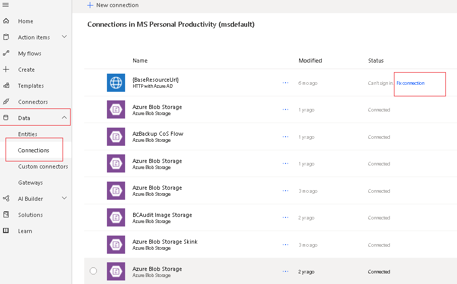
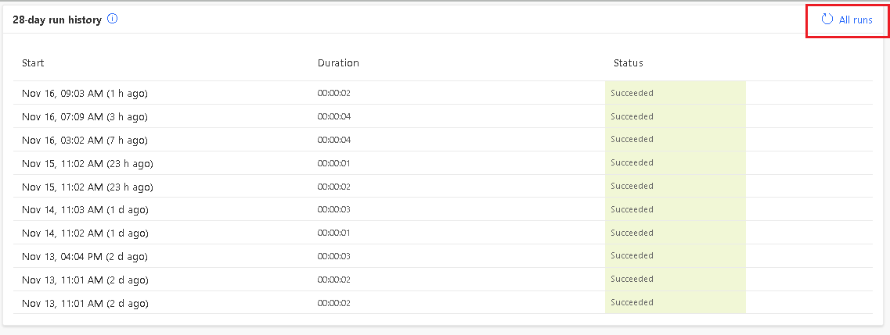
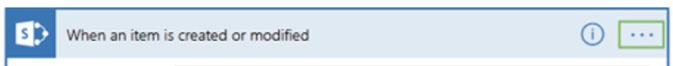
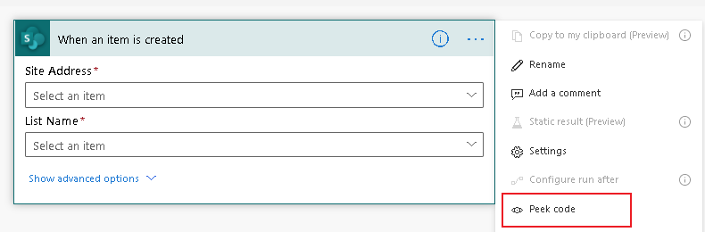
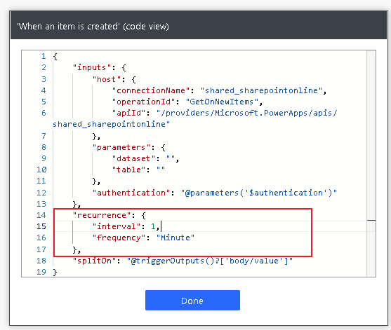

# Troubleshoot common issues with triggers

Here are a few tips and tricks for troubleshooting issues with triggers.

## My trigger doesn’t fire

1. A data loss prevention policy could be to blame.

   Admins can create [data loss prevention (DLP)](/power-platform/admin/wp-data-loss-prevention) policies that can act as guardrails to help prevent users from unintentionally exposing organizational data. DLP policies enforce rules for which connectors can be used together by classifying connectors as either **Business** or **Non-Business**. If you put a connector in the **Business** group, it can only be used with other connectors from that group in any given app or flow.

   If your flow violates a DLP policy, it will be suspended, causing the trigger to not fire. To know if your flow is suspended, try to edit the flow and save it. The Flow checker will report it if the flow is violating a DLP policy. Your admin can change the DLP policy.

1. The trigger may be failing.

   To confirm:
   
   1. Go to **My flows** and then select your flow.
   1. Do you see the following error in the **Details**?

      

   This error means that Power Automate tried multiple times to establish a connection to register the trigger and failed. Your flow won't trigger until this problem is resolved.

   One of the common reasons for the failure is that the Power Automate service end points are not part of the allow list. To fix it, confirm that your IT department has added these endpoint to the allow list.

   Here is the list of [IP addresses](/powerapps/maker/canvas-apps/limits-and-config%23ip-addresses#ip-addresses) and [domains](https://support.microsoft.com/help/4557620/client-request-aborted-or-failed-to-fetch-error-in-power-automate) that need to be added to your allow list.

   Refer to this [support article](https://support.microsoft.com/help/4540228/there-is-a-problem-with-the-flow-s-trigger) to know more about how to fix issues with triggers.

   
<!--todo, what's this about-->
<!-- Make sure access to OData is enabled. -->

Once the problem is resolved, modify the flow, save it, and then change it back and save again. The flow becomes aware that it's configuration changed, and tries to register its trigger again.

### Verify connections

With the default settings, users only need to login to a connection once. They can then use that connection until it's revoked by an admin. A possible scenario is that the password for the connection can expire or there might be a policy in your organization which sets the connector’s login token expiration after a specific amount of time. Token lifetime policies have been configured on Azure Active Directory. For more information, check this [Azure article](/azure/active-directory/develop/active-directory-configurable-token-lifetimes) or this [support article](https://support.microsoft.com/help/4467879/conditional-access-and-multi-factor-authentication-in-flow).

To verify if your connections are broken:

1. Sign into Power Automate.
1. Go to **Data** > **Connections**.
1. Find the connection that's used in your flow. 
1. Select **Fix connections**, and then update the credentials for your connection if there is a **Fix connection** message next to the **Status** column.

   

### Verify if the flow uses a premium connector trigger

1. Edit your flow to find the connector name for the trigger. 
1. Go to the [list of connectors](https://preview.flow.microsoft.com/connectors) and search for that connector. If the connector is a premium connector, it shows below the name of the connector.

   

A standalone Power Apps or Power Automate license is required to access all premium, on-premises, and custom connectors. You can [purchase new licenses](https://flow.microsoft.com/pricing) at any time.

### Check your license type

To view the type of license that you have:

- Go to **My flows** in navigation tab.
- Select any flow.
- In the **Details** section, find **Plan**. Your current license plan is listed.

### Verify if trigger check is skipped 

You just completed an event (for example, added a new list item or sent an email, etc.) that should have triggered the flow, but the flow didn’t run.

Go to **My flows** in the navigation pane, and then select the flow. In the **28-day run history**, select **All runs**.

If you are expecting the flow to run but it didn’t run, see if it shows the trigger check was skipped at that time. If the trigger check was skipped, the trigger condition wasn’t met for the flow to trigger. Verify the inputs and trigger conditions of the flow to see you are using the latest configuration to trigger the flow.

### Verify inputs and trigger conditions 

Sometimes, the inputs and trigger conditions may cause failures. Follow these steps to verfiy your inputs and conditions.

1. Edit the flow.
1. Expand the first card to see what folders, sites, mailboxes, etc. are used in the trigger.
1. Select the ellipses (…) on the card

   

1. Select **Settings**.

   
   
1. Find **Trigger conditions**. 

   If the field is empty, it means that there are no additional customizations and that the title of the card (in this case, **when an item is created or modified**) indicates when the trigger fires.
   
   If there are additional customizations in **Trigger conditions**, confirm that you are using the expected/correct inputs to trigger the flow.

   

### Check permissions

Verify that you have access to the folders, sites, or mailboxes that are used in the trigger. For example, to be able to send email from a shared inbox via Power Automate, you need permissions to send an email via the shared inbox. Test sending an email from that shared mailbox in Outlook.

### Verify if admin mode is turned on 

If an environment’s admin mode is turned on, all background processes, including flows will be turned off, causing the flow to not trigger.

Follow these steps to disable the admin mode.

1. Go to the Power Platform admin center and sign in using Environment Admin or System Administrator role credentials.
1. From the left-side menu, select **Environments**, and then select a sandbox or production environment.
1. On the **Details** page, select **Edit**.
1. Under **Administration** mode, toggle **Disabled** to **Enabled**.
1. Optionally, you can set Background operations and Custom message, and then select Save.

If everything looks good but your flow is still not triggering, verify if your flow triggers after every step.

### Try these steps:

1. Test the flow manually.
1. Remove, and then re-add the trigger.
1. Switch connection.
1. Turn off, and then turn on the flow.
1. [Export, and then import](https://flow.microsoft.com/blog/import-export-bap-packages) the flow.
1. Create a copy of the flow.
1. If the trigger uses special conditions, like when an email arrives in specific folder, remove the folder, and then add it again.

## My trigger is firing for old events

There are two types of triggers&mdash;polling triggers
or Webhook triggers.

If you turned off your flow and then turned it back on, depending on your trigger type, your old triggers may be processed. 

A polling trigger periodically makes a call to your service to look for new data, whereas a Webhook trigger responds to a push of new data from the service. 

See the following table to understand how your flow responds when it's turned back on.

|    |                                                                                                                                              |
|-----------------------------------------|----------------------------------------------------------------------------------------------------------------------------------------------|
| Trigger type                            | Description                                                                                                                                  |
| Polling, such as the **recurrence** trigger | When the flow is turned on again, all unprocessed/pending events are processed. Delete, and then recreate your flow if you don't want to process pending items when you turn your flow back on. |
| Webhook                                 | When the flow is turned on again, it processes new events that are generated after the flow is turned on.                               |

To determine the type of trigger that's used in your flow:

1. Select the …(ellipses) for your flow, and then select **Peek code**.

   

1. Find the recurrence section with an interval frequency element. If this section is available, the trigger is a polling trigger.

   

## My recurrence trigger runs ahead of schedule

Confirm you've [set the start time](https://powerusers.microsoft.com/t5/Using-Flows/Recurrence-set-for-10-but-ran-at-9-22/m-p/241400) to make sure it runs only at that time.

## There's a delay before my trigger fires

If the trigger is a polling trigger, it wakes up periodically to check if any new events have occurred.  The wake-up time depends on the license plan on which the flow runs. 

For example, your flows may run every 15 minutes if you’re on the **Free** license plan. On the **Free** plan, if a cloud flow is triggered less than 15 minutes after its last run, it’s queued until 15 minutes have elapsed. 

And, if your license is the **Flow for Office 365** plan (from your Enterprise license E3, E5, etc.) or the **Flow for Dynamics 365** plan, your flow won't run again until five minutes have elapsed. So, it may be a few minutes between the time the triggering event occurs and the time the flow begins. 

To check the trigger wake up frequency:

1. Go to your flow trigger, and then select the …(ellipses).
1. Select **Peek code**.

   

1. Find the interval frequency.

   

If it is taking much longer than expected for your flow to trigger, the two likeliest reasons are:

1. There has been too many calls to the connector or flow, causing it to be throttled. To verify if your flow is being throttled, manually test the flow to see if it triggers immediately. If it triggers immediately, it is not throttled.

   Further, you can check the Power Automate action analytics. Check out this
[blog](https://flow.microsoft.com/blog/introduction-action-usage-analytics-in-power-automate/)
to know more about action analytics.

   If your flow is frequently throttled, redesign your flow to use fewer actions.
Learn more about [plan limits and tips to optimize flows to use fewer actions](https://support.microsoft.com/help/4531688/troubleshooting-slow-running-flows).

   Additional tips:

   1. Acquire a Per User or Per Flow license. After this is acquired, open and resave the flow, in order to refresh the entitlement associated with it, and to change the throttling Mode.

   1. Split the flow into several instances. If the flow processes data, you can divide this data into subsets (per country, per business area, etc.).

   1. After this, you can use **Save As** on the flow to create several instances that
will process each one their own data. Since the quota is per flow, this can be used as a workaround.

2. There was a communication issue preventing Power Automate from reacting to trigger events. Potentially because of a service outage, policy change, password expiry, and so on, that caused the delay. You can [check](https://admin.powerplatform.microsoft.com/support) to find out if there are any active outages. You can also clear the cache of the browser and then retry.

## Dynamics 365 connector trigger issues 

There's a delay - [Dynamics 365](/connectors/dynamicscrmonline/) connector triggers can take up to 2 hours to run. This connector is deprecated and our recommendation is to migrate your flows to use [Microsoft Dataverse](/connectors/commondataservice/).

My flow is not listed - The Power Automate menu only lists flows that begin with the **When a row is added, modified or deleted** trigger and contain at least one trigger or action that references that table. Flows that contain other types of triggers (automatic, scheduled, etc.) will not be listed in Dynamics 365. 

You can also access these flows in the [Power Platform admin center](https://admin.powerplatform.microsoft.com/environments):

1. Sign into [Power Platform admin center](https://admin.powerplatform.microsoft.com/environments).
1. Select **Environments**.
1. Select that environment that contains the flow.
1. Select **Flows** under the **Resources** section.

>[!IMPORTANT]
>You must enable [Power Automate](/power-platform/admin/enable-embedded-flow-in-your-organization#enable-or-disable-power-automate-in-your-organization) before you can find these flows.

## Power Apps apps trigger issues

<!--todo: steps are not clear-->
Unable to rename actions in a cloud flow – This is a known issue for flows that use Power Apps triggers. As a work around to rename actions, remove the trigger. Rename the actions and add your Power Apps trigger and configure variables wherever needed.

Once a Power Apps app is published, make copies of the flows used by the Power Apps app to make any updates. Any update to a cloud flow that's referenced by a published Power Apps app can break existing users. Do not delete or turn off existing flows until all users have been upgraded to the new published version of the Power Apps app.

## SharePoint trigger issues

SharePoint triggers, for example **When a file is created or modified** will not fire if a file is added/updated in a subfolder. If you need the flow to trigger on subfolders, create multiple flows.

## My flow triggers multiple times

Verify that you don’t have copies of the flow active in different environments that are triggering based on same condition. Use trigger conditions to customize triggers to reduce the number of times it triggers.

## Users are unable to run flows that are shared to them, but the owner can run the flow

You can try one of the following:

1. Fix/update connections.

   If your flow uses a **Manual** trigger, it needs the connection of the user who is triggering the flow. If it uses the **Recurrence** trigger, it can run on the flow maker's connections.

1. Confirm the user has the appropriate license for the connections in the flow.

   A Power Automate license is required for the user to perform any actions like save, turn off, etc. A Power Apps, Dynamics 365, or Office 365 license is not sufficient. Users with whom flows that use premium connectors are shared will each need a Power Automate **Per User** or **Per Flow** license to edit or manually trigger the flow. If the user was previously able to save/modify the flow, it's possible that their license has expired.
   
   Alternatively, you can start a trial for the **Per User** plan for 90 days, after which you will need a paid plan to run/edit flows that use premium connectors. See the [licensing page](https://flow.microsoft.com/pricing) or this [support article](https://support.microsoft.com/help/4552636/error-user-does-not-have-a-service-plan-adequate-for-the-non-standard) for more details.

[!INCLUDE[footer-include](includes/footer-banner.md)]