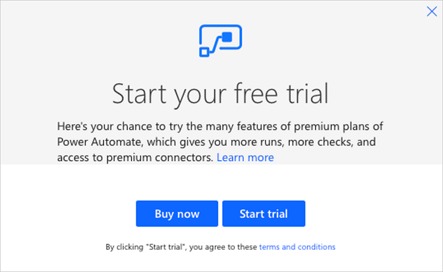
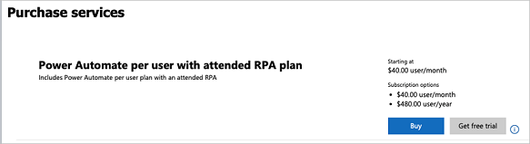
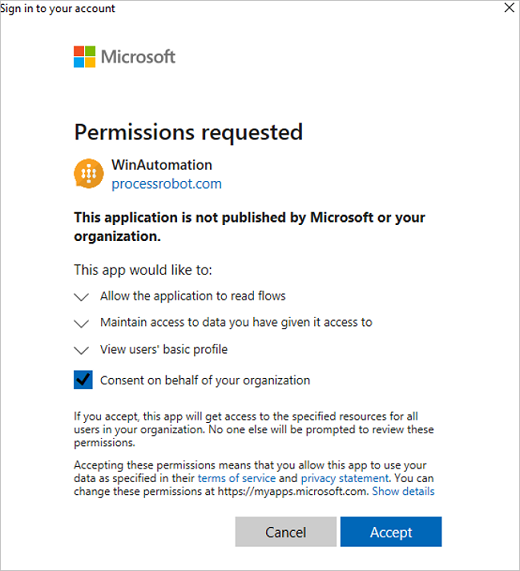

# Use Softomotive's WinAutomation with UI flows

Your Power Automate Attended RPA license (paid or trial) now gives you full access to Softomotive's [WinAutomation](https://www.winautomation.com/). This document will guide you through getting WinAutomation processes running with Power Automate.

Existing WinAutomation users can learn more at [Softomotive's support page](https://support.softomotive.com/support/home)

## Overview for existing UI flows users

[Download](https://aka.ms/rpaDesktopAutomationInstallPage), install then sign into WinAutomation with the same work or school account as in Power Automate. After you've created an process within WinAutomation, you can run it attended or unattended from Power Automate by using a UI flow. To do this, follow these steps:

1. Start a UI flows desktop recording.
1. Open the command prompt.
1. Enter the command to trigger the process.
   - For a process that doesn't require input variables, enter *"%programfiles%\WinAutomation\WinAutomationController.exe" /start "/My Robots/MyAutomationName"*.
   - For a process that requires input variables, enter them after the process name. For example, if a process named *MyAutomationName* requires *VariableA* and *VariableB*, place their values like this: *"%programfiles%\WinAutomation\WinAutomationController.exe" /start "/My Robots/MyAutomationName" ValueA ValueB.*

   >[!TIP] 
   >You can use UI flows inputs and Dynamic content to change the target WinAutomation process from Power Automate.

1. Press enter at the command prompt, and then stop the UI flows recording. 
   UI flows captures all the necessary information at the time the WinAutomation process starts.
   
1. Add the UI flow into a flow, and then select *attended* or *unattended*  as the run type.

   >[!TIP] 
   >In the WinAutomation process, use the *Get Command Line Arguments* action to retrieve the command line arguments. The arguments are in an array. Use their index to reference each argument.
   
## Set up WinAutomation

>[!TIP]
>Automation scripts in WinAutomation are called **processes**. In Power Automate, automation scripts are called *flows* or *UI flows*.

Before you create a WinAutomation process, check the [list of connectors](https://flow.microsoft.com/connectors/) to see if the application you want to automate already has a connector. If it does, consider creating a flow instead of a UI flow. You might also [build your own connector](https://docs.microsoft.com/connectors/custom-connectors/). In general API-based connectors provide a better overall experience than UI automation in terms of scalability, reliability, and lower cost.

>[!TIP]
>To run WinAutomation scripts from Power Automate, you must first initiate the playback of the scripts from UI flows.

## Prerequisites 

To run WinAutomation as part of Power Automate, you will need to:
1. Ensure your machine meets the [requirements for UI flows](https://docs.microsoft.com/power-automate/ui-flows/setup#prerequisites).
1. Install the [UI flows](https://docs.microsoft.com/power-automate/ui-flows/setup) app, and then install and configure the on-premises data gateway.

## Licensing

You need to have a *Per user plan with attended RPA* to use UI flows and WinAutomation. If you don't have a paid plan, you can start a trial of the *Per user plan with attended RPA* by going to Power Automate, and then selecting the **UI flows** tab under **My flows**. You'll see the trial dialog from which you can start the trial.

If you already have a paid plan or you used a trial previously, you cannot start a new trial. In this case, you will need to ask your administrator to buy or start a trial of the Power Automate *Per user plan with attended RPA*. They can make the purchase by going to **Billing** > **Purchase services** in the Microsoft 365 admin center, and then searching for the right plan.

Finally, once they have purchased a plan or gotten the free trial, they need to assign that plan to a user. 

>[!NOTE]
>When you assign a plan to a user, it may take few minutes before the assignment becomes effective.

>[!WARNING]
>You must have the latest version of each component to record, test, or run UI automation.

## Install WinAutomation

Once UI flows has been installed on your machine, you can install WinAutomation to record, edit, and test automation scripts for desktop by following these steps:

1.  Download the [WinAutomation installer](https://aka.ms/rpaDesktopAutomationInstallPage).

1.  Open the **WinAutomationSetup.exe** file. This file is likely in your **Downloads** folder.

1.  Follow the instructions in the WinAutomation installer to complete the installation. During installation, ensure the **License Type** is set to **Microsoft Power Automate**.

## Sign-in to WinAutomation 

After the installation completes, start the WinAutomation Console from the Windows start menu. The application will prompt you to login or start a 30-day trial. If you already have a *Per user plan with attended RPA* license for Power Automate, enter the user credentials you use for the [Power Automate](https://flow.microsoft.com). You can also visit the [pricing page](https://flow.microsoft.com/pricing/) to learn more about this license or to get a trial license.

If you don’t have a valid license, you will see this error message.

>[!WARNING]
>You will need your tenant administrator to grant consent to use your Power Automate Work or School account with WinAutomation. For that, they can install WinAutomation, sign in with their tenant administrator account, and then grant consent.

Once signed in, you will see the WinAutomation console with a few example processes. To get started, you can go to **Options** > **Help** > **Getting Started**, and then go through a few examples of creating simple processes. Additionally, several [WinAutomation getting started tutorials](https://www.winautomation.com/support/tutorials/) are available.

## Run WinAutomation processes from Power Automate

Once you have defined your automation script in WinAutomation, you can run it from a flow in Power Automate using UI flows’ support for launching applications with the command prompt. To learn more about creating and testing UI flows, you can go [here](https://docs.microsoft.com/power-automate/ui-flows/create-desktop).

### Running WinAutomation processes 

To run a WinAutomation process without the Console environment, you can use the WinAutomationController.EXE command. This process in located in the WinAutomation installation folder and can be launched from the **Command Prompt** in Windows. While it has many useful parameters, to launch the automation, you will use the ‘/start’ flag which will start the specified process. Here's an example of the command: **WinAutomationController /start processPath**

*processPath* is the path in the WinAutomation Console for the Process, from a base directory of My Processes in the Folders Pane on the left side. If you have put the Process in a subfolder, you will need to include that information in the processPath. Note that if processPath contains spaces, it should be enclosed in double quotes (e.g. WinAutomationController /start "/My Robots/../../processName").

### Launching WinAutomation processes from UI flows

Once you have successfully identified the command to run WinAutomation processes above, you can now invoke this command directly from UI flows. To do this:

1.  Add a new step in UI flow recording experience by clicking **Launch Recorder** if you have a blank UI flow. If you already have pre-defined steps in UI flow, you can click **New Step** and then **Record app** to launch the recorder. More information about the recording experience is available [here](https://docs.microsoft.com/power-automate/ui-flows/create-desktop).

1.  Select **Record** in the launched recorder.

1.  Open the **Command Prompt** app in Windows.

1.  Type in the WinAutomationController command you authored earlier (for example, WinAutomationController /start "/My Robots/../../process").

1.  Select **Done** in the recorder.

You will notice that recorder adds new steps to your UI flow that now includes launching the WinAutomationController.

>[!TIP]
>UI flows can run in both attended and unattended automation modes. You can run WinAutomationController in both cases as well. If you’re executing UI flows on an unattended cluster, ensure that the WinAutomationController
command specified above will run on all machines in the cluster. For more information on attended and unattended UI flows, click [here](https://docs.microsoft.com/power-automate/ui-flows/run-ui-flow).

## Waiting for a WinAutomation process to complete in UI flows

By default, WinAutomationController.exe runs processes in the background. If you’d like to have UI flows wait for WinAutomation process automation to complete, you can raise an informational message box at the end of the WinAutomation process using the **Display Message** command, and then wait in UI flows to click on that message box button. To do this:

1.	Add a “Display Message” command as the last step in your WinAutomation Process. To do this, filter the Actions panel on the left to find Display Message and drag and drop that command to the Process script editor. You can give it some friendly title and description and leave the default button selection that shows the OK button.
1.	Run the WinAutomation Process until the message box is shown. 
1.	Add a new UI flow recording, click on the title of the Display Message box and then click OK. 
1.	Stop recording by clicking Done. You will now see the script in UI flow has new set of actions for clicking on the dialog box and discarding the message box.
1.	And finally, you will need to tell UI flow to give WinAutomation certain amount of time to complete. To do this, expand the previous Send Keys command that starts the WinAutomationController.exe command, expand to see the advanced options, and set the Wait After property to wait for the maximum amount of time the WinAutomation Process script will take to execute.

## Uninstall WinAutomation

1.  Open the **Start** menu \> **Settings** \> **Apps**.

1.  Search for **WinAutomation**, and then select it.

1.  Select **Uninstall**.

## Troubleshooting WinAutomation licensing issues

If you are receiving licensing errors during the launch of WinAutomation, ensure the user you’re logging in as has a valid license for UI flows. To do that: 

1.	Go to [Power Automate](https://flow.microsoft.com) and sign in.
1.	Select My flows on the left navigation bar.
1.	Select UI flows on the page on the right. You may need to start a trial or ask your administrator to do that.

To reset the license information stored by WinAutomation, you can delete the following file: %localappdata%\Softomotive\WinAutomation\msalcache.bin3

>[!NOTE]
>This license is cached when users launch WinAutomation while connected to the Internet. 

## Learn more

- Read about the [WinAutomation acquisition](https://flow.microsoft.com/blog/microsoft-acquires-softomotive-to-expand-low-code-robotic-process-automation-capabilities-in-microsoft-power-automate/)
- Get support for [WinAutomation](https://support.softomotive.com/support/home).
- Get a head start with [WinAutomation tutorials](https://www.winautomation.com/support/tutorials/).
- Learn to [create desktop UI flows](https://docs.microsoft.com/power-automate/ui-flows/create-desktop).
- Learn how to [run UI flows](https://docs.microsoft.com/power-automate/ui-flows/run-ui-flow).
- Learn to [manage UI flows.](https://docs.microsoft.com/power-automate/ui-flows/manage)
- Learn more about the [on-premises gateway](https://docs.microsoft.com/power-automate/gateway-reference#use-a-gateway).
