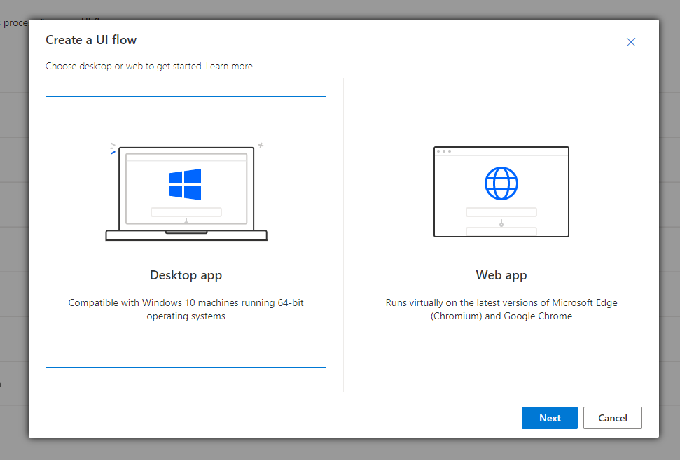
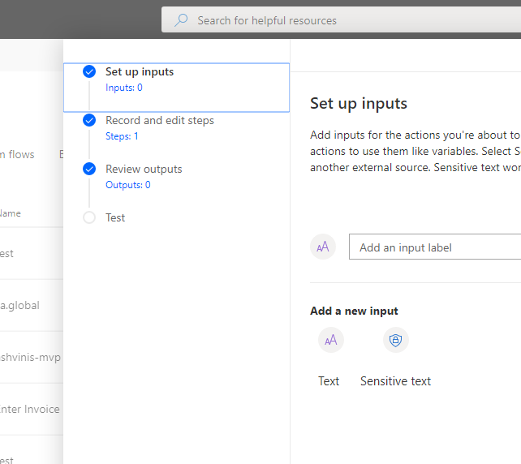
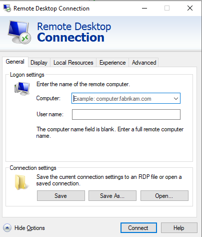
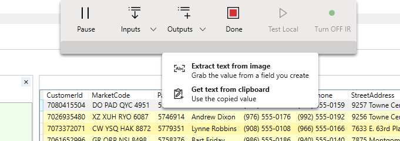
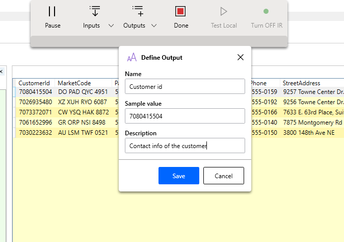
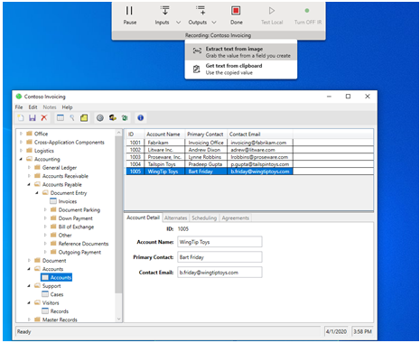
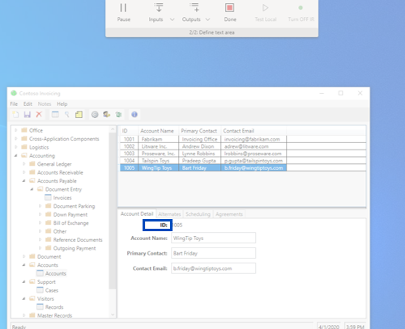
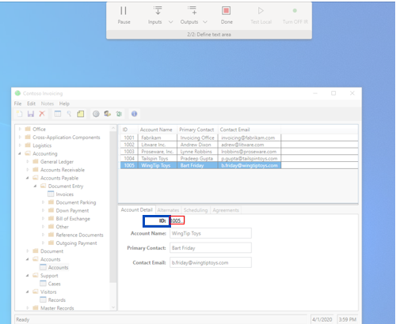

# Create and test Remote Desktop UI flows

TODO: Addt this content to the edit a desktop ui flow and link to it from within this doc.

Note: Proposed location for “Add a recording of a remote computer using image recognition” is part of the Edit Desktop UI flows page:

<https://docs.microsoft.com/power-automate/ui-flows/edit-desktop>

## Add a recording of a remote computer using image recognition

*{{Placeholder for disclaimer – this functionality is in preview and subject to
change.}}*

 

What is image recognition?
--------------------------

Currently, desktop UI flows are primarily recorded using accessibility APIs (UI
Automation and WinAppDriver) to detect the controls in the Windows UI tree.​ The
UI tree is not always available, such as with web-based or Java apps, and may be
unreliable, such as when the IDs of a control change frequently or between
sessions. With image recognition, click locations and other details are visually
matched during playback, greatly expanding the range of applications that can be
automated. Image recognition in UI flows is in public preview and currently
available when recording a remote computer through the Remote Desktop Connection
(RDC) app.

### To record a remote computer using image recognition: 

 

1.  Follow the steps in **Add a recording** to launch the recorder control for a
    new or existing UI flow

1.  Connect to the remote computer using the Remote Desktop Connection (RDC)
    app, and expand the window to full screen.

1.  Select **Record** from the recorder control.

1.  Perform the steps on the remote computer, and then select **Done** on the
    recorder control.

1. Go to the inputs tab > create **sensitive text** inputs for the user name and password that will be used on log into the remote device.

1.  Locate the Launch Remote Desktop (preview) action within your recording

1.  Add sensitive text input for (host name or IP address), username, and password for the
    remote computer.

1.  Select **Save**, and then test your UI flow.

 

### To retrieve an output from a remote computer, use the Extract Text from Image action while recording: 

 

1.  While recording, navigate to the location of the text that you wish to
    capture.

1.  Select Outputs -\> Extract Text from Image from the recorder control

1.  Follow the prompts to select an **anchor area** (a section of the screen
    that is not expected to change, such as the label next to a field) and
    **target area** (the area from which text will be extracted using OCR)

1.  Enter a name for the output

1.  Select **Done** on the recorder control

1.  Select **Save**, and then test your UI flow.

### Known issues and limitations

1.  Ensure that all required inputs (computer name, username, and password) are
    filled in and saved before recording further steps in the same UI flow.

1.  To attach to an existing remote desktop session, the session must have been
    launched earlier in the same UI flow

1.  If Remote Desktop is launched during recording, and not prior, the Windows
    Security dialog may be recorded. As playback into this dialog is not
    supported, these steps should be removed from the automation before testing
    or playing back.

1.  Playback can fail if the UI flow was recorded on a screen with screen
    scaling (Windows Settings -\> Display -\> Screen Scaling) set to a value
    other than 100%. As a workaround, ensure that screen scaling is set to 100%
    prior to recording.

## Unfinished/unneeded sections 

Create a Remote Desktop UI flow
-------------------------------

-   Select Desktop app:

>    

>    

>    

-   Create 2 inputs in the first step of the wizard: these inputs will be used
    to connect to your Remote Desktop during the playback.

>    

>    

-   The sample values will be the **credentials** of the **remote machine** you
    want to connect.

-   **Computer name**: the name of the PC you want to connect (you can use the
    hostname or your IP address)

-   **Username **:

>    

>    

-   Launch the recorder

-   You can record on an already open Remote Desktop session (recommended):

    -   Launch the RDP session before starting recording and start record
        actions on a session that is already open.

-   Alternatively, you can start your Remote Desktop session during the
    recording:

    -   Open the Remote Desktop connection (mstc) and sign in to launch your
        remote desktop session and continue to use the same recording to record
        clicks and inputs within the remote desktop session.

>   **For safety reasons, all the login steps of RDP are not saved in the script
>   and won't be displayed in the designer.**

>   **To allow the connection to the remote desktop during the playback, users
>   need to bind the created inputs with credential fields in the Login Remote
>   Desktop action**

How to define variable with Image Recognition
---------------------------------------------

### Inputs

TBC

### Outputs

We introduce two new types of outputs for Image recognition: Extract text from
image and Get text from Clipboard.

-   Define an output with clipboard:

    -   During the recording, copy a string value

>    

-   Select Get output with clipboard

>    

-   The value is displayed, define a name and description for this output

>    

-   You can use this output as an input of a next step

-   Define an output with OCR

    -   Select « Extract text from image » in the list of Output options

>    

-   Define the anchor (the invariant area close to the text you want to select)

>    

-   Define the area where the text is contained (target)

    -   Ex: if you want to select the ID of a table. The anchor is “ID”, the
        target is “1001”

>    

>    

-   Ensure the value has been correctly captured. If not retry the process.

>    

-   Stop the recording and go back to the wizard
