# 작업과 작업창 구성

[!INCLUDE [cc-beta-prerelease-disclaimer.md](../../includes/cc-beta-prerelease-disclaimer.md)]

흐름 디자이너를 열면, 창 왼편에 있는 작업창에서 모든 작업 그룹을 볼 수 있습니다.

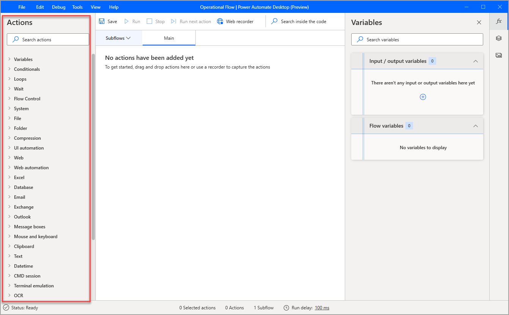

특정 작업을 빨리 검색하려면 검색창에 작업 이름을 입력하세요. 일부 일치하는 결과도 검색이 가능합니다.

## 작업공간에 작업 추가하기

흐름 개발을 시작하려면, 작업을 선택후 더블클릭하시거나 끌어서(드래그해서) 작업공간에 이동하셔도 됩니다.

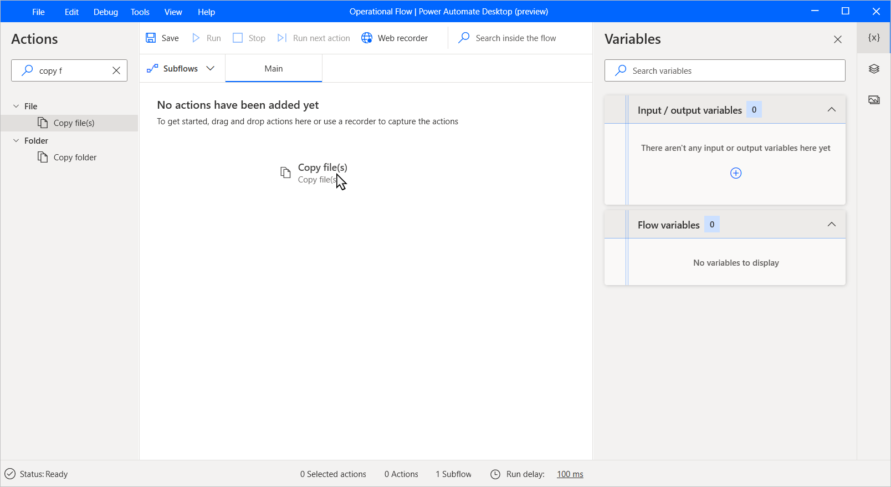

작업 매개변수를 가진 대화 박스가 열립니다. 작업은 변수 이름과 같은 특정 매개변수와 기본 값을 갖고 있습니다. 다른 작업들은 시작하기 위해 사용자의 입력을 요구합니다. **저장(Save)** 을 선택하면, 작업이 작업공간에 나타납니다.

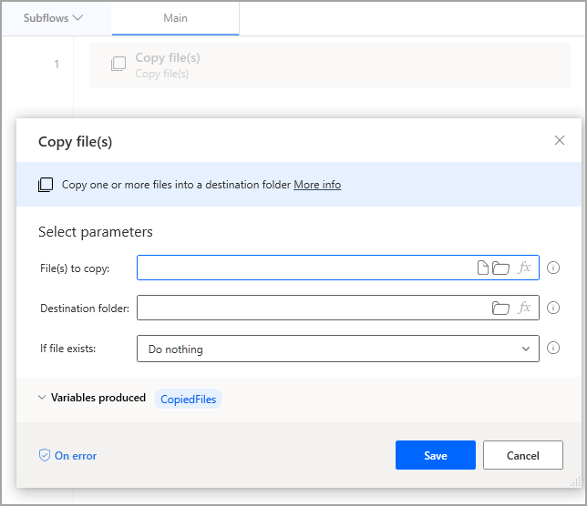

## 작업 구성

파워 오토메이트 데스크톱(Power Automate Desktop) 작업은 두가지 주요 부분으로 구성되어 있습니다.
- 입력 매개변수 - 텍스트 영역, 드롭다운 메뉴와 체크박스 형태
- 생성된 변수 - 자동으로 생성된 변수

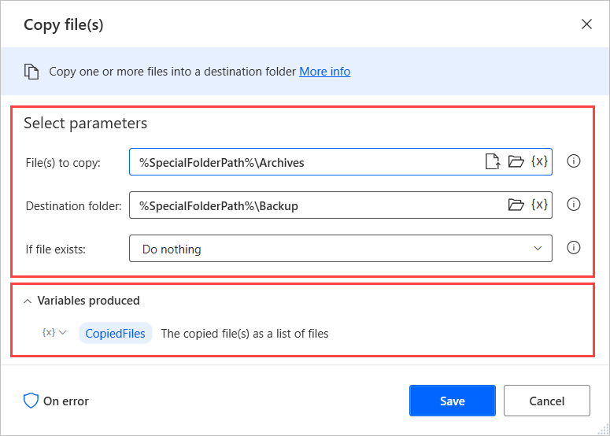

입력 매개변수는 작업이 처리할 함수와 입력으로 가져올 데이터를 결정합니다. 해당 데이터는 하드코딩된 값일 수도 있고 변수일 수도 있습니다. 

변수를 매개변수로 사용하려면, 해당 영역의 오른편에 있는 아이콘을 선택해서 해당되는 변수를 정하면 됩니다.

각 영역은 숫자, 텍스트 또는 리스트와 같은 특정 데이터 타입을 수용할 수 있습니다. 만일 값이나 변수가 맞지 않는 타입이 입력된다면, 작업은 에러를 발생합니다. 

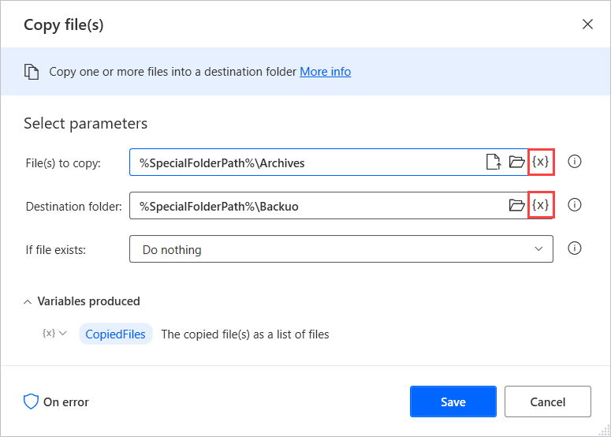

생성된 변수는 나중에 사용하기 위해 작업의 결과물을 유지합니다. 모든 생성된 변수는 작업 속성(action's properties) 아랫 부분에 표시됩니다. 

각 생성된 변수들은 해당 데이터에의해 정의된 데이터 타입을 띱니다. **변수(Variables)** 창에서 변수의 데이터 타입을 보실 수 있습니다. 데이터 타입에 관한 더 많은 정보는 [해당 문서](variable-data-types.md)에서 확인하세요.

생성된 변수가 나중에 필요하지 않은 경우, 왼편에 있는 아이콘 가운데 **필요없음(Not needed)** 을 선택하시면 됩니다. 

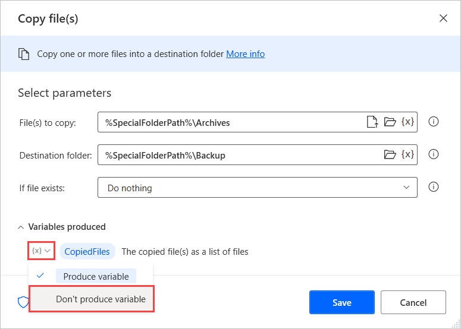

## Configuring action exceptions

작업에서 예외가 발생하면 흐름은 기본적으로 실행을 중지합니다. 작업에 대한 사용자 맞춤형으로 오류 처리 동작을 구성하려면 해당 속성에서 **오류관련(On error)** 옵션을 선택합니다.

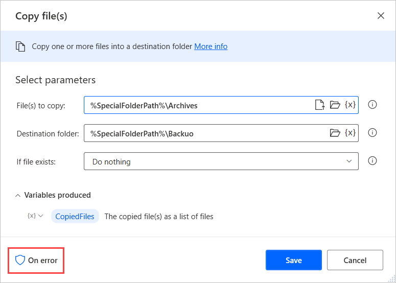

대화 상자의 첫 옵션에 **에러 발생시 다시시도 작업(Retry action if an error occurs)** 체크박스를 하면 그 흐름이 2초 후에 해당 작업을 다시 실행하게 됩니다.

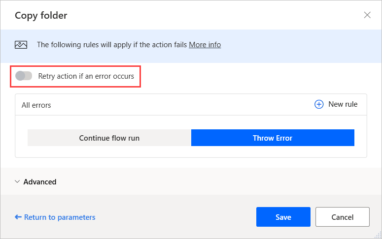

다시시도 옵션이 실패하더라도 흐름 실행을 계속하려면 **흐름 실행 계속(Continue flown run)** 옵션을 선택합니다. ​드롭다운 목록에서 아래와 같이 수행 할 수 있습니다.

- **다음 작업으로 가기(Go to next action)**: 순서에 따라 다음 작업을 실행
- **반복 작업(Repeat action)**: 성공할 때까지 해당 작업을 반복
- **라벨로 이동(Go to label)**: **라벨(Label)** 작업에서 정의한 지점에서 실행 계속

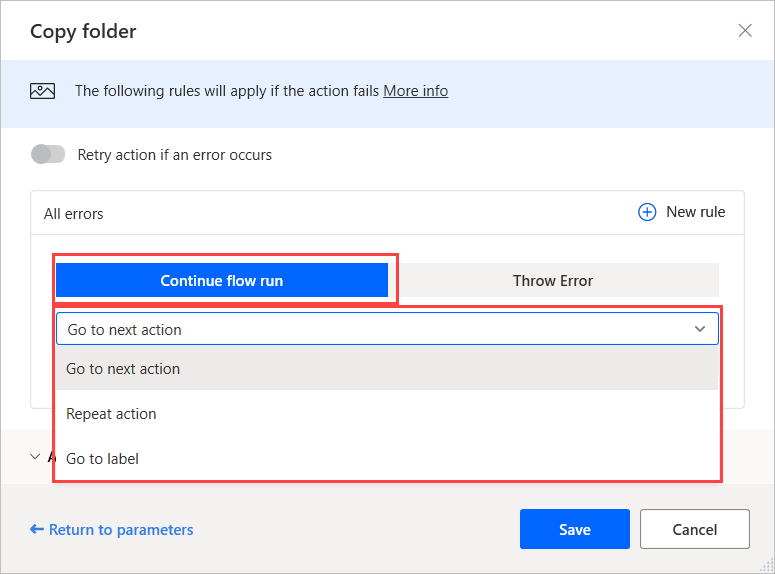

파워 오토메이트 데스크톱(Power Automate Desktop)은 추가적으로 오류 처리 옵션을 두가지 제공합니다. **새 규칙(New rule)** 버튼을 선택해서
- **변수 설정(Set variable)**: 희망한 값을 특정 변수에 설정할 수 있고
- **하위 흐름 실생(Run subflow)**: 특정 하위 흐름을 실행할 수 있습니다

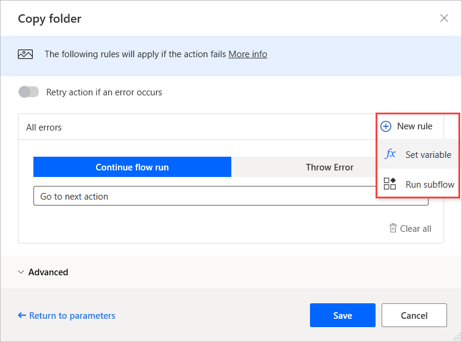

만일 서로 다른 오류들에 대해 각각 다른 오류 처리 동작이 필요하다면, **고급(Advanced)** 옵션을 선택해서 발생가능한 각 오류들을 알맞게 구성하면 됩니다.

## 작업 활성화 및 비활성화

작업을 활성화 또는 비활성화 하려면, 마우스 오른쪽 클릭하여 **작업 비활성화(Disable action)** 또는 **작업 활성화(Enable Action)** 를 알맞게 선택하세요. 

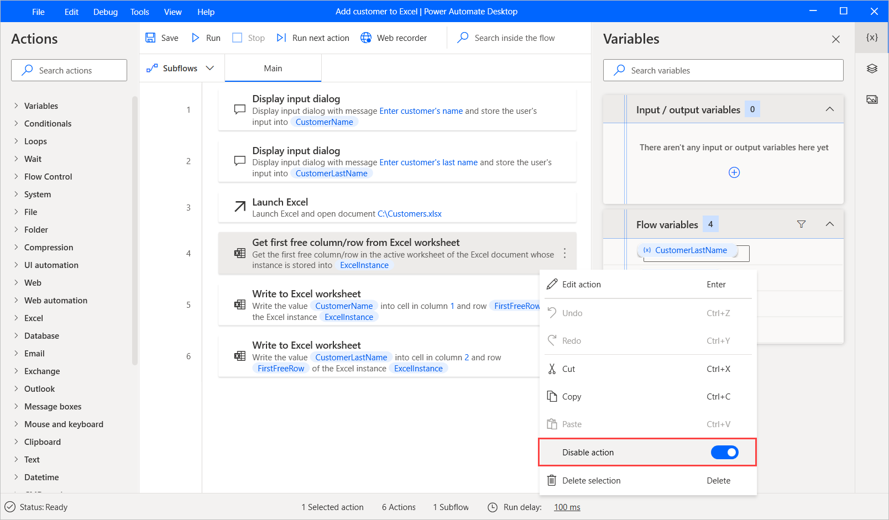

작업을 비활성화를 통해 해당 작업을 지우지 않고 흐름에서만 제거 할 수 있습니다. 이 기능은 일반적으로 어떤 흐름을 여러 버전으로 테스트하고 어떤 것이 가장 효율적인지를 판단하는 데 적용하실 수 있습니다.

작업이 비활성화 되면, 거기에 정의된 모든 변수들은 **변수들(Variables)** 창에서 숨김 상태가 됩니다. 만일 숨겨진 변수들이 다른 작업에서 사용된다면, 그 흐름은 오류를 발생시킬 수도 있습니다. 

아래 예제에서, 두 작업이 오류를 발생하는데 비활성화된 작업에서 정의된 변수들을 포함하고 있기 때문입니다.

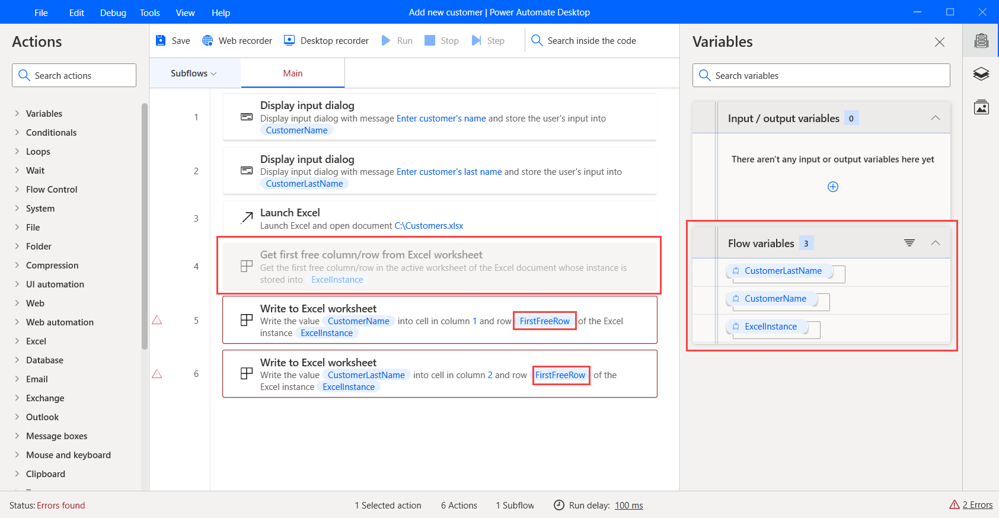
