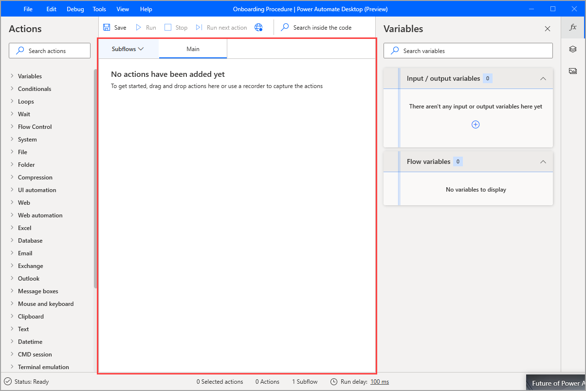

# The flow designer workspace

[!INCLUDE [cc-beta-prerelease-disclaimer.md](../../includes/cc-beta-prerelease-disclaimer.md)]

The central pane of the flow designer is called the workspace. Here is where the series of actions that make up the flow is assembled:

During development, users may add, edit, and delete actions in the workspace.

Drag actions to rearrange them and change the order in which they run. Right-click an action and select **Enable action** or **Disable action** to enable or disable an action respectively; while running, the flow skips any disabled actions.

Copy and paste any selected actions in the workspace. This can be done within the same subflow, among different subflows, or other open instances of flow designer.
