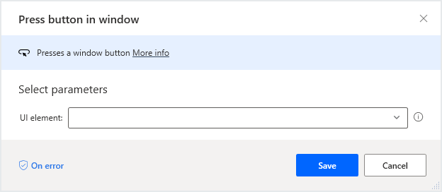
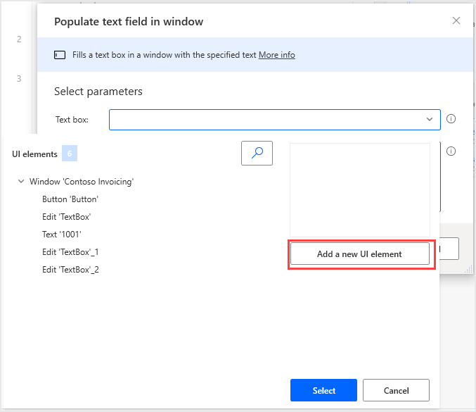
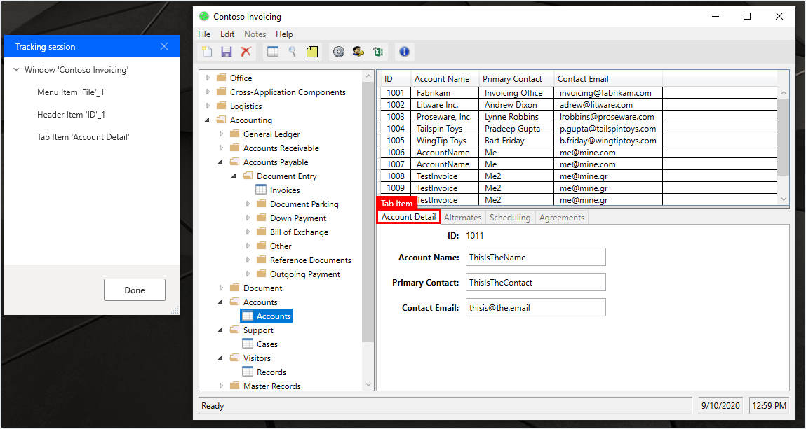
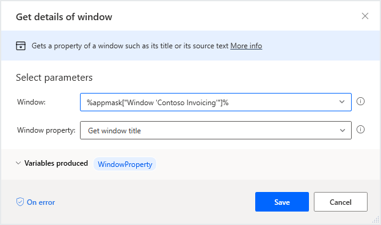

# 데스크톱 자동화 흐름

[!INCLUDE [cc-beta-prerelease-disclaimer.md](../../includes/cc-beta-prerelease-disclaimer.md)]

흐름 디자이너에는 데이터 입력 또는 추출 등의 방법으로 Windows 응용 프로그램 및 요소(element)를 조작할 수 있는 UI 자동화 작업 그룹들을 포함하고 있습니다.

**Windows** 하위 범주의 작업들은 전체 UI 창을 직접 조작하는 반면 **서식 채우기(Form Filling)** 작업은 텍스트 필드 및 단추와 같은 보다 특정 요소(element)와 상호 작용합니다.

데스크톱 자동화는 손수 필요한 작업을 부가하거나 데스크톱 녹화기(Desktop recorder) 기능을 통해 수행할 수 있습니다.

## 데스크톱 응용프로그램과 상호작용하기

UI 자동화는 저장소(repository)에 있는 창들과 요소들에 전적으로 기반하고 있는 모든 UI 응용프로그램 인터페이스에서 수행될 수 있습니다.

UI 작업을 구성하기 위해 다음과 같이 상호작용할 해당 요소를 입력합니다.

기존 UI 요소는 리포지토리에서 추가 할 수 있으며 새 요소는 작업의 속성에서 직접 추가 할 수도 있습니다.

새로운 요소를 추가할면 해당 요소를 하이라이트한 후 **컨트롤(Ctrl) 버튼을 누를 상태에서 마우스 왼쪽 클릭** 을 하세요.

필요한 모든 요소를 추가한 다음 **완료(Done)** 버튼을 눌러서 저장소에 저장합니다.

UI 창에서 제목, 위치, 크기 등의 일련의 데이터를 추출하려면 **윈도우 상세내용 구하기(Get details of window)** 작업을 활용하시기 바랍니다.

다른 방법으로 창 내의 특정 요소에서 데이터를 추출하려면 **창에서 UI 요소의 상세내용 구하기(Get details of a UI element in window)** 작업을 사용하실 수 있습니다.

[참조할 작업들](./actions-reference/uiautomation.md)에서 UI 자동화 작업들을 더 많이 확인 하실 수 있습니다.
