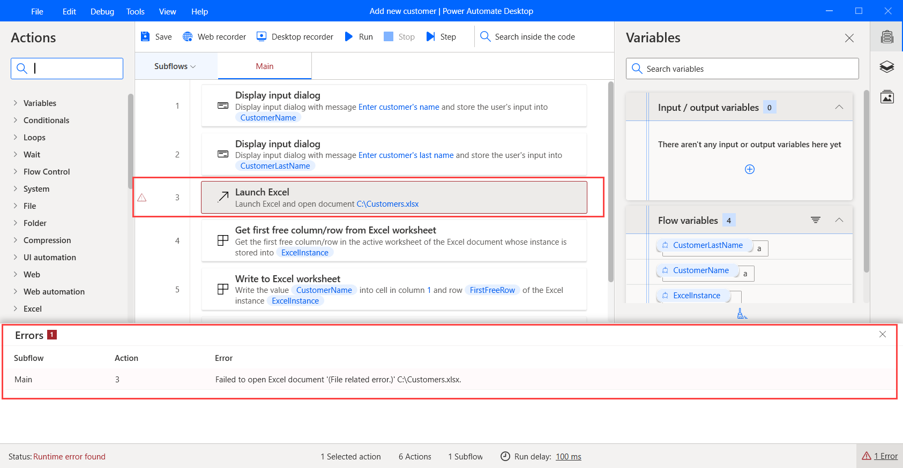

# Errors

When an action throws an error during the execution, the **Power Automate Desktop** platform displays an error icon next to it and a pop-up pane with relevant error information. 

The **Errors** pane is split into three columns:

- **Subflow**: The name of the subflow containing the action that threw the error.
- **Action**: The line number of the action that threw the error.
- **Error**: The error message.

