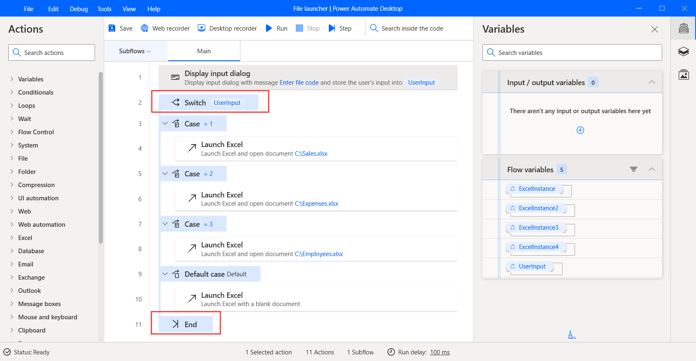
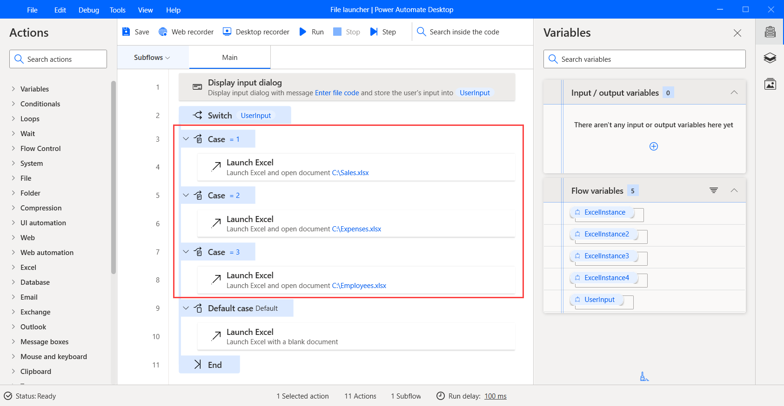
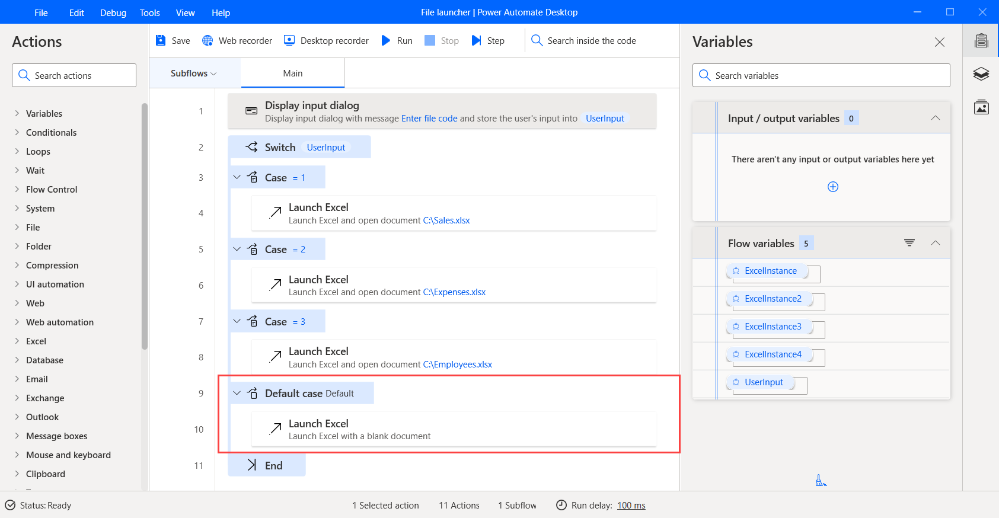

# Switch-case model

Unlike if-else conditionals, a switch block can address several possible execution paths. A switch statement is a control mechanism that allows a variable or expression to change the flow's behavior.

The **Switch** action marks the beginning of a switch block. Every **Switch** is accompanied by an **End** action that marks the switch block's end.

Inside the switch block, each **Case** marks a block of actions to execute if the respective condition is true.

In case all conditions are invalid, the flow will execute the actions in the **Default Case** block, if exists.

