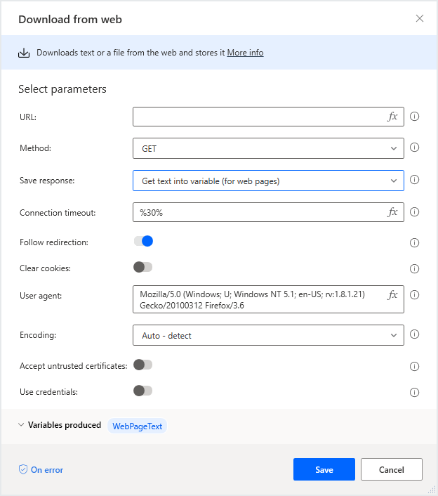
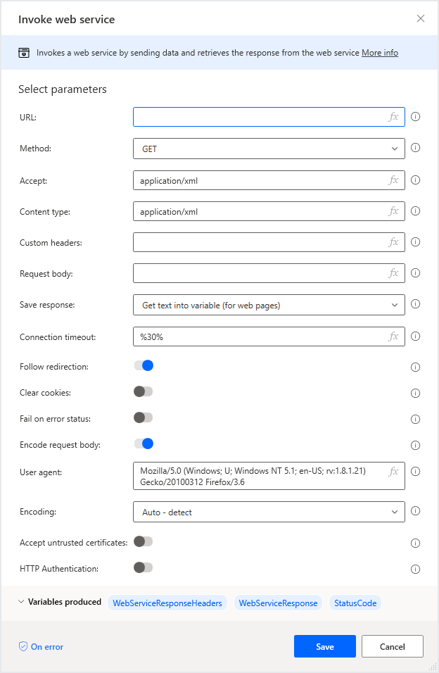

# Interacting with the web and web services

[!INCLUDE [cc-beta-prerelease-disclaimer.md](../../includes/cc-beta-prerelease-disclaimer.md)]

It is possible to communicate directly with web resources, such as web pages, files, and APIs, without using a web browser.

## Downloading web resources

Use the **Download from web** action to directly download web page content, or files on the web:

Both the **GET** and **POST** methods may be used with this action; files can be downloaded directly to the disk, while web page contents are saved into a variable.

## Accessing web APIs

Use the **Invoke web service** action to access web APIs:

A variety of methods are compatible with this action, which is fully customizable in order to accommodate virtually any API.