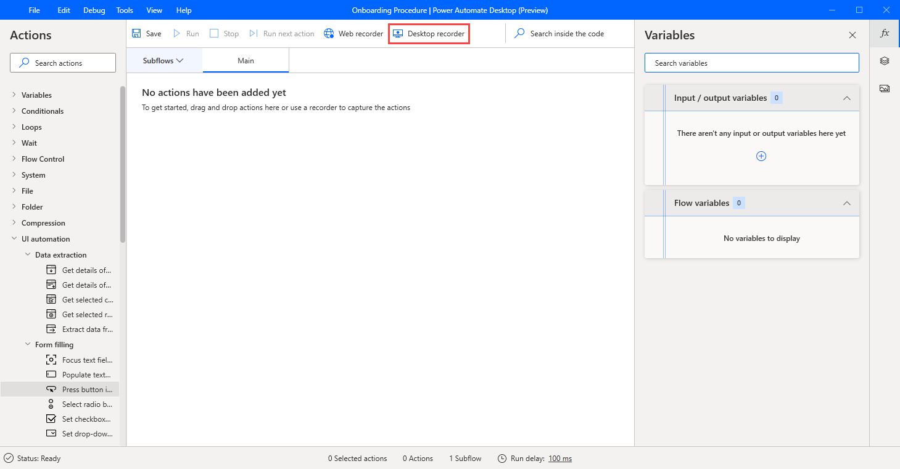
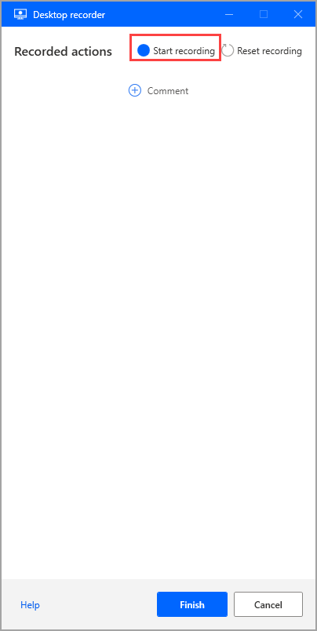
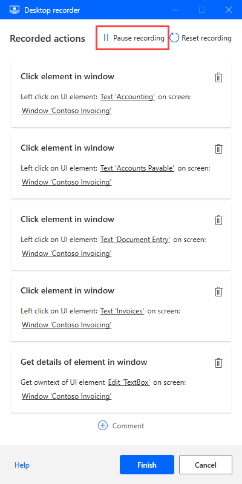

# Recording in a desktop flow

[!INCLUDE [cc-beta-prerelease-disclaimer.md](../../includes/cc-beta-prerelease-disclaimer.md)]

It's possible to design flows simply by performing the task you wish to automate, using the desktop recorder.

## Desktop recorder
In the flow designer, select **Desktop recorder** in the toolbar to record desktop actions:

Select **Start recording** in the desktop recorder window to record actions.

The desktop recorder keeps track of mouse and keyboard activity in relation to UI elements, and records each action separately:

 Select **Pause recording** to suspend the recording of actions:
 

 
 Select **+** to add a comment to the recorded actions:

 ## Recording vs building a flow

Any actions created through the use of a recorder can be edited manually once the recording is finished. Use the recorder in a flow that is already under development to add the recorded steps to it.

> [!NOTE]
> Use the recorder to create the backbone of your flow. Certain simple tasks may require no further editing, however most recorded tasks should be modified to achieve optimal results. Certain types of actions, like conditionals or loops, cannot be recorded. Also, there may be redundant actions in a recording that should be removed.