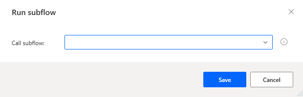
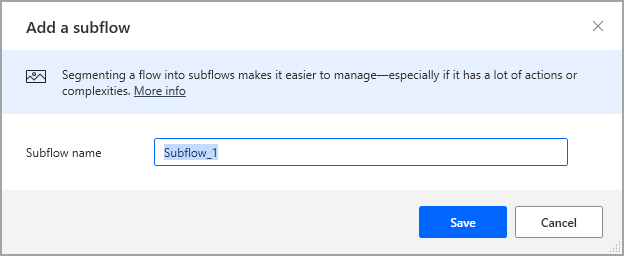

# Setting up subflows

[!INCLUDE [cc-beta-prerelease-disclaimer.md](../../includes/cc-beta-prerelease-disclaimer.md)]

Subflows are groups of actions, which may be referenced as a group within a flow.

Every flow contains the **Main** subflow - this is the subflow that is run when a flow starts. Any other subflows may be invoked through the **Run subflow** action:

Subflows are shown in tabs, directly over the main workspace. To add a new subflow, select the subflows tab, select **+**, and enter the subflow name.

Select a subflow tab to edit the respective subflow.